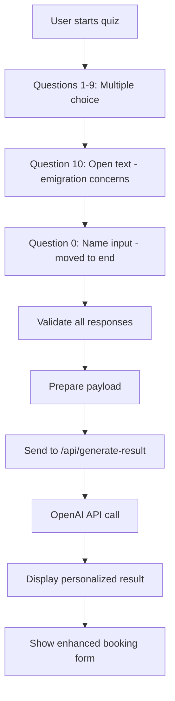

# Form Question Order Adjustment and Final Screen Enhancement

## Overview

This design document outlines modifications to the quiz application flow to improve user experience and conversion. The changes focus on reordering the question sequence, enhancing the value proposition on the final screen, and updating the AI-generated result prompt.

**Core Objectives:**
- Move the name field from the beginning to the end of the quiz flow (before displaying results)
- Add a new open-ended question about emigration concerns
- Strengthen the value proposition for the free consultation session
- Update the call-to-action messaging
- Enhance the AI prompt for more personalized and conversion-focused responses

## Current System Analysis

### Current Question Flow
The existing quiz follows this sequence:
1. Question 0: Name input field (text)
2. Questions 1-9: Multiple choice questions about adaptation stage
3. Result display with AI-generated personalized feedback
4. Booking form with Telegram username field

### Current Final Screen Structure
- AI-generated result based on quiz answers
- Booking form section with:
  - Telegram username field
  - Standard call-to-action text
  - Coach information display
  - Strategy map preview

## Revised Question Flow Architecture

### New Question Sequence

The quiz flow will be reorganized as follows:

| Step | Question ID | Question Type | Purpose |
|------|-------------|---------------|---------|
| 1 | q1 | Multiple choice | Time living in new country |
| 2 | q2 | Multiple choice | Recurring thoughts pattern |
| 3 | q3 | Multiple choice | Physical body responses |
| 4 | q4 | Multiple choice | Social connections assessment |
| 5 | q5 | Multiple choice | Work and self-realization |
| 6 | q6 | Multiple choice | Internal emotional state |
| 7 | q7 | Multiple choice | Future outlook |
| 8 | q8 | Multiple choice | Coping mechanisms |
| 9 | q9 | Multiple choice | Self-description |
| 10 | q10 (new) | Text area | "What worries you most about emigration?" |
| 11 | q0 | Text input | Name field (moved from beginning) |
| 12 | - | Result display | AI-generated personalized plan |

### Question Counter Display Logic

The progress indicator will display "N of 11" (instead of current "N of 9") to reflect:
- 9 original multiple-choice questions
- 1 new open-ended question about emigration concerns
- 1 name field (moved from position 0)

## New Open-Ended Question Design

### Question Specification

**Question Text (Russian):**
"Что больше всего беспокоит вас в эмиграции?"

**Question Text (English translation for reference):**
"What worries you most about emigration?"

**Field Configuration:**
- Field type: Multi-line text area (textarea)
- Minimum height: 80-100 pixels
- Character limit: 500 characters (soft limit)
- Placeholder text: "Напишите, что вызывает больше всего тревоги или вопросов..." (Write what causes you the most anxiety or questions...)
- Validation: Optional field, allows proceeding even if left empty
- Position: Between last multiple-choice question (q9) and name field (q0)

### Purpose and Usage

This question serves multiple purposes:
1. **Qualitative data collection** - Captures specific pain points not covered by structured questions
2. **Personalization input** - Provides context for AI-generated recommendations
3. **Lead qualification** - Reveals urgency and specific concerns for follow-up conversations
4. **Empathy building** - Gives users space to express authentic concerns

## Enhanced Final Screen Design

### Meeting Value Proposition

The final screen will present a clear, structured value statement replacing the generic text.

**New Value Statement Structure:**

**Header (Russian):**
"На встрече мы:"

**Header (English translation):**
"During the meeting we will:"

**Three Core Benefits:**

| # | Benefit Statement (Russian) | Benefit Statement (English) |
|---|----------------------------|----------------------------|
| 1 | Разберем вашу текущую ситуацию | We'll analyze your current situation |
| 2 | Определим 1-2 ключевых шага для вас на ближайший месяц | We'll identify 1-2 key steps for you for the next month |
| 3 | Вы получите шаблон 'Стратегической карты адаптации' | You'll receive the 'Strategic Adaptation Map' template |

**Visual Treatment:**
- Present as numbered list with clear hierarchy
- Use emoji or visual indicators for each benefit
- Apply spacing for readability
- Position prominently before the booking form

### Updated Call-to-Action

**Previous CTA:**
Generic text inviting users to sign up for a free session

**New CTA (Russian):**
"Давайте вместе составим ваш личный план?"

**New CTA (English translation):**
"Let's create your personal plan together?"

**Design Characteristics:**
- Conversational, collaborative tone
- Uses question format to invite engagement
- Emphasizes personalization ("your personal plan")
- Avoids aggressive sales language
- Maintains warmth and invitation

## AI Result Generation Prompt Update

### New Prompt Structure

The AI prompt sent to OpenAI API will be completely replaced with the following specification:

**System Role Context:**
Professional and empathetic coach persona (Alena) who helps women in emigration find stability and move from stagnation to gentle progress. Tone should be warm, supportive, like a conversation with a close friend over coffee.

**Primary Goal:**
Not just deliver quiz results, but build trust and desire to sign up for a free consultation to receive a personalized plan.

**Prompt Template Structure:**

```
Role Definition:
- You are Alena, a professional and empathetic coach
- You help women in emigration find stability
- You guide them from stagnation to gentle movement
- Your tone is warm, supportive, like talking with a close friend over coffee

Primary Goal:
- Build trust and desire to sign up for a free consultation
- Offer a personalized plan, not just quiz results

Strict Requirements:
1. Address by name: Always use the person's name (${safeName})
2. Structure: Follow seven-block format with exact CSS classes
3. Personalization: Reference user's answers gently
4. HTML format: Return clean HTML (h2, h3, p, ul, li, strong, em)
5. Appropriate emojis: Add warmth without overloading
6. Conversion focus: Final block must include warm call-to-action
7. Compact writing: Short paragraphs for easy reading

Seven-Block Structure:

Block 1: <h2 class="section-title">Где вы сейчас</h2>
(Where you are now)

Block 2: <h2 class="section-title">Что сейчас важно</h2>
(What's important now)

Block 3: <h2 class="section-title">Твои точки роста</h2>
(Your growth points - replaces "Through 7/14/30 days")
Sub-blocks:
- <h3>Через 7 дней</h3> (Through 7 days)
- <h3>Через 14 дней</h3> (Through 14 days)
- <h3>Через 30 дней</h3> (Through 30 days)

Block 4: <h2 class="section-title">Первый, самый бережный шаг</h2>
(First, most gentle step - replaces "First step")

Block 5: <h2 class="section-title">Моя рекомендация для тебя</h2>
(My recommendation for you - replaces "Recommendation")

Block 6: <h2 class="section-title">Маленький бонус для настроения</h2>
(Small bonus for mood - replaces "Bonus")

Block 7: <h2 class="section-title">Что дальше? Давай поговорим</h2>
(What's next? Let's talk - NEW conversion block)

Conversion Block Example Text:
"${safeName}, эти рекомендации — первый шаг. На нашей бесплатной дружеской встрече мы сможем вместе составить твой личный, пошаговый план. Это просто тёплый разговор, который поможет тебе найти ясность. Заполни форму ниже, и давай созвонимся!"

Must emphasize: Free and no obligation.

User Response Context:
${formattedAnswers || 'Ответы не заполнены'}
```

### Prompt Input Data

The prompt will receive:
- User's name (from q0)
- Answers to questions 1-9 (multiple choice)
- Answer to question 10 (new open-ended question about emigration concerns)
- Question text labels for context
- Answer option labels for clarity

### Expected Output Format

The AI will return clean HTML content structured with:
- Seven h2 section headers with exact CSS class "section-title"
- Three h3 sub-headers within "Твои точки роста" section
- Paragraph tags for body content
- Unordered lists where appropriate
- Strategic emoji usage
- Personalized references to user's specific answers
- Warm, conversion-focused final section

## Data Flow Architecture

### Quiz Answer Collection



### Answer Payload Structure

The data sent to the result generation API will include:

| Field | Type | Description |
|-------|------|-------------|
| name | string | User's name from q0 (repositioned) |
| answers | object | Map of question IDs to selected answers |
| answers.q1-q9 | string | Multiple choice values (A/B/C/D) |
| answers.q10 | string | Open-ended text about emigration concerns |
| answers.q0 | string | User's name |
| questionTexts | object | Human-readable question labels |
| answerTexts | object | Human-readable answer option texts |

## User Interface Updates

### Progress Bar Calculation

The progress calculation will be updated to reflect 11 total questions instead of 9:

**Current Formula:**
```
progress = (currentQuestion / 9) * 100
```

**New Formula:**
```
progress = (currentQuestion / 11) * 100
```

### Navigation Button States

The "Next" button will be enabled when:
- For q1-q9: A radio button option is selected
- For q10: Field can be empty (optional) or filled
- For q0 (name): Text field contains at least 1 character

Auto-advance behavior (current): After selecting multiple-choice answer, automatically proceed after 1 second delay

**Exception:** Do not auto-advance after q10 (open text) or q0 (name) - require explicit "Next" button click

### Question Counter Display

Display format: "N of 11"

Examples:
- At question 1: "1 of 11"
- At question 10 (new concern field): "10 of 11"
- At question 11 (name field): "11 of 11"

### Final Screen Layout Order

```mermaid
flowchart TD
    AI[AI-Generated Result Sections 1-7]
    AI --> Value[Value Proposition: "На встрече мы:"]
    Value --> Benefit1[1. Разберем вашу текущую ситуацию]
    Benefit1 --> Benefit2[2. Определим 1-2 ключевых шага]
    Benefit2 --> Benefit3[3. Получите шаблон карты адаптации]
    Benefit3 --> CTA[Call-to-Action: Давайте вместе составим план?]
    CTA --> BookingForm[Booking Form: Telegram field]
    BookingForm --> CoachInfo[Coach Information Section]
    CoachInfo --> MapPreview[Strategy Map Preview]
```

## Form Submission Flow

### Updated Telegram Message Format

When user submits the booking form, the Telegram notification will include:

**Message Structure:**

```
🎯 Новая заявка на бесплатную сессию!

👤 Имя: [User's name from q0]
📱 Telegram: [Telegram username from form]

📊 РЕЗУЛЬТАТ КВИЗА:
[Calculated result stage A/B/C/D with title]

🔍 ЧТО БЕСПОКОИТ БОЛЬШЕ ВСЕГО:
[Answer to q10 - emigration concerns]

📝 ОТВЕТЫ НА ВОПРОСЫ:
[Questions 1-9 with selected answers]

📅 Время заявки: [Timestamp]
```

### Data Persistence

**Client-side storage (localStorage):**
- Update quiz statistics to track 11 questions instead of 9
- Store user responses including new q10 field
- Maintain completion rate metrics

**Server-side submission:**
- Send all answers (q1-q10 + q0) to /api/submit endpoint
- Include open-ended response in payload
- Forward to Telegram bot for coach notification

## Visual Design Specifications

### Value Proposition Section Styling

**Container:**
- Background: Light gradient or solid background to stand out
- Border radius: 15-20px
- Padding: 25-30px
- Margin: 20px 0

**Header Typography:**
- Font size: 1.3-1.5rem
- Font weight: 600-700 (semi-bold to bold)
- Color: Primary dark color
- Margin bottom: 15-20px

**Benefit List:**
- List style: Numbered or with custom icons
- Line height: 1.7-1.8 for readability
- Font size: 1rem
- Spacing between items: 12-15px
- Left padding: 20px for alignment

**Visual Enhancements:**
- Optional: Add icons or emoji before each benefit
- Optional: Subtle checkmark or arrow icons
- Border or shadow for container emphasis

### Call-to-Action Button Styling

**Text Display:**
- Font size: 1.1-1.2rem
- Font weight: 600
- Color: Warm, inviting color (aligned with brand)
- Letter spacing: Slight increase for emphasis

**Container Treatment:**
- If displayed as button: Rounded corners, gradient background
- If displayed as text: Bold, centered, with decorative elements
- Spacing: 20-25px margin top and bottom

### New Question (q10) Field Styling

**Textarea Appearance:**
- Width: 100% of container
- Height: 80-100px minimum
- Border: 2px solid with subtle color
- Border radius: 8-12px
- Padding: 12-15px
- Font size: 1rem
- Line height: 1.5

**Placeholder Text:**
- Color: Subtle gray (#999 or similar)
- Font style: Italic or normal
- Opacity: 0.6-0.7

**Focus State:**
- Border color: Primary brand color
- Subtle shadow or glow effect
- Smooth transition animation

## Localization Considerations

All text content is presented in Russian as the primary language for the target audience (women in emigration, primarily Russian-speaking).

**Key Text Elements:**

| Element | Russian Text | Purpose |
|---------|--------------|---------|
| New question label | Что больше всего беспокоит вас в эмиграции? | Open-ended input |
| Value header | На встрече мы: | Introduces meeting benefits |
| Benefit 1 | Разберем вашу текущую ситуацию | Analysis promise |
| Benefit 2 | Определим 1-2 ключевых шага для вас на ближайший месяц | Action steps |
| Benefit 3 | Вы получите шаблон 'Стратегической карты адаптации' | Deliverable promise |
| New CTA | Давайте вместе составим ваш личный план? | Collaborative invitation |

## Testing Considerations

### Functional Testing Scenarios

| Test Case | Expected Behavior |
|-----------|-------------------|
| Complete quiz skipping q10 | Should proceed successfully (optional field) |
| Complete quiz filling q10 with 500+ chars | Should accept input (soft limit) |
| Navigate back from name field (q0) | Should return to q10 |
| Submit without name | Should prevent submission (required) |
| View AI result with q10 filled | Should incorporate concern into response |
| View AI result with q10 empty | Should generate relevant response without it |
| Progress bar at each step | Should show correct N of 11 |
| Auto-advance after q10 | Should NOT auto-advance (text field) |
| Auto-advance after q0 | Should NOT auto-advance (text field) |

### Conversion Tracking Points

Monitor these key metrics to evaluate effectiveness:

1. **Completion rate** - Percentage reaching the end after reordering
2. **Name field fill rate** - Users who complete the moved name field
3. **Q10 fill rate** - Percentage who write in open-ended concern field
4. **Form submission rate** - Percentage who submit booking form after enhanced value proposition
5. **Average q10 response length** - Quality/depth of concern sharing

## AI Prompt Optimization Strategy

### Prompt Engineering Principles

The new prompt incorporates these optimization techniques:

**Clarity through structure:**
- Explicit seven-block requirement prevents format deviation
- CSS class names specified to ensure proper HTML output
- Sub-section structure defined for timeline content

**Personalization triggers:**
- Name variable substitution: ${safeName}
- Reference to user's specific answers through ${formattedAnswers}
- Instruction to acknowledge answers (e.g., "I see you answered that your body reacts with fatigue...")

**Conversion optimization:**
- Dedicated final block for warm call-to-action
- Explicit instruction to emphasize free and no-obligation nature
- Example text provided as template for AI to follow

**Tone calibration:**
- "Warm, supportive, like conversation with close friend over coffee"
- "Empathetic coach" role definition
- Instruction to use appropriate emojis for warmth

**Quality controls:**
- Compact paragraph instruction prevents overly long blocks
- HTML-only output requirement (no markdown or extra wrappers)
- Temperature setting of 0.8 for creative but consistent output

## Error Handling and Fallback Scenarios

### API Failure Fallback

If OpenAI API call fails or times out:

1. Display pre-defined fallback content based on calculated result stage (A/B/C/D)
2. Fallback content will still follow seven-block structure
3. Include generic but relevant advice for the identified stage
4. Maintain same visual styling and structure
5. Still display enhanced value proposition and CTA

### Empty Response Handling

If AI returns empty or malformed response:
- Fall back to stage-based template content
- Log error for monitoring
- User experience remains uninterrupted

### Validation Edge Cases

| Scenario | Handling |
|----------|----------|
| Name field submitted with only spaces | Trim and validate as empty, prevent submission |
| Q10 submitted with special characters/emoji | Accept all input, sanitize before API submission |
| Browser back button pressed mid-quiz | Preserve answers in state, allow continuation |
| Page refresh during quiz | Current implementation loses progress (no change) |
| Slow AI response (>20 seconds) | Countdown shows full 20 seconds, then waits for completion |

## Migration and Deployment Notes

### Code Changes Summary

**Files to modify:**

1. **quiz.html**
   - Reorder question divs (move q0 to position 11)
   - Add new q10 textarea question
   - Update totalQuestions from 9 to 11
   - Modify auto-advance logic to skip q10 and q0
   - Update progress calculation
   - Add new value proposition HTML section
   - Update CTA text
   - Ensure question counter displays "N of 11"

2. **api/generate-result.js**
   - Replace entire prompt template with new seven-block structure
   - Update prompt to reference q10 (emigration concerns)
   - Ensure fallback content structure matches new seven-block format
   - Update CSS class names in fallback templates

3. **api/submit.js**
   - Update Telegram message template to include q10 response
   - Add section "ЧТО БЕСПОКОИТ БОЛЬШЕ ВСЕГО" in formatted message

### Backwards Compatibility

**Consideration:** Existing answers in localStorage will have old structure (9 questions, q0 at beginning)

**Mitigation:**
- New question IDs (q10, repositioned q0) won't conflict with old data
- Old stats can remain for historical tracking
- No migration needed for localStorage data

### Gradual Rollout Option

If desired, changes can be deployed in phases:

**Phase 1:** Add q10 and enhance final screen (keep q0 at start)
**Phase 2:** Move q0 to end after validating Phase 1
**Phase 3:** Update AI prompt after testing Phases 1-2

However, all changes are cohesive and can be deployed together as they form a unified user experience improvement.
