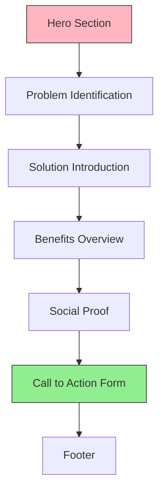
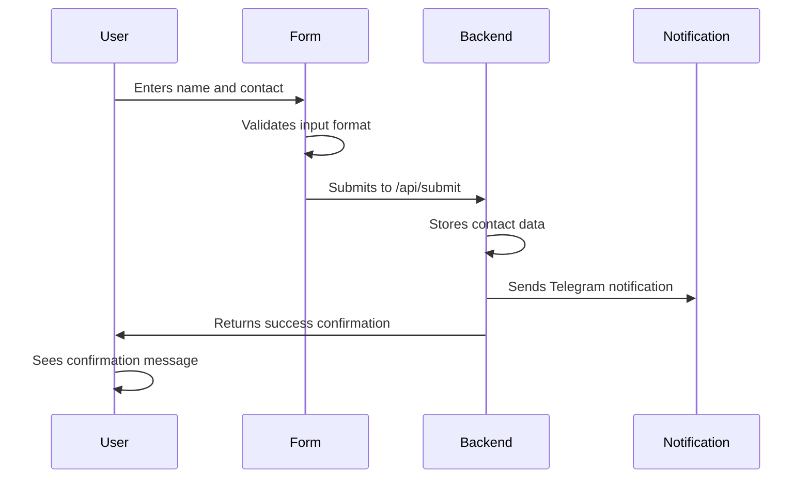
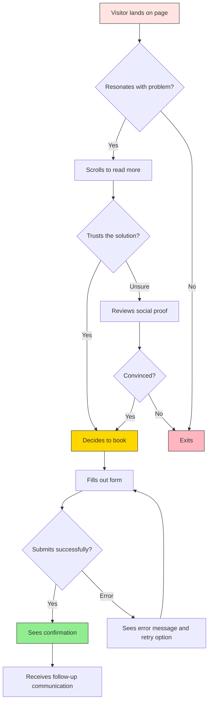

# Landing Page Design: Free Consultation Booking

## Overview

This document defines the strategic design for a single-page landing page focused on converting visitors into consultation bookings with Alena, an immigration adaptation coach for women. The landing page serves as the primary entry point for attracting potential clients who are experiencing challenges during their immigration journey and need professional coaching support.

**Target Audience**: Women who have recently immigrated to a new country and are experiencing various stages of adaptation (from "tourist stage" to "cultural fatigue").

**Primary Goal**: Convert visitors into qualified leads by collecting contact information and scheduling free 30-minute consultation sessions.

**Secondary Goal**: Establish trust and emotional connection with potential clients who may be experiencing vulnerability during their adaptation journey.

**Design System**: The landing page leverages shadcn/ui component library for consistent, accessible, and modern UI elements. This ensures rapid development, built-in accessibility features, and professional aesthetics aligned with contemporary web standards.

## shadcn/ui Component Strategy

The landing page utilizes shadcn/ui components to ensure consistency, accessibility, and modern design patterns. Each section of the landing page is built using specific shadcn components that provide both visual appeal and functional reliability.

### Component Mapping

| Page Section | Primary shadcn Components | Purpose |
|--------------|--------------------------|----------|
| Hero Section | Typography, Button | Display prominent heading and primary CTA |
| Problem Section | Card, Typography | Present pain points in visually distinct containers |
| Solution Section | Card, Avatar, Badge | Showcase Alena's profile and credentials |
| Benefits Section | Card, Separator | Display benefit categories in organized grid |
| Social Proof | Card, Avatar, Typography | Present testimonials with credibility |
| CTA Form | Form, Input, Label, Button, Toast | Collect user information with validation |
| Footer | Separator, Typography | Provide legal and contact information |

### Core Component Definitions

**Typography Component**
- Used for all text hierarchy (H1, H2, H3, body text)
- Provides consistent font sizing and spacing
- Ensures proper semantic HTML structure
- Applied throughout all sections for headings and paragraphs

**Card Component**
- Primary container for discrete content sections
- Includes built-in padding, borders, and shadow
- Used for pain points, benefits, testimonials
- Provides visual separation between content blocks

**Button Component**
- Primary and secondary CTA buttons
- Variants: default (primary), outline (secondary), ghost (tertiary)
- Sizes: default, large (for hero CTA)
- Includes hover states and loading indicators

**Form Component**
- Integrates with React Hook Form for validation
- Provides error handling and field state management
- Used for consultation booking form
- Includes built-in accessibility features

**Input Component**
- Text input fields for name and contact information
- Includes label association and error states
- Provides consistent styling across all form fields
- Supports placeholder text and validation messages

**Label Component**
- Accessible labels for form inputs
- Properly associates labels with input fields
- Includes required field indicators
- Ensures screen reader compatibility

**Toast Component**
- Success/error notifications after form submission
- Non-intrusive feedback mechanism
- Auto-dismissible with customizable duration
- Positioned at screen corner (top-right or bottom-right)

**Avatar Component**
- Display Alena's photo in solution section
- Used for testimonial client representations
- Includes fallback initials for loading states
- Circular or rounded square variants

**Badge Component**
- Highlight key credentials or certifications
- Display "Free Consultation" or "30 Minutes" labels
- Used for trust indicators and value propositions
- Color variants for different emphasis levels

**Separator Component**
- Visual dividers between major sections
- Provides breathing room in content flow
- Subtle styling that doesn't distract
- Used between footer and main content

### Component Composition Patterns

**Hero Section Composition**

The hero section combines Typography and Button components in a centered layout. The composition creates immediate visual impact with clear hierarchy:

- H1 Typography component for main headline
- H3 Typography component for supporting subheadline
- Large Button component for primary CTA
- Optional Badge component for "Limited Time" or "Free" indicator

**Problem Card Composition**

Each pain point is presented using Card components arranged in a responsive grid:

- Card container with hover effects
- Icon or emoji visual indicator (optional)
- Typography component for pain point description
- Subtle border and shadow for depth

**Benefits Grid Composition**

Benefit categories use Card components in a three-column layout (responsive to single column on mobile):

- Card with header and body sections
- Typography components for title and description
- Optional icon or visual element
- Consistent height across all cards

**Testimonial Card Composition**

Testimonial cards combine multiple components for credibility:

- Card container with subtle background
- Avatar component for client photo or initials
- Typography for testimonial quote
- Typography for client name and location
- Optional Badge for adaptation stage

**Form Composition**

The consultation form uses shadcn's Form component with React Hook Form integration:

- Form wrapper component for validation context
- Label components properly associated with inputs
- Input components for text entry
- Error message typography below invalid fields
- Button component for submission
- Toast component for post-submission feedback

### Form Validation Strategy

The Form component integrates with React Hook Form to provide real-time validation:

**Validation Rules**:

| Field | Validation Rules | Error Messages |
|-------|-----------------|----------------|
| Name | Required, minimum 2 characters, letters only | "Please enter your name" / "Name must be at least 2 characters" |
| Telegram/WhatsApp | Required, valid phone number or handle format | "Please enter your contact" / "Please enter a valid Telegram or WhatsApp contact" |

**Validation Display Strategy**:
- Validate on blur (when user leaves field)
- Show inline error messages below invalid fields
- Disable submit button until all fields are valid
- Display red border on invalid fields
- Show green checkmark on valid fields (optional)

### Accessibility Features

All shadcn/ui components include built-in accessibility features:

- **Keyboard Navigation**: All interactive elements accessible via Tab key
- **Screen Reader Support**: Proper ARIA labels and roles
- **Focus Indicators**: Visible focus rings on interactive elements
- **Color Contrast**: Meets WCAG AA standards for text and backgrounds
- **Form Accessibility**: Labels properly associated with inputs, error announcements
- **Semantic HTML**: Proper heading hierarchy, landmark regions

### Theme Configuration

The shadcn/ui theme should be customized to align with Alena's brand identity:

**Color Palette**:
- Primary color: Soft pink or warm rose (for CTAs and accents)
- Secondary color: Calming blue (for trust indicators)
- Neutral colors: Warm grays for text and backgrounds
- Success color: Soft green for form success states
- Error color: Gentle red for validation errors

**Typography Scale**:
- Font family: Friendly sans-serif (e.g., Inter, Poppins)
- Heading sizes: H1 (3rem), H2 (2rem), H3 (1.5rem)
- Body text: 1rem with 1.6 line height for readability
- Responsive scaling for mobile devices

**Spacing System**:
- Consistent spacing units (4px base)
- Section padding: 4rem desktop, 2rem mobile
- Card padding: 2rem desktop, 1.5rem mobile
- Form field spacing: 1.5rem between fields

### Responsive Behavior

All shadcn/ui components include responsive utilities:

**Mobile Adaptations**:
- Cards stack vertically on screens < 768px
- Button width expands to full width on mobile
- Font sizes scale down proportionally
- Padding and spacing reduce for smaller screens
- Form inputs expand to full width

**Tablet Adaptations**:
- Two-column grid for benefits cards
- Balanced spacing between elements
- Maintained readability and touch targets

**Desktop Enhancements**:
- Three-column grid for benefits
- Larger hero section with prominent CTA
- Enhanced hover states on interactive elements
- Fixed or sticky CTA option (secondary button)

## Page Architecture

The landing page follows a vertical scroll structure optimized for both mobile and desktop devices. The page is organized into distinct sections that guide the visitor through an emotional journey from problem awareness to action.

### Section Flow



### Visual Hierarchy Strategy

The page uses a warm, supportive color palette aligned with the existing quiz interface to maintain brand consistency. Primary colors include soft pinks, calming blues, and warm gradients that evoke feelings of safety and support.

**Typography Strategy**:
- Primary headings use warm, friendly sans-serif fonts
- Body text prioritizes readability with optimal line spacing
- Emphasis text uses contrasting colors to highlight key emotional benefits

## Content Sections

### Hero Section

**Purpose**: Immediately capture attention and establish emotional resonance with the visitor's current struggles.

**shadcn Component Usage**:
- Typography component for H1 headline (large, prominent)
- Typography component for H3 subheadline
- Button component (large variant) for primary CTA
- Optional Badge component for "Free" or "Limited Time" indicator

**Key Elements**:
- Typography H1 component with compelling headline addressing the core pain point
- Typography H3 component with subheadline offering immediate hope and solution
- Visual element (optional): supportive imagery or subtle animation
- Large Button component for primary CTA visible above the fold
- Optional Badge component above headline ("Free 30-Minute Consultation")

**Emotional Tone**: Empathetic, warm, non-judgmental

**Headline Strategy**: The headline should speak directly to feelings of isolation, overwhelm, or uncertainty that immigrant women commonly experience.

**Example Message Direction**: "Feeling Lost in Your New Country? You're Not Alone."

### Problem Identification Section

**Purpose**: Validate the visitor's struggles and demonstrate understanding of their specific challenges.

**shadcn Component Usage**:
- Card components arranged in responsive grid (2-3 columns desktop, 1 column mobile)
- Typography components for pain point descriptions
- Optional Badge components for stage indicators

**Content Structure**:
- Brief introduction acknowledging common adaptation challenges
- Grid of 4-6 Card components, each representing a specific pain point
- Emotional language that makes visitors feel seen and understood
- Hover effects on Card components for interactivity

**Pain Points to Address**:
- Emotional isolation despite being surrounded by people
- Physical symptoms of stress (fatigue, disrupted sleep)
- Career uncertainty and professional identity loss
- Difficulty forming meaningful social connections
- Feeling torn between old and new cultural identities
- Uncertainty about whether challenges are "normal"

### Solution Introduction Section

**Purpose**: Present Alena as the guide who understands the journey because she has experienced it herself.

**shadcn Component Usage**:
- Large Card component containing Alena's profile section
- Avatar component displaying Alena's photo (left-aligned or centered)
- Typography components for bio and credentials
- Badge components for certifications or key qualifications
- Button component for secondary CTA ("Learn More" or "See How I Can Help")

**Key Elements**:
- Avatar component with Alena's photo
- Brief introduction to Alena's background and expertise
- Badge components highlighting key credentials
- Emphasis on personal experience with immigration adaptation
- Overview of coaching approach and methodology
- Statement of understanding the four adaptation stages

**Trust Building Strategy**: Position Alena as both an expert and a fellow traveler who has successfully navigated the same challenges.

### Benefits Overview Section

**Purpose**: Clearly articulate what visitors will gain from working with Alena.

**shadcn Component Usage**:
- Three Card components arranged in responsive grid
- Typography components for benefit titles and descriptions
- Optional icons or visual elements within each Card
- Separator component between section header and cards

**Content Structure**: Three-column grid (stackable on mobile) presenting tangible and emotional benefits using Card components

**Benefit Categories**:

| Benefit Type | Description | Emotional Value |
|--------------|-------------|-----------------|
| Clarity | Understand which adaptation stage you're in and what to expect next | Reduces anxiety about the unknown |
| Personalized Strategy | Receive actionable steps tailored to your specific situation | Replaces overwhelm with direction |
| Supportive Partnership | Work with someone who genuinely understands your experience | Eliminates feelings of isolation |

### Social Proof Section

**Purpose**: Build credibility and reduce hesitation through testimonials and success indicators.

**shadcn Component Usage**:
- Multiple Card components for individual testimonials
- Avatar components for client photos or initials
- Typography components for quotes and client names
- Badge components for client adaptation stages
- Optional Carousel component if displaying multiple rotating testimonials

**Content Elements**:
- Card components containing client testimonials highlighting transformation stories
- Avatar components representing clients (with fallback initials)
- Statistics about clients served or successful adaptations
- Badge components for trust indicators (certifications, years of experience)

**Testimonial Structure**: Each testimonial should include:
- Client's stage of adaptation when they started
- Specific challenge they were facing
- Outcome or transformation achieved
- Client identifier (first name and origin country, or initials)

### Call to Action Form Section

**Purpose**: Capture lead information with minimal friction while collecting essential contact details.

**Form Design Strategy**:

The form should feel like a conversation starter rather than a bureaucratic barrier. The design emphasizes simplicity and emotional safety. Built using shadcn/ui Form, Input, Label, and Button components with React Hook Form integration.

**shadcn Component Usage**:
- Form component wrapper for validation context
- Label components for accessible field labels
- Input components for text entry fields
- Button component for form submission
- Toast component for success/error feedback

**Form Fields**:

| Field Name | Type | shadcn Component | Validation | Purpose |
|------------|------|-----------------|------------|---------|
| Name | Text input | Input + Label | Required, minimum 2 characters | Personalization and addressing the client |
| Telegram/WhatsApp | Text input | Input + Label | Required, phone number or handle format | Primary communication channel |

**Form Submission Flow**:



**Pre-form Messaging**: Brief text above the form emphasizing the value proposition:
- Free 30-minute consultation
- No obligation or commitment required
- Confidential and supportive environment
- Immediate scheduling confirmation

**Post-submission Behavior**: After successful submission, the user should see a confirmation message and automatic redirect to a thank you page or calendar booking interface.

**CTA Button Text Strategy**: The submit Button component should use action-oriented, benefit-focused language rather than generic "Submit" text.

Examples of effective CTA button text:
- "Book My Free Consultation"
- "Start My Adaptation Journey"
- "Get My Personalized Support"

**Button Component Configuration**:
- Variant: default (solid background)
- Size: large (for prominence)
- Loading state: enabled (shows spinner during submission)
- Full width on mobile devices
- Disabled state: active until form is valid

**Post-submission Toast Notification**:
Upon successful submission, a Toast component displays at the top-right corner with:
- Success variant (green background)
- Message: "Thank you! We'll contact you within 24 hours."
- Duration: 5 seconds before auto-dismiss
- Close button for manual dismissal

### Footer Section

**Purpose**: Provide additional trust signals and legal compliance information.

**shadcn Component Usage**:
- Separator component to divide footer from main content
- Typography components for legal text and links
- Optional Button components (ghost variant) for social media links

**Content Elements**:
- Separator component creating visual division
- Typography components for privacy statement or link to privacy policy
- Contact information for additional questions
- Social media links using ghost Button components or plain links
- Copyright and legal disclaimers in smaller Typography

## Integration Architecture

### Backend Integration

The landing page integrates with the existing Vercel serverless architecture used by the quiz system.

**API Endpoint Usage**:

| Endpoint | Purpose | Data Transmitted |
|----------|---------|------------------|
| /api/submit | Store consultation booking requests | Name, Telegram/WhatsApp contact, timestamp, source page identifier |
| Telegram API | Notify Alena of new booking request | Formatted message with lead details |

**Data Flow**:

```mermaid
graph LR
    A[Landing Form] --> B[/api/submit endpoint]
    B --> C[answers.json or database]
    B --> D[Telegram Notification]
    D --> E[Alena receives alert]
    B --> F[Confirmation to User]
    
    style A fill:#FFE4E1,stroke:#333
    style D fill:#DDA0DD,stroke:#333
    style F fill:#90EE90,stroke:#333
```

### Data Storage Strategy

Consultation requests should be stored with the following attributes:

- Timestamp of submission
- Visitor's name
- Contact method and identifier (Telegram/WhatsApp)
- Source page (landing vs. quiz)
- User agent and referrer (for analytics)
- Booking status (pending, contacted, scheduled, completed)

### Notification Strategy

When a new consultation request is submitted, an automated notification is sent via Telegram to Alena using the existing bot integration (Chat ID: 684726097).

**Notification Message Format**:
- Alert header identifying this as a consultation request
- Visitor's name
- Contact information provided
- Timestamp of submission
- Link to calendar for scheduling (if applicable)

## User Journey Flow

### Entry Points

Visitors may arrive at the landing page through multiple channels:

- Direct URL sharing in social media or messaging apps
- Completion of the adaptation stage quiz (post-results CTA)
- Organic search results
- Paid advertising campaigns
- Referrals from previous clients

### Conversion Flow



### Post-submission Experience

After successful form submission, the user should receive immediate feedback confirming their request has been received. The confirmation should include:

- Appreciation message thanking them for taking the step
- Reassurance that Alena will contact them within 24-48 hours
- What to expect in the consultation session
- Optional: Immediate access to calendar booking link
- Redirect to thank-you page after 3-5 seconds

## Responsive Design Strategy

The landing page must provide optimal experience across all device types, with mobile-first design principles.

### Breakpoint Strategy

| Device Category | Viewport Width | Layout Adjustments |
|-----------------|----------------|-------------------|
| Mobile | < 768px | Single column, stacked sections, full-width CTA |
| Tablet | 768px - 1024px | Two-column benefits grid, optimized imagery |
| Desktop | > 1024px | Full multi-column layout, enhanced visuals, fixed CTA sidebar option |

## Performance Requirements

### Loading Strategy

The landing page should load and become interactive within 2 seconds on 3G mobile connections. shadcn/ui components are optimized for performance with tree-shaking and minimal bundle size.

**Optimization Techniques**:
- Minimize CSS and JavaScript file sizes (shadcn components are individually importable)
- Lazy load images below the fold
- Use modern image formats (WebP with fallbacks)
- Inline critical CSS for above-the-fold content
- Defer non-critical JavaScript execution
- Load only required shadcn components (tree-shaking unused components)

**shadcn Performance Considerations**:
- Import only necessary components to reduce bundle size
- Use lightweight components (Button, Typography, Input) preferentially
- Optimize Card component rendering with React.memo if needed
- Lazy load Carousel component if used for testimonials
- Minimize custom styling overrides to leverage base component performance

### Analytics Integration

The page should track key conversion metrics to enable optimization:

**Events to Track**:
- Page views and unique visitors
- Scroll depth milestones (25%, 50%, 75%, 100%)
- Time spent on page
- Form field interactions (focus, blur, errors)
- Form submissions (successful and failed)
- CTA button clicks
- Exit points and bounce rate

## Accessibility Requirements

The landing page must be accessible to users with diverse abilities and assistive technologies. All shadcn/ui components include built-in accessibility features that comply with WCAG standards.

**Accessibility Standards**:
- WCAG 2.1 Level AA compliance (built into shadcn components)
- Proper heading hierarchy (H1, H2, H3) using Typography component
- Sufficient color contrast ratios (minimum 4.5:1) in theme configuration
- Keyboard navigation support (native to all shadcn interactive components)
- Screen reader compatible Form Labels (Label component properly associates with inputs)
- Alternative text for all imagery (including Avatar fallbacks)
- Focus indicators for interactive elements (visible focus rings on Button, Input, etc.)

**shadcn Component Accessibility Features**:
- Form components include proper ARIA labels and error announcements
- Button components support keyboard activation and focus management
- Input components have associated Label elements for screen readers
- Card components use semantic HTML with proper heading structure
- Toast notifications announce messages to screen readers
- All interactive elements meet minimum touch target size (44x44px)

## Testing Strategy

### Usability Testing

Before launch, the landing page design should be validated through:

- User testing with 5-10 individuals matching target audience profile
- A/B testing of different headline variations in Typography components
- Form completion rate analysis (tracking Input field interactions)
- Mobile device testing across iOS and Android (shadcn responsive behavior)
- Cross-browser compatibility verification (Chrome, Safari, Firefox, Edge)
- Keyboard-only navigation testing for accessibility
- Screen reader testing with NVDA/JAWS

### Component-Specific Testing

**Form Component Testing**:
- Validation message display and timing
- Error state styling and accessibility announcements
- Input field focus management and tab order
- Button loading states during submission
- Toast notification display and dismissal

**Card Component Testing**:
- Hover effects and animations
- Responsive stacking behavior on mobile
- Content overflow handling
- Touch interaction on mobile devices

**Button Component Testing**:
- Click/tap responsiveness
- Loading indicator during async operations
- Disabled state styling and cursor behavior
- Focus state visibility

### Conversion Optimization

Post-launch optimization should focus on:

- Analyzing form abandonment points (which Input field causes dropoff)
- Testing different CTA Button colors, sizes, and text variations
- Experimenting with form field order
- Testing with and without social proof Card section
- Evaluating impact of different visual elements in Card components
- A/B testing Badge component messaging ("Free" vs "No Commitment")
- Testing Typography hierarchy variations for headlines
- Analyzing Toast notification effectiveness for post-submission feedback

## Content Tone Guidelines

All written content on the landing page should adhere to consistent tone and voice guidelines:

**Voice Characteristics**:
- Warm and empathetic (not clinical or distant)
- Confident but not authoritative
- Personal but professional
- Encouraging without being pushy
- Culturally sensitive and inclusive

**Language Preferences**:
- Use "you" to directly address the visitor
- Favor simple, clear language over jargon
- Include emotional vocabulary that acknowledges feelings
- Avoid minimizing struggles ("it's not that bad")
- Emphasize partnership rather than expert-client dynamic

## Localization Considerations

The landing page should be designed with Russian language as the primary content language, based on the target audience (Russian-speaking immigrant women).

**Content Language**: Russian

**Cultural Adaptations**:
- Use culturally relevant examples and references
- Consider time zone differences for consultation scheduling
- Account for communication preferences (Telegram is preferred over other platforms in Russian-speaking communities)

## Security and Privacy

### Data Protection

All form submissions must be transmitted securely and stored in compliance with data protection regulations.

**Security Measures**:
- HTTPS encryption for all data transmission
- Secure storage of contact information
- No unnecessary data collection
- Clear privacy statement regarding data usage
- Option for users to request data deletion

### GDPR/Privacy Compliance

The landing page should include:
- Clear privacy policy link
- Consent checkbox for data processing (if legally required)
- Transparency about how contact information will be used
- Right to be forgotten mechanism

## Maintenance and Updates

### Content Update Strategy

The landing page should be designed to allow easy updates without technical knowledge:

- Testimonials can be added or rotated
- Statistics can be updated as business grows
- Headline and messaging can be A/B tested
- Seasonal or campaign-specific variations can be deployed

### Technical Maintenance

Regular technical maintenance should include:

- Monthly performance audits
- Quarterly security updates
- Analytics review and optimization recommendations
- Form submission testing
- Link integrity verification
