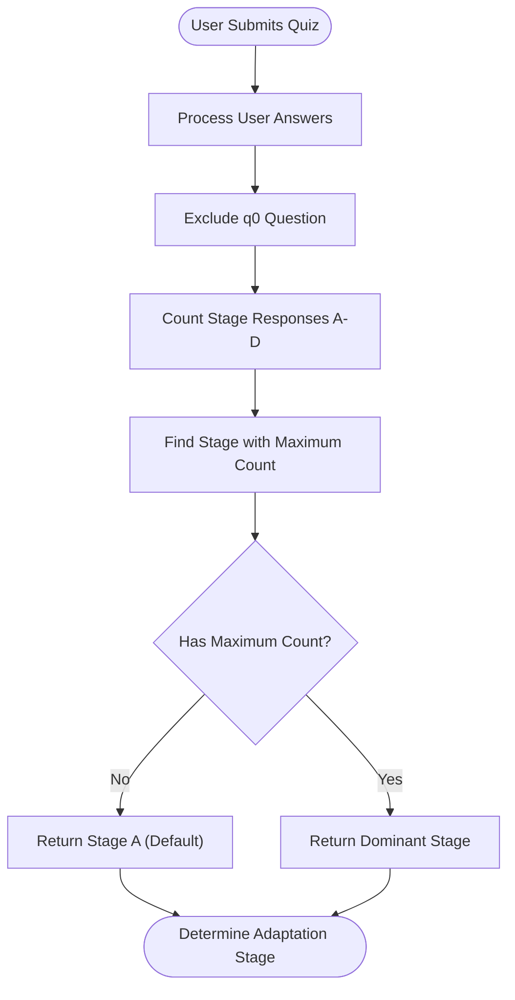
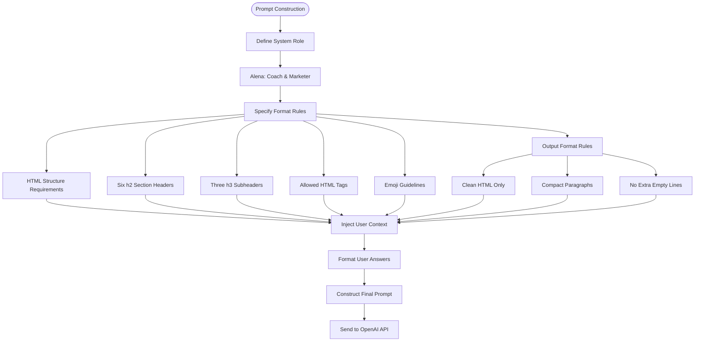
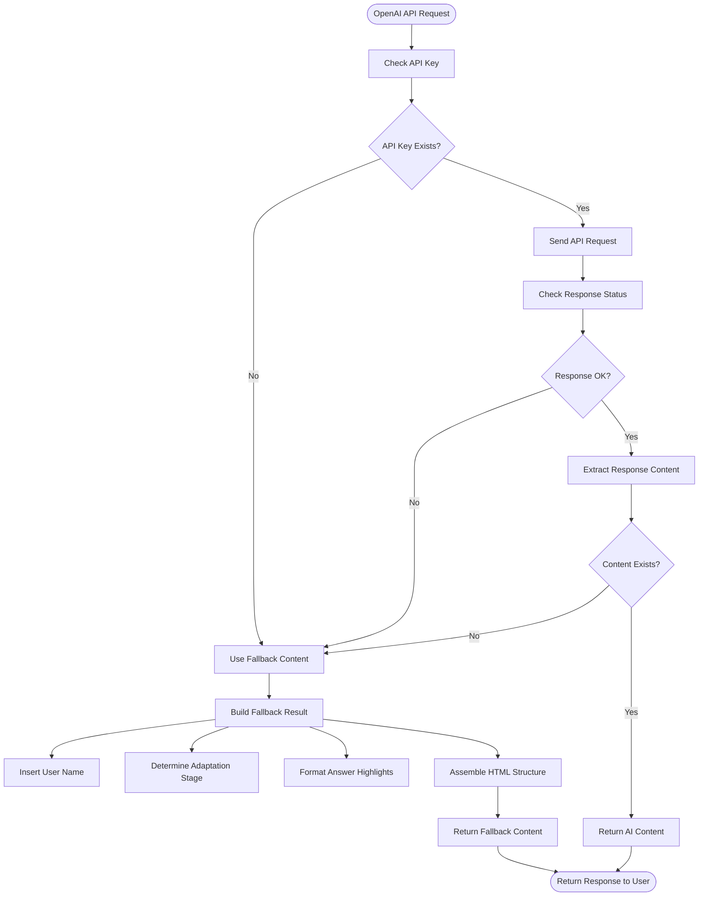

# AI Integration

<cite>
**Referenced Files in This Document**   
- [api/generate-result.js](file://api/generate-result.js)
- [agents.md](file://agents.md)
- [tests/openai-connection.test.js](file://tests/openai-connection.test.js)
</cite>

## Table of Contents
1. [OpenAI Integration Overview](#openai-integration-overview)
2. [Adaptation Stage Determination](#adaptation-stage-determination)
3. [Prompt Engineering Strategy](#prompt-engineering-strategy)
4. [Fallback Mechanism](#fallback-mechanism)
5. [Error Handling and Retry Logic](#error-handling-and-retry-logic)
6. [API Configuration and Authentication](#api-configuration-and-authentication)
7. [Agent Personas and Stage Mapping](#agent-personas-and-stage-mapping)
8. [Response Formatting and HTML Structure](#response-formatting-and-html-structure)
9. [Customization and Optimization](#customization-and-optimization)
10. [Testing and Validation](#testing-and-validation)

## OpenAI Integration Overview

The alena application integrates with the OpenAI API through the `generate-result.js` endpoint to provide personalized coaching advice based on user responses from a psychological adaptation quiz. The system analyzes user answers to determine their current psychological adaptation stage (A-D) and generates tailored guidance using the GPT-4o-mini model. The integration follows a robust pattern that prioritizes reliability by implementing a comprehensive fallback mechanism when the OpenAI service is unavailable.

The core workflow begins when a user completes the adaptation quiz, submitting their responses which are then processed by the generate-result endpoint. The system first determines the user's adaptation stage based on their answer patterns, then constructs a detailed prompt that includes the user's context, the coaching persona requirements, and specific formatting instructions. This prompt is sent to the OpenAI API, which returns personalized coaching content in HTML format that is directly rendered in the application interface.

**Section sources**
- [api/generate-result.js](file://api/generate-result.js#L0-L243)

## Adaptation Stage Determination

The system determines a user's psychological adaptation stage by analyzing their quiz responses through a counting algorithm that identifies the most frequently selected answer category. The quiz responses are categorized into four stages (A, B, C, D), each representing a different phase of psychological adaptation to a new environment. The `determineStage` function processes the user's answers, excluding the initial question (q0), and counts occurrences of each stage designation.

The algorithm identifies the stage with the highest response count as the primary adaptation stage. In cases where no answers are provided or there is no clear majority, the system defaults to stage A (Tourist phase). This stage determination is critical as it informs both the AI-generated content and the fallback responses, ensuring that users receive contextually appropriate guidance regardless of which content generation method is used.



**Diagram sources**
- [api/generate-result.js](file://api/generate-result.js#L2-L21)

**Section sources**
- [api/generate-result.js](file://api/generate-result.js#L2-L21)

## Prompt Engineering Strategy

The application employs a sophisticated prompt engineering strategy that combines system-level instructions with user-specific context to generate personalized coaching advice. The prompt construction follows a multi-layered approach that ensures consistent output format while allowing for personalization based on the user's name and specific responses.

The prompt begins with a clear role definition, establishing the AI's persona as "Alena, a professional coach and marketer who helps women in emigration." This is followed by detailed formatting requirements that specify the exact HTML structure, including six required sections with specific CSS classes (`<h2 class="section-title">`). The prompt mandates the use of supporting HTML elements (p, ul, li, strong, em) and encourages appropriate emoji usage while cautioning against overuse.

User context is injected into the prompt by formatting the quiz responses as a structured text block that presents each question and its corresponding answer. This contextual information allows the AI to provide personalized observations and recommendations based on the user's specific situation. The prompt also includes strict output requirements, such as returning only clean HTML without code block wrappers, using compact paragraphs, and avoiding unnecessary empty lines for a clean visual presentation.



**Diagram sources**
- [api/generate-result.js](file://api/generate-result.js#L150-L180)

**Section sources**
- [api/generate-result.js](file://api/generate-result.js#L150-L180)

## Fallback Mechanism

The application implements a comprehensive fallback mechanism that activates when the OpenAI API is unavailable or fails to generate a valid response. This ensures uninterrupted service and maintains user experience even during external service outages. The fallback system is designed to provide consistent, stage-appropriate content that mirrors the structure and tone of the AI-generated responses.

The fallback mechanism is triggered in three scenarios: when the OpenAI API key is not configured, when the API returns a non-successful response, or when the API response does not contain valid content. In each case, the system generates content using pre-written templates stored in the `fallbackContent` object within `generate-result.js`. These templates are organized by adaptation stage (A-D) and contain the same six-section structure as the AI-generated responses, ensuring visual and experiential consistency.

Each fallback template includes specific content fields such as title, current state description, focus areas, timeline guidance for 7/14/30 days, first step recommendations, general recommendations, and bonus suggestions. The system dynamically inserts the user's name and highlights their specific answer patterns to maintain a personalized feel. This approach ensures that users receive valuable guidance regardless of the content generation method, with only subtle differences in content depth and personalization between AI-generated and fallback responses.



**Diagram sources**
- [api/generate-result.js](file://api/generate-result.js#L182-L242)

**Section sources**
- [api/generate-result.js](file://api/generate-result.js#L98-L129)

## Error Handling and Retry Logic

The application implements a robust error handling strategy that gracefully manages various failure scenarios in the OpenAI API integration. Rather than propagating errors to the user, the system captures exceptions and seamlessly falls back to pre-written content, ensuring a consistent user experience regardless of external service reliability.

The error handling occurs at multiple levels: configuration validation, API response validation, and content validation. First, the system checks for the presence of the `OPENAI_API_KEY` environment variable before making any API requests. If the key is missing, the system immediately uses the fallback content without attempting an API call.

When an API request is made, the system validates the response status using the `ok` property of the fetch response. If the response indicates an error (non-200 status), the system logs the error details, including the response text, and activates the fallback mechanism. Similarly, if the API returns a successful status but the response body does not contain valid content in the expected structure (specifically, the message content within the choices array), the system treats this as a content generation failure and uses the fallback.

The implementation also includes comprehensive exception handling around the entire request process using a try-catch block. This captures any unexpected errors during JSON parsing, network issues, or other runtime exceptions. In the catch block, the system makes a best-effort attempt to parse the original request body to extract user data for the fallback content, ensuring that even in complete failure scenarios, personalized fallback content can be generated.

Notably, the current implementation does not include retry logic for failed API requests, opting instead for immediate fallback to ensure quick response times. This design prioritizes user experience over maximizing AI content delivery, recognizing that timely guidance is more valuable than delayed AI-generated content.

**Section sources**
- [api/generate-result.js](file://api/generate-result.js#L211-L242)

## API Configuration and Authentication

The OpenAI API integration is configured with specific parameters that balance content quality, response length, and cost efficiency. The system uses the GPT-4o-mini model, specified by the `MODEL` constant, which provides a good balance between performance and cost for the coaching content generation use case.

Authentication is handled through the `OPENAI_API_KEY` environment variable, following security best practices by avoiding hard-coded credentials. The API key is included in the Authorization header of the fetch request using the Bearer token scheme. This approach keeps sensitive credentials out of the source code and allows for easy configuration across different deployment environments.

The API request includes several configuration parameters in the request body:
- `temperature: 0.8` - This setting introduces moderate creativity and variation in the responses while maintaining coherence and relevance to the coaching context
- `max_tokens: 800` - This limits the response length to ensure concise, focused coaching advice that fits well within the application interface
- The model parameter specifying 'gpt-4o-mini' for cost-effective performance

The system makes direct HTTP requests to the OpenAI API endpoint using the native fetch function, avoiding additional dependencies. The request includes proper content-type headers and structured the request body as JSON with the required messages array containing both system and user roles. This direct approach minimizes dependencies and potential points of failure in the integration.

**Section sources**
- [api/generate-result.js](file://api/generate-result.js#L188-L209)

## Agent Personas and Stage Mapping

The application maps user responses to four distinct psychological adaptation stages (A-D), each with a corresponding agent persona that reflects a different phase of the emigration journey. These stages are represented by descriptive titles with evocative emojis that communicate the emotional state and challenges of each phase.

Stage A (Tourist phase) is represented by the "✈️ Стадия 1. Туристка — «Пока всё ново и интересно»" persona, characterized by novelty and excitement with underlying tension. This stage focuses on energy management and establishing basic routines to navigate the initial adaptation period.

Stage B (Immersion phase) is represented by the "🌊 Стадия 2. Погружение — «Всё идёт, но не так легко»" persona, reflecting deeper engagement with the new environment and the emotional challenges that arise. This stage emphasizes emotional normalization and the importance of seeking support.

Stage C (Fatigue phase) is represented by the "🌑 Стадия 3. Усталость — «Живу, но не чувствую себя живой»" persona, acknowledging the exhaustion that can come after sustained adaptation efforts. This stage focuses on resource restoration and reconnecting with personal interests.

Stage D (New Self phase) is represented by the "🌅 Стадия 4. Новая версия себя — «Живу, но хочу большего смысла и лёгкости»" persona, indicating a stable adaptation and the desire to build a more meaningful life in the new environment. This stage encourages moving from obligation to desire and expanding personal horizons.

Each persona includes specific content elements that address the unique challenges of that stage, including current state descriptions, focus areas, timeline guidance, first steps, recommendations, and bonus suggestions. This structured approach ensures that users receive targeted, stage-appropriate guidance that evolves with their adaptation journey.

**Section sources**
- [api/generate-result.js](file://api/generate-result.js#L22-L96)

## Response Formatting and HTML Structure

The system enforces a strict HTML structure for both AI-generated and fallback responses to ensure consistent presentation and styling across the application. The response format follows a six-section template with specific HTML elements and CSS classes that are directly rendered in the frontend interface.

The required structure includes:
- Six `<h2>` headings with the exact class `section-title` for: "Где вы сейчас", "Что сейчас важно", "Через 7/14/30 дней", "Первый шаг", "Рекомендация", and "Бонус"
- Within the timeline section, three `<h3>` subheadings for "Через 7 дней", "Через 14 дней", and "Через 30 дней"
- Use of semantic HTML elements including `<p>`, `<ul>`, `<li>`, `<strong>`, and `<em>` for proper content formatting
- Strategic emoji placement to enhance emotional resonance without overwhelming the text
- Compact paragraphs without unnecessary empty lines for clean visual presentation

The AI prompt explicitly requires the model to return only clean HTML without any additional wrappers like `<html>` tags or code block delimiters (````html````). This ensures that the response can be directly injected into the DOM without additional processing. The fallback mechanism replicates this exact structure using template literals, ensuring pixel-perfect consistency between AI-generated and fallback content.

User-specific personalization is achieved through name insertion and response highlighting. The user's name is safely escaped and inserted in the opening paragraph, while their specific answer patterns are extracted and displayed in a bulleted list under the "Твои ответы подсказали, куда смотреть внимательнее:" section, providing personalized feedback that reinforces the relevance of the coaching advice.

**Section sources**
- [api/generate-result.js](file://api/generate-result.js#L98-L129)

## Customization and Optimization

The AI integration provides several configuration points for customization and optimization to balance content quality, user experience, and operational costs. The primary customization parameters are exposed through the API request configuration, allowing adjustments without code changes.

The temperature parameter (currently set to 0.8) controls the creativity and randomness of the AI responses. A higher temperature would produce more diverse and creative responses, while a lower temperature would generate more predictable and focused content. This parameter can be adjusted based on user feedback and the desired balance between novelty and reliability in coaching advice.

The max_tokens parameter (currently set to 800) limits the response length, which directly impacts both the comprehensiveness of the advice and the API cost. Increasing this value would allow for more detailed guidance, while decreasing it would produce more concise responses and reduce costs. This parameter should be optimized based on user engagement metrics and the effectiveness of the coaching content.

The model selection (currently gpt-4o-mini) represents a strategic choice between performance and cost. The application could be configured to use different models based on availability, cost considerations, or quality requirements. The system architecture supports model swapping with minimal code changes, as the model is defined as a constant at the top of the file.

For API cost management, the application could implement response caching to avoid redundant API calls for identical or similar user response patterns. While not currently implemented, this would significantly reduce costs for frequently occurring adaptation stage patterns. Additionally, rate limiting could be implemented to prevent abuse, though the current design relies on Vercel's platform-level protections.

**Section sources**
- [api/generate-result.js](file://api/generate-result.js#L206-L207)

## Testing and Validation

The application includes a dedicated test file for validating the OpenAI API connectivity and basic functionality. The test suite, located in `openai-connection.test.js`, verifies that the application can successfully communicate with the OpenAI API when properly configured.

The test checks for the presence of the `OPENAI_API_KEY` environment variable and attempts to make a minimal API call using the gpt-4o-mini model with a simple "ping" input. The test expects a valid response object with defined output text, confirming that the API integration is functional. This connectivity test serves as a basic health check for the AI integration, helping to identify configuration issues before they affect users.

The test implementation uses the OpenAI SDK to create a client instance and make the API call, demonstrating the expected usage pattern. However, the production code uses direct fetch requests instead of the SDK, suggesting that the test may not perfectly mirror the production integration method. This discrepancy should be addressed to ensure the test accurately reflects the production behavior.

The testing strategy focuses on connectivity rather than content quality, which is appropriate for an integration test. Content quality and prompt effectiveness would require different testing approaches, such as manual review or more sophisticated automated checks of response relevance and structure.

**Section sources**
- [tests/openai-connection.test.js](file://tests/openai-connection.test.js#L0-L16)