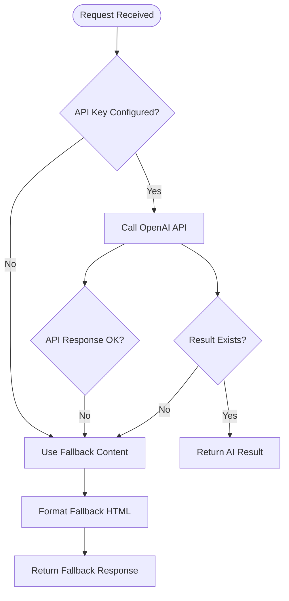
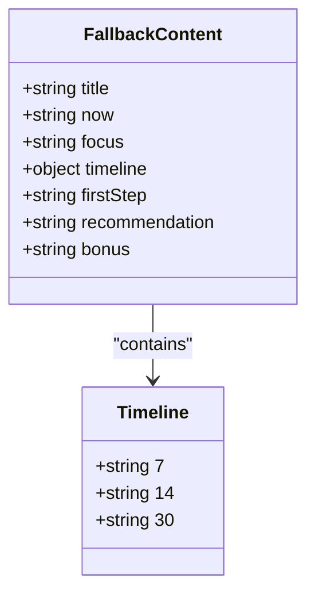
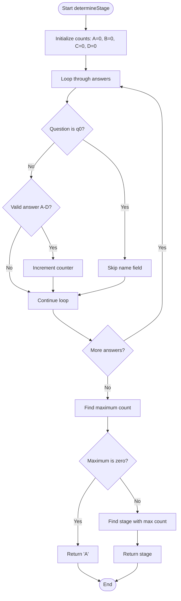
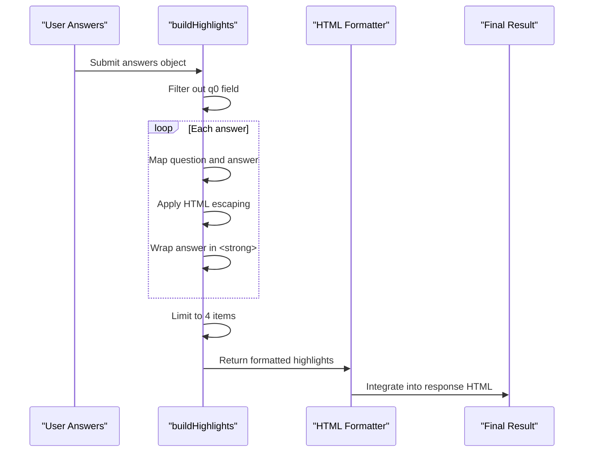

# Fallback Mechanism

<cite>
**Referenced Files in This Document**   
- [generate-result.js](file://api/generate-result.js)
- [agents.md](file://agents.md)
</cite>

## Table of Contents
1. [Introduction](#introduction)
2. [Fallback Trigger Conditions](#fallback-trigger-conditions)
3. [Fallback Content Structure](#fallback-content-structure)
4. [Stage Determination Logic](#stage-determination-logic)
5. [Response Highlighting Mechanism](#response-highlighting-mechanism)
6. [HTML Formatting and Structure](#html-formatting-and-structure)
7. [Deployment and Quality Assurance Guidance](#deployment-and-quality-assurance-guidance)
8. [Customization and Visual Consistency](#customization-and-visual-consistency)

## Introduction
The alena application implements a robust fallback mechanism to ensure users receive meaningful coaching advice even when the OpenAI API is unavailable or returns an error. This system activates when the primary AI generation process fails due to missing API credentials, non-OK responses, empty results, or exceptions during execution. The fallback mechanism provides structured, pre-written content tailored to the user's adaptation stage (A-D), maintaining the same visual format as AI-generated responses to ensure a seamless user experience.

**Section sources**
- [generate-result.js](file://api/generate-result.js#L178-L242)

## Fallback Trigger Conditions
The fallback mechanism activates under four specific conditions within the generate-result.js handler:
1. **Missing API Key**: When the OPENAI_API_KEY environment variable is not configured
2. **Non-OK API Response**: When the OpenAI API returns an error status
3. **Empty Result**: When the API response contains no valid content
4. **Exception Handling**: When any error occurs during the request processing

The system gracefully degrades to the fallback content in all these scenarios, ensuring users always receive a response. The fallback is triggered at multiple points in the request lifecycle, with appropriate warning flags included in the response to indicate the fallback status.



**Diagram sources**
- [generate-result.js](file://api/generate-result.js#L178-L242)

**Section sources**
- [generate-result.js](file://api/generate-result.js#L178-L242)

## Fallback Content Structure
The fallbackContent object contains comprehensive coaching advice for each of the four adaptation stages (A-D). Each stage includes the following structured elements:

- **title**: Stage identifier with emoji and descriptive name
- **now**: Current state description providing empathetic context
- **focus**: Key focus areas for the user's current situation
- **timeline**: Time-based recommendations for 7, 14, and 30 days
- **firstStep**: Immediate actionable step to take
- **recommendation**: Primary recommendation for ongoing progress
- **bonus**: Additional bonus suggestion for enhanced support

This structure mirrors the AI-generated response format exactly, ensuring visual and organizational consistency regardless of whether the content is AI-generated or served from the fallback system.



**Diagram sources**
- [generate-result.js](file://api/generate-result.js#L23-L76)

**Section sources**
- [generate-result.js](file://api/generate-result.js#L23-L76)

## Stage Determination Logic
The determineStage function calculates the user's adaptation stage based on their answer distribution across the four possible responses (A, B, C, D). The algorithm works as follows:

1. Initialize counters for each stage (A-D) to zero
2. Iterate through all user answers, excluding the name field (q0)
3. Increment the counter for each answer type (A, B, C, or D)
4. Find the maximum count among all stages
5. Return the stage with the highest count, defaulting to 'A' if no answers are present or if there's a tie

This simple yet effective voting mechanism identifies the dominant pattern in the user's responses, providing a reasonable approximation of their current adaptation stage when AI analysis is unavailable.



**Diagram sources**
- [generate-result.js](file://api/generate-result.js#L2-L21)

**Section sources**
- [generate-result.js](file://api/generate-result.js#L2-L21)

## Response Highlighting Mechanism
The buildHighlights function processes user responses to create highlighted excerpts that appear in the fallback result. This function:

1. Filters out the name field (q0) from the answers
2. Maps each answer to a formatted string containing the question text and selected answer
3. Applies HTML escaping to prevent injection vulnerabilities
4. Wraps the answer portion in strong tags for visual emphasis
5. Limits the output to the first four responses
6. Returns an HTML-formatted list of the most relevant answer pairs

These highlights provide context for the coaching advice by showing which specific responses influenced the stage determination, creating a more personalized feel even in the fallback scenario.



**Diagram sources**
- [generate-result.js](file://api/generate-result.js#L87-L96)

**Section sources**
- [generate-result.js](file://api/generate-result.js#L87-L96)

## HTML Formatting and Structure
The fallback response uses identical HTML formatting to the AI-generated responses, ensuring complete visual consistency. The buildFallbackResult function generates HTML with the following structure:

- **h2.section-title**: Section headers with exact CSS classes matching AI output
- **p**: Paragraph elements for all descriptive content
- **strong**: Emphasis on key terms and stage titles
- **ul/li**: Unordered lists for highlighted responses
- **h3**: Subheadings for timeline recommendations

The HTML structure follows the same six-section format as AI-generated responses: "Where You Are Now", "What's Important Now", "7/14/30 Days Timeline", "First Step", "Recommendation", and "Bonus". This mirroring of structure ensures users cannot distinguish between AI-generated and fallback content based on presentation alone.

```mermaid
flowchart TD
Start([buildFallbackResult]) --> DetermineStage[determineStage(answers)]
DetermineStage --> GetContent[Get fallbackContent for stage]
GetContent --> EscapeName[Escape user name]
EscapeName --> BuildHighlights[buildHighlights()]
BuildHighlights --> FormatHTML[Format HTML template]
FormatHTML --> ReturnHTML[Return complete HTML]
subgraph HTML Structure
FormatHTML --> H2_1["<h2 class='section-title'>Where You Are Now</h2>"]
H2_1 --> P_1["<p><strong>Stage Title</strong></p>"]
P_1 --> P_2["<p>Name, current state description</p>"]
P_2 --> H2_2["<h2 class='section-title'>What's Important Now</h2>"]
H2_2 --> P_3["<p>Focus areas</p>"]
P_3 --> Highlights{Highlights exist?}
Highlights --> |Yes| UL["<ul><li>Question — <strong>Answer</strong></li></ul>"]
Highlights --> |No| Timeline
UL --> Timeline["<h2 class='section-title'>7/14/30 Days</h2>"]
Timeline --> H3_1["<h3>7 Days</h3>"]
H3_1 --> P_4["<p>7-day recommendation</p>"]
P_4 --> H3_2["<h3>14 Days</h3>"]
H3_2 --> P_5["<p>14-day recommendation</p>"]
P_5 --> H3_3["<h3>30 Days</h3>"]
H3_3 --> P_6["<p>30-day recommendation</p>"]
P_6 --> H2_3["<h2 class='section-title'>First Step</h2>"]
H2_3 --> P_7["<p>First step advice</p>"]
P_7 --> H2_4["<h2 class='section-title'>Recommendation</h2>"]
H2_4 --> P_8["<p>Main recommendation</p>"]
P_8 --> H2_5["<h2 class='section-title'>Bonus</h2>"]
H2_5 --> P_9["<p>Bonus suggestion</p>"]
end
```

**Diagram sources**
- [generate-result.js](file://api/generate-result.js#L108-L145)

**Section sources**
- [generate-result.js](file://api/generate-result.js#L108-L145)

## Deployment and Quality Assurance Guidance
The agents.md file provides deployment and quality assurance guidance for the application, despite not containing agent personas as initially expected. The document outlines three critical post-deployment steps:

1. **Deployment Verification**: Wait for Vercel deployment to complete after pushing to GitHub and address any deployment errors
2. **Automated Testing**: Test the solution using Playwright MCP before submission
3. **Response Quality Check**: Verify the personalization response for code cleanliness, emoji usage, visualization, and line height to prevent vertical stretching

These guidelines ensure that the fallback mechanism and overall application maintain high quality standards in production. The emphasis on visual consistency and response formatting directly supports the fallback system's goal of providing a seamless user experience regardless of content origin.

**Section sources**
- [agents.md](file://agents.md#L1-L3)

## Customization and Visual Consistency
To maintain visual consistency between AI-generated and fallback responses, developers should ensure that any modifications to the response format are applied to both systems simultaneously. When customizing fallback content:

1. Preserve the exact HTML structure and CSS classes
2. Maintain the six-section format with identical headings
3. Use similar tone, length, and complexity in writing
4. Include appropriate emojis that match the AI-generated style
5. Ensure proper HTML escaping of all user-generated content
6. Test both AI and fallback flows to verify consistent presentation

The escapeHtml utility function protects against XSS attacks by encoding special characters, and should be used for all dynamic content insertion. By following these guidelines, the fallback system provides a reliable, high-quality user experience that is indistinguishable from the AI-powered primary flow.

**Section sources**
- [generate-result.js](file://api/generate-result.js#L78-L85)
- [generate-result.js](file://api/generate-result.js#L108-L145)