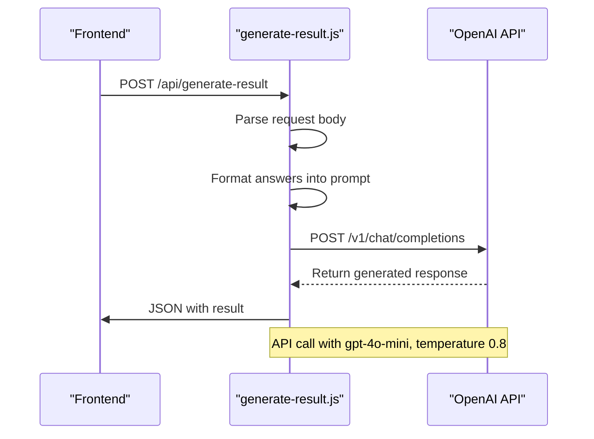
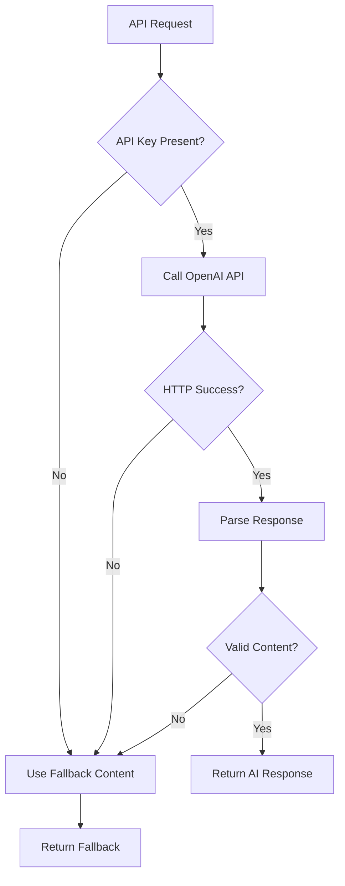

# OpenAI Configuration

<cite>
**Referenced Files in This Document**   
- [generate-result.js](file://api/generate-result.js)
- [openai-connection.test.js](file://tests/openai-connection.test.js)
- [package.json](file://package.json)
</cite>

## Table of Contents
1. [Introduction](#introduction)
2. [Configuration Overview](#configuration-overview)
3. [API Request Structure](#api-request-structure)
4. [Error Handling and Fallback Strategy](#error-handling-and-fallback-strategy)
5. [Security Considerations](#security-considerations)
6. [Performance and Reliability](#performance-and-reliability)
7. [Testing and Validation](#testing-and-validation)
8. [Modification and Customization](#modification-and-customization)
9. [Conclusion](#conclusion)

## Introduction

The alena application integrates with the OpenAI API to generate personalized coaching responses for users based on their quiz answers. This documentation details the configuration and implementation of the OpenAI integration within the `generate-result.js` API endpoint. The system is designed to provide empathetic, structured guidance to women navigating immigration, using the GPT-4o-mini model to generate HTML-formatted coaching content. The integration includes robust error handling with a fallback mechanism to ensure service continuity even when the OpenAI API is unavailable.

## Configuration Overview

The OpenAI integration is configured through environment variables and hardcoded parameters within the `generate-result.js` file. The primary configuration elements include model selection, authentication, and request parameters.

### Model Selection

The application uses the `gpt-4o-mini` model for generating responses. This model is specified as a constant at the top of the `generate-result.js` file:

```javascript
const MODEL = 'gpt-4o-mini';
```

This model choice balances cost efficiency with performance, providing high-quality responses suitable for the coaching context.

### Authentication

Authentication to the OpenAI API is managed through the `OPENAI_API_KEY` environment variable. The application checks for the presence of this variable before making API calls:

```javascript
if (!process.env.OPENAI_API_KEY) {
    // Fallback logic
}
```

If the API key is not present, the system activates its fallback content generation mechanism, ensuring that users still receive meaningful responses.

### Request Parameters

The API request includes several key parameters that control the behavior of the language model:

- **Temperature**: Set to `0.8`, this parameter controls the randomness of the output. A value of 0.8 provides a balance between creativity and coherence, allowing for personalized, engaging responses while maintaining relevance to the coaching context.
- **Max Tokens**: Set to `800`, this parameter limits the length of the generated response, ensuring that outputs are comprehensive but not excessively long.

These parameters are configured within the request body when calling the OpenAI API.

**Section sources**
- [generate-result.js](file://api/generate-result.js#L0-L21)
- [generate-result.js](file://api/generate-result.js#L206-L207)

## API Request Structure

The API request to OpenAI is structured to provide clear context and formatting instructions to the language model, ensuring consistent and usable output.

### System and User Messages

The request uses a two-message structure with distinct roles:

1. **System Message**: Provides the AI with its role and behavioral guidelines:
   ```
   "Ты эмпатичный коуч и маркетолог, который помогает женщинам в эмиграции. Пиши структурировано, с лёгкими эмодзи и вдохновляющими формулировками, но без клише."
   ```

2. **User Message**: Contains the formatted prompt with user data and specific formatting requirements.

### Prompt Construction

The prompt is dynamically constructed from user responses, with answers formatted as question-answer pairs. The prompt includes strict formatting requirements:

- Responses must be in HTML format
- Specific CSS classes (`section-title`) must be used for headings
- Six content sections are required with exact titles
- Emoji can be used sparingly for emotional tone
- Output must be clean HTML without code block wrappers

User responses are injected into the prompt after being formatted from the JSON input, preserving the original question texts and answer labels.



**Diagram sources**
- [generate-result.js](file://api/generate-result.js#L178-L209)

**Section sources**
- [generate-result.js](file://api/generate-result.js#L178-L209)

## Error Handling and Fallback Strategy

The application implements a comprehensive error handling strategy to maintain reliability despite potential API failures.

### HTTP Status Checks

The system checks the `ok` property of the OpenAI response to determine if the request was successful:

```javascript
if (!openaiResponse.ok) {
    const errorText = await openaiResponse.text();
    console.error('OpenAI API error:', errorText);
    // Activate fallback
}
```

This check captures HTTP errors such as 429 (rate limiting), 500 (server errors), or 401 (authentication issues).

### Response Parsing and Validation

After a successful HTTP response, the system parses the JSON and validates that a meaningful response was generated:

```javascript
const result = data?.choices?.[0]?.message?.content?.trim();
if (!result) {
    // Activate fallback
}
```

This prevents empty or malformed responses from being returned to users.

### Fallback Mechanism

The application features a sophisticated fallback mechanism that activates under three conditions:

1. Missing OpenAI API key
2. Failed API request (HTTP error)
3. Empty or invalid response from OpenAI

When activated, the fallback system generates coaching content based on a rule-based algorithm that analyzes the user's answer patterns to determine their adaptation stage (A, B, C, or D). The content is pre-defined in the `fallbackContent` object and formatted using the same HTML structure as the AI-generated responses.



**Diagram sources**
- [generate-result.js](file://api/generate-result.js#L211-L242)

**Section sources**
- [generate-result.js](file://api/generate-result.js#L211-L242)

## Security Considerations

The OpenAI integration incorporates several security measures to protect sensitive information.

### API Key Management

The API key is stored in an environment variable (`OPENAI_API_KEY`), which prevents it from being exposed in the source code. This follows the principle of separation between code and configuration, reducing the risk of accidental exposure.

The test file confirms that the API key is required for testing, indicating that the development environment also treats the key as sensitive:

```javascript
if (!apiKey) {
    throw new Error('OPENAI_API_KEY is not set for the test environment');
}
```

### Input Sanitization

The application includes input sanitization to prevent XSS attacks in the generated HTML. The `escapeHtml` function is used to sanitize user-provided names and content:

```javascript
function escapeHtml(value = '') {
    return value
        .replace(/&/g, '&amp;')
        .replace(/</g, '&lt;')
        .replace(/>/g, '&gt;')
        .replace(/"/g, '&quot;')
        .replace(/'/g, '&#39;');
}
```

This ensures that any HTML metacharacters in user input are properly escaped before being included in the response.

**Section sources**
- [generate-result.js](file://api/generate-result.js#L120-L127)
- [openai-connection.test.js](file://tests/openai-connection.test.js#L5-L8)

## Performance and Reliability

The integration is designed with performance and reliability in mind, though some aspects could be enhanced.

### Current Implementation

The current implementation uses a direct fetch call to the OpenAI API without explicit timeout or retry handling. While this keeps the code simple, it may lead to long response times if the OpenAI API is slow to respond.

The request is made with standard fetch options, relying on default browser or server timeout values.

### Potential Improvements

For improved reliability, the system could benefit from:

- **Timeout handling**: Implementing a timeout for the OpenAI API call to prevent hanging requests
- **Retry logic**: Adding retry attempts with exponential backoff for transient failures
- **Caching**: Implementing response caching for identical user answer patterns to reduce API calls and costs

The max_tokens parameter (800) helps control response length and associated costs, contributing to predictable performance.

**Section sources**
- [generate-result.js](file://api/generate-result.js#L188-L209)

## Testing and Validation

The application includes testing to validate the OpenAI integration.

### Integration Test

The `openai-connection.test.js` file contains a test that verifies connectivity to the OpenAI API:

```javascript
describe('OpenAI connectivity', () => {
  it('responds to a minimal ping', async () => {
    // Test implementation
  });
});
```

This test checks that the API key is available and that the OpenAI service responds to requests. It uses the same `gpt-4o-mini` model as the production code, ensuring consistency between test and production environments.

### Dependencies

The package.json file shows that the application depends on the OpenAI npm package:

```json
"dependencies": {
    "openai": "^4.104.0"
}
```

This official SDK provides a reliable interface to the OpenAI API, though the application currently uses the fetch API directly rather than the SDK for the main request.

**Section sources**
- [openai-connection.test.js](file://tests/openai-connection.test.js#L0-L17)
- [package.json](file://package.json#L6-L8)

## Modification and Customization

The OpenAI configuration can be modified to suit different requirements.

### Changing Configuration Values

To modify the API configuration:

1. **Model**: Change the `MODEL` constant to use a different OpenAI model (e.g., 'gpt-4-turbo' or 'gpt-3.5-turbo')
2. **Temperature**: Adjust the temperature value to make responses more deterministic (lower values) or more creative (higher values)
3. **Max Tokens**: Increase or decrease the max_tokens value to control response length
4. **System Message**: Update the system message to change the AI's behavior, tone, or expertise

### Testing Changes Safely

When modifying the configuration:

1. Update the integration test to reflect any model changes
2. Test with a variety of input scenarios to ensure the output meets quality standards
3. Monitor API usage and costs, as different models have different pricing
4. Verify that the fallback mechanism still works correctly
5. Check that the HTML output remains valid and properly formatted

Changes should be tested in a staging environment before deployment to production.

**Section sources**
- [generate-result.js](file://api/generate-result.js#L0-L21)
- [generate-result.js](file://api/generate-result.js#L206-L207)
- [openai-connection.test.js](file://tests/openai-connection.test.js#L0-L17)

## Conclusion

The OpenAI integration in the alena application provides a sophisticated coaching experience by leveraging the gpt-4o-mini model to generate personalized responses. The system is well-structured with clear separation between AI-generated content and fallback mechanisms, ensuring reliability even when the external API is unavailable. Security is maintained through proper API key management and input sanitization. While the current implementation lacks explicit timeout and retry handling, the overall design is robust and maintainable. The configuration is straightforward to modify, allowing for adaptation to different models or requirements as needed.