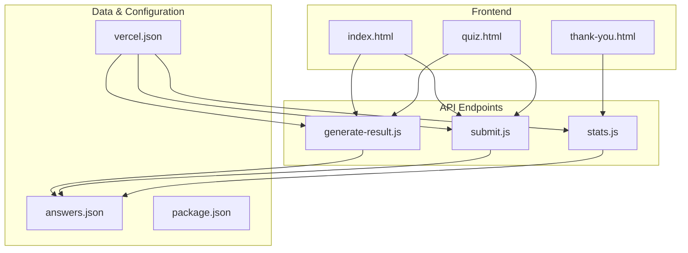
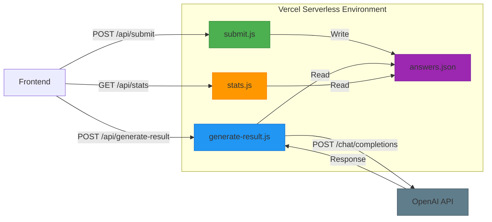
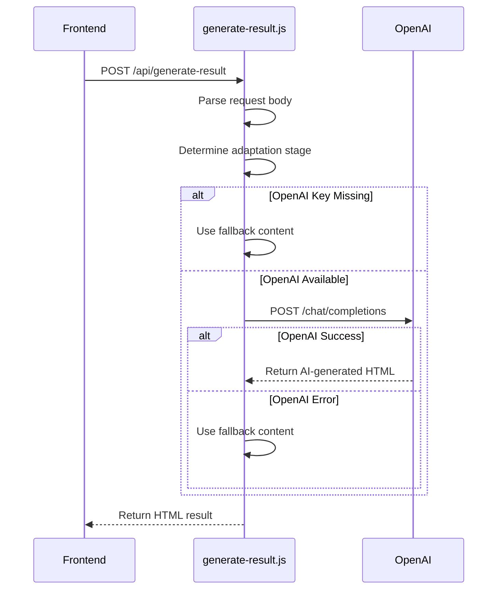
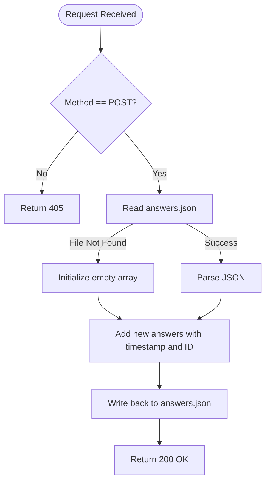
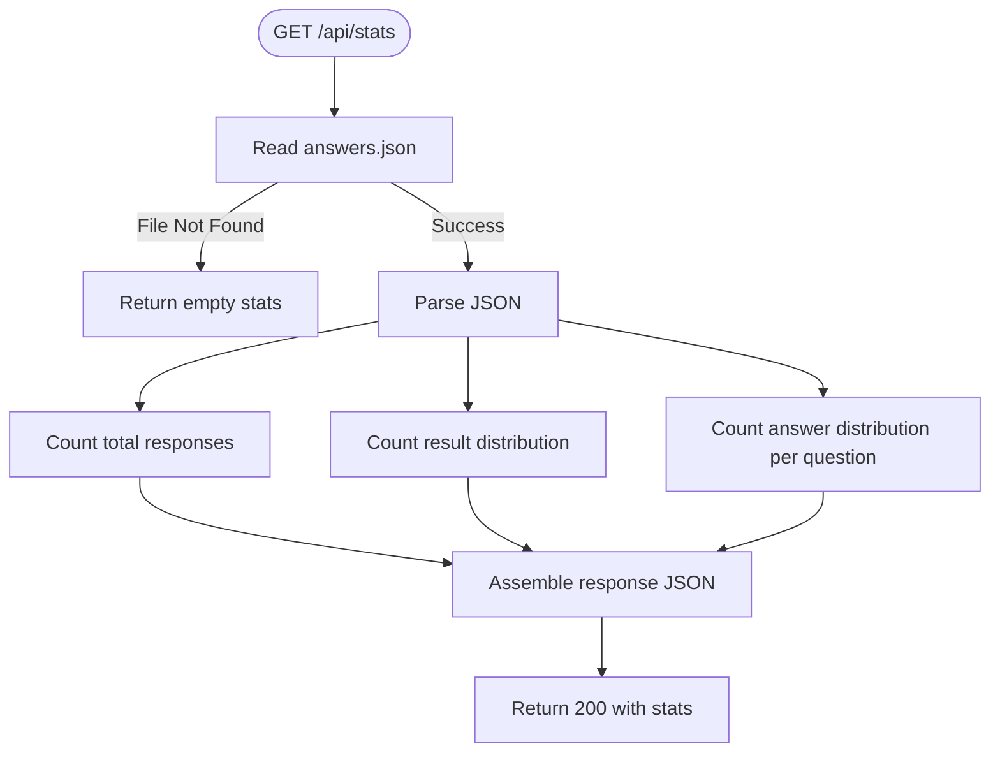
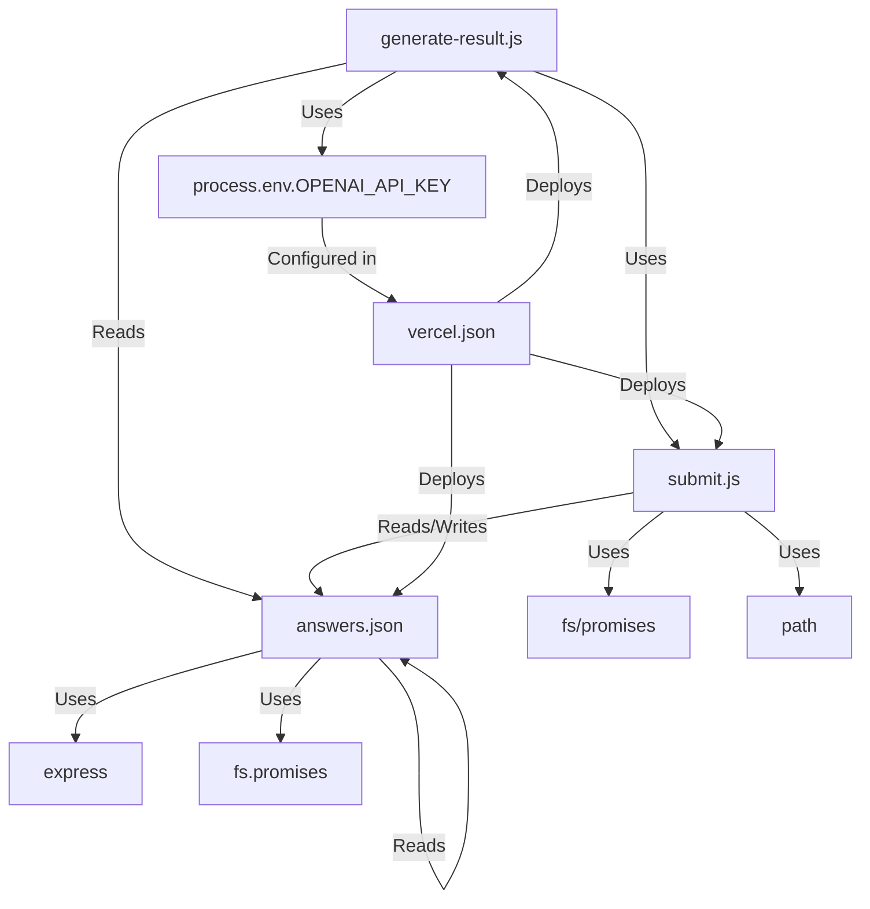

# Backend Architecture

<cite>
**Referenced Files in This Document**   
- [generate-result.js](file://api/generate-result.js)
- [submit.js](file://api/submit.js)
- [stats.js](file://api/stats.js)
- [answers.json](file://answers.json)
- [vercel.json](file://vercel.json)
- [package.json](file://package.json)
</cite>

## Table of Contents
1. [Introduction](#introduction)
2. [Project Structure](#project-structure)
3. [Core Components](#core-components)
4. [Architecture Overview](#architecture-overview)
5. [Detailed Component Analysis](#detailed-component-analysis)
6. [Dependency Analysis](#dependency-analysis)
7. [Performance Considerations](#performance-considerations)
8. [Troubleshooting Guide](#troubleshooting-guide)
9. [Conclusion](#conclusion)

## Introduction
This document provides comprehensive architectural documentation for the backend serverless functions in the Alena application. The system is built on Vercel's serverless infrastructure and consists of three primary API endpoints: `generate-result.js`, `submit.js`, and `stats.js`. These functions support a psychological assessment quiz designed to help women in migration identify their adaptation stage and receive personalized guidance.

The backend follows a stateless, event-driven model typical of serverless architectures, with request-response patterns, CORS handling, and JSON payloads. Data persistence is implemented via a file-based system using `answers.json`, and AI-powered feedback generation is orchestrated through OpenAI's API with fallback logic. This documentation details the data flow, execution model, error resilience, and scalability characteristics of the system.

## Project Structure

**Diagram sources**
- [api/generate-result.js](file://api/generate-result.js)
- [api/submit.js](file://api/submit.js)
- [api/stats.js](file://api/stats.js)
- [answers.json](file://answers.json)
- [vercel.json](file://vercel.json)

**Section sources**
- [api/generate-result.js](file://api/generate-result.js)
- [api/submit.js](file://api/submit.js)
- [api/stats.js](file://api/stats.js)
- [answers.json](file://answers.json)
- [vercel.json](file://vercel.json)

## Core Components

The backend consists of three serverless functions deployed on Vercel:

- **generate-result.js**: AI-powered feedback generator that analyzes user responses and returns personalized HTML content via OpenAI, with fallback logic.
- **submit.js**: Handles persistence of user quiz answers to `answers.json` with timestamp and unique ID.
- **stats.js**: Provides analytics on response distribution and adaptation stages across all users.

All functions implement CORS headers to allow cross-origin requests from the frontend, and follow a stateless execution model where each invocation is independent and ephemeral.

**Section sources**
- [api/generate-result.js](file://api/generate-result.js)
- [api/submit.js](file://api/submit.js)
- [api/stats.js](file://api/stats.js)

## Architecture Overview

**Diagram sources**
- [api/generate-result.js](file://api/generate-result.js)
- [api/submit.js](file://api/submit.js)
- [api/stats.js](file://api/stats.js)
- [answers.json](file://answers.json)

## Detailed Component Analysis

### generate-result.js Analysis

This function generates personalized feedback using OpenAI's GPT-4o-mini model based on user answers. It implements a robust fallback mechanism in case of API unavailability.

**Diagram sources**
- [api/generate-result.js](file://api/generate-result.js#L131-L242)

**Section sources**
- [api/generate-result.js](file://api/generate-result.js)

### submit.js Analysis

Handles the persistence of user answers to a JSON file, adding metadata such as timestamp and unique ID.

**Diagram sources**
- [api/submit.js](file://api/submit.js#L4-L62)

**Section sources**
- [api/submit.js](file://api/submit.js)

### stats.js Analysis

Provides analytical insights by aggregating data from all stored responses.

**Diagram sources**
- [api/stats.js](file://api/stats.js)

**Section sources**
- [api/stats.js](file://api/stats.js)

## Dependency Analysis

**Diagram sources**
- [api/generate-result.js](file://api/generate-result.js)
- [api/submit.js](file://api/submit.js)
- [api/stats.js](file://api/stats.js)
- [answers.json](file://answers.json)
- [vercel.json](file://vercel.json)

**Section sources**
- [api/generate-result.js](file://api/generate-result.js)
- [api/submit.js](file://api/submit.js)
- [api/stats.js](file://api/stats.js)
- [vercel.json](file://vercel.json)

## Performance Considerations

The serverless architecture introduces cold start latency, particularly for `generate-result.js` which must initialize the OpenAI request pipeline. The file-based persistence in `answers.json` presents scalability limitations as concurrent writes may cause race conditions without proper locking mechanisms.

The system is stateless, ensuring horizontal scalability, but file I/O operations on Vercel's ephemeral filesystem may impact performance under high load. The fallback content in `generate-result.js` ensures availability even when OpenAI API is unreachable, improving resilience.

Data aggregation in `stats.js` loads the entire `answers.json` into memory, which may become problematic as the dataset grows. Pagination or database integration would be recommended for long-term scalability.

**Section sources**
- [api/generate-result.js](file://api/generate-result.js)
- [api/submit.js](file://api/submit.js)
- [api/stats.js](file://api/stats.js)
- [answers.json](file://answers.json)

## Troubleshooting Guide

Common issues and their resolutions:

- **OpenAI API failures**: The system automatically falls back to predefined content. Ensure `OPENAI_API_KEY` is set in Vercel environment variables.
- **File write conflicts**: Concurrent submissions may overwrite data. Implement atomic writes or consider a database.
- **CORS errors**: All endpoints set `Access-Control-Allow-Origin: *`, but verify frontend origin matches.
- **Empty responses**: Check request payload structure; must include `name` and `answers` fields.
- **Stats not updating**: Verify `answers.json` is being written correctly by `submit.js`.

**Section sources**
- [api/generate-result.js](file://api/generate-result.js)
- [api/submit.js](file://api/submit.js)
- [api/stats.js](file://api/stats.js)

## Conclusion

The Alena application employs a clean, serverless backend architecture on Vercel with three well-defined functions handling feedback generation, data persistence, and analytics. The system demonstrates thoughtful error handling with fallback content and proper CORS configuration. While the file-based storage is simple and effective for low-to-medium traffic, it presents concurrency and scalability challenges that should be addressed in future iterations. The integration with OpenAI enables personalized user experiences, and the modular function design supports maintainability and independent deployment.