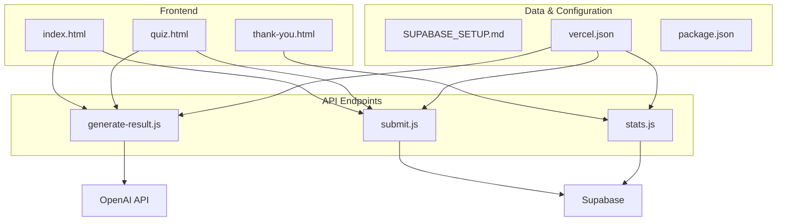
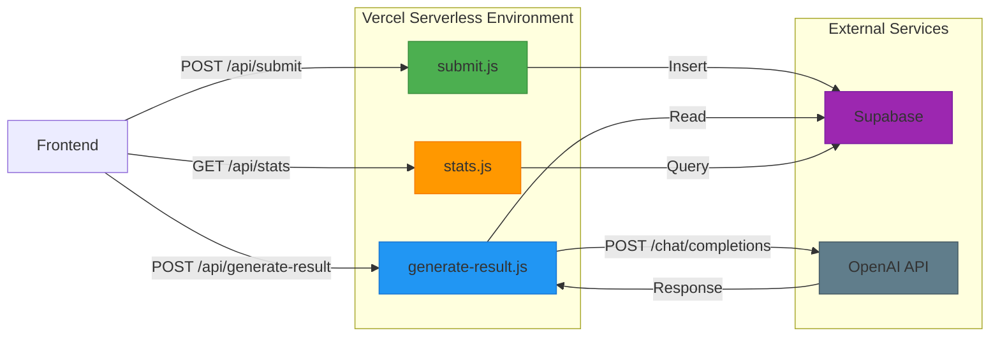
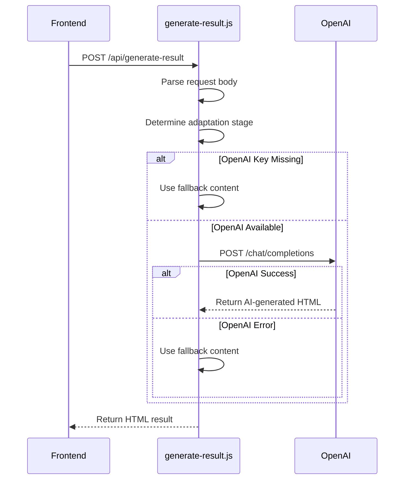
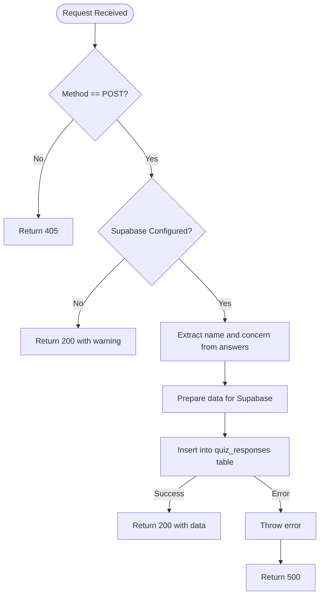
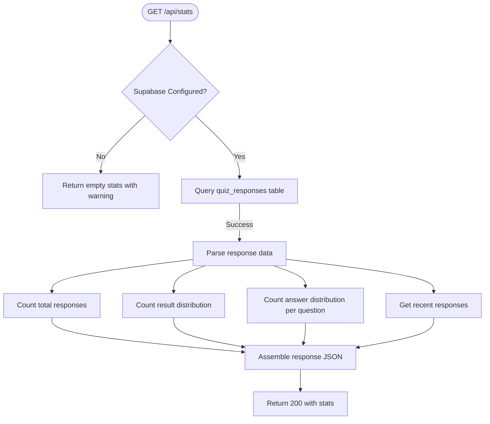

# Backend Architecture

<cite>
**Referenced Files in This Document**   
- [generate-result.js](file://api/generate-result.js)
- [submit.js](file://api/submit.js) - *Updated for Supabase integration*
- [stats.js](file://api/stats.js) - *Updated for Supabase integration*
- [SUPABASE_SETUP.md](file://SUPABASE_SETUP.md) - *Added in recent commit*
- [vercel.json](file://vercel.json)
- [package.json](file://package.json)
</cite>

## Update Summary
**Changes Made**   
- Updated documentation to reflect migration from file-based storage to Supabase cloud database
- Modified architecture diagrams and data flow descriptions to show Supabase integration
- Updated section analyses for submit.js and stats.js to reflect new database implementation
- Added Supabase setup and configuration details
- Removed outdated information about answers.json file storage
- Enhanced source tracking with annotations for updated files

## Table of Contents
1. [Introduction](#introduction)
2. [Project Structure](#project-structure)
3. [Core Components](#core-components)
4. [Architecture Overview](#architecture-overview)
5. [Detailed Component Analysis](#detailed-component-analysis)
6. [Dependency Analysis](#dependency-analysis)
7. [Performance Considerations](#performance-considerations)
8. [Troubleshooting Guide](#troubleshooting-guide)
9. [Conclusion](#conclusion)

## Introduction
This document provides comprehensive architectural documentation for the backend serverless functions in the Alena application. The system is built on Vercel's serverless infrastructure and consists of three primary API endpoints: `generate-result.js`, `submit.js`, and `stats.js`. These functions support a psychological assessment quiz designed to help women in migration identify their adaptation stage and receive personalized guidance.

The backend follows a stateless, event-driven model typical of serverless architectures, with request-response patterns, CORS handling, and JSON payloads. Data persistence has been migrated from file-based storage to Supabase cloud database, providing improved scalability and reliability. AI-powered feedback generation is orchestrated through OpenAI's API with fallback logic. This documentation details the data flow, execution model, error resilience, and scalability characteristics of the system.

## Project Structure



**Diagram sources**
- [api/generate-result.js](file://api/generate-result.js)
- [api/submit.js](file://api/submit.js)
- [api/stats.js](file://api/stats.js)
- [SUPABASE_SETUP.md](file://SUPABASE_SETUP.md)
- [vercel.json](file://vercel.json)

**Section sources**
- [api/generate-result.js](file://api/generate-result.js)
- [api/submit.js](file://api/submit.js)
- [api/stats.js](file://api/stats.js)
- [SUPABASE_SETUP.md](file://SUPABASE_SETUP.md)
- [vercel.json](file://vercel.json)

## Core Components

The backend consists of three serverless functions deployed on Vercel:

- **generate-result.js**: AI-powered feedback generator that analyzes user responses and returns personalized HTML content via OpenAI, with fallback logic.
- **submit.js**: Handles persistence of user quiz answers to Supabase cloud database with timestamp and unique ID.
- **stats.js**: Provides analytics on response distribution and adaptation stages across all users by querying Supabase.

All functions implement CORS headers to allow cross-origin requests from the frontend, and follow a stateless execution model where each invocation is independent and ephemeral.

**Section sources**
- [api/generate-result.js](file://api/generate-result.js)
- [api/submit.js](file://api/submit.js)
- [api/stats.js](file://api/stats.js)

## Architecture Overview



**Diagram sources**
- [api/generate-result.js](file://api/generate-result.js)
- [api/submit.js](file://api/submit.js)
- [api/stats.js](file://api/stats.js)
- [SUPABASE_SETUP.md](file://SUPABASE_SETUP.md)

## Detailed Component Analysis

### generate-result.js Analysis

This function generates personalized feedback using OpenAI's GPT-4o-mini model based on user answers. It implements a robust fallback mechanism in case of API unavailability.



**Diagram sources**
- [api/generate-result.js](file://api/generate-result.js#L131-L242)

**Section sources**
- [api/generate-result.js](file://api/generate-result.js)

### submit.js Analysis

Handles the persistence of user answers to Supabase cloud database, adding metadata such as timestamp and unique ID.



**Diagram sources**
- [api/submit.js](file://api/submit.js#L4-L78) - *Updated for Supabase*

**Section sources**
- [api/submit.js](file://api/submit.js) - *Updated for Supabase integration*

### stats.js Analysis

Provides analytical insights by aggregating data from all stored responses in Supabase.



**Diagram sources**
- [api/stats.js](file://api/stats.js) - *Updated for Supabase*

**Section sources**
- [api/stats.js](file://api/stats.js) - *Updated for Supabase integration*

## Dependency Analysis

```mermaid
graph TD
A[generate-result.js] --> |Uses| B[OpenAI API]
A --> |Uses| C[process.env.OPENAI_API_KEY]
B[submit.js] --> |Uses| D[Supabase]
B --> |Uses| E[process.env.SUPABASE_URL]
B --> |Uses| F[process.env.SUPABASE_ANON_KEY]
C[stats.js] --> |Uses| D[Supabase]
C --> |Uses| E[process.env.SUPABASE_URL]
C --> |Uses| F[process.env.SUPABASE_ANON_KEY]
D[Supabase] --> |Configured via| G[SUPABASE_SETUP.md]
G --> |Deploys| B
G --> |Deploys| C
H[package.json] --> |Includes| I[@supabase/supabase-js]
I --> |Used by| B
I --> |Used by| C
```

**Diagram sources**
- [api/generate-result.js](file://api/generate-result.js)
- [api/submit.js](file://api/submit.js)
- [api/stats.js](file://api/stats.js)
- [SUPABASE_SETUP.md](file://SUPABASE_SETUP.md)
- [package.json](file://package.json)

**Section sources**
- [api/generate-result.js](file://api/generate-result.js)
- [api/submit.js](file://api/submit.js)
- [api/stats.js](file://api/stats.js)
- [SUPABASE_SETUP.md](file://SUPABASE_SETUP.md)
- [package.json](file://package.json)

## Performance Considerations

The serverless architecture introduces cold start latency, particularly for `generate-result.js` which must initialize the OpenAI request pipeline. The migration from file-based persistence to Supabase cloud database has resolved scalability limitations and eliminated race conditions associated with concurrent writes.

The system is stateless, ensuring horizontal scalability. The Supabase integration provides reliable data persistence with proper indexing and Row Level Security. The fallback content in `generate-result.js` ensures availability even when OpenAI API is unreachable, improving resilience.

Data aggregation in `stats.js` now queries Supabase directly, which can handle larger datasets efficiently through proper indexing. The implementation includes safeguards for when Supabase credentials are not configured, returning appropriate warnings.

**Section sources**
- [api/generate-result.js](file://api/generate-result.js)
- [api/submit.js](file://api/submit.js)
- [api/stats.js](file://api/stats.js)
- [SUPABASE_SETUP.md](file://SUPABASE_SETUP.md)

## Troubleshooting Guide

Common issues and their resolutions:

- **Supabase credentials not found**: Ensure `SUPABASE_URL` and `SUPABASE_ANON_KEY` are set in Vercel environment variables.
- **Supabase table not found**: Execute the SQL script in Supabase SQL Editor to create the `quiz_responses` table.
- **CORS errors**: All endpoints set `Access-Control-Allow-Origin: *`, but verify frontend origin matches.
- **Empty responses**: Check request payload structure; must include `name` and `answers` fields.
- **Stats not updating**: Verify Supabase configuration and check that `submit.js` is successfully inserting records.

**Section sources**
- [api/submit.js](file://api/submit.js)
- [api/stats.js](file://api/stats.js)
- [SUPABASE_SETUP.md](file://SUPABASE_SETUP.md)

## Conclusion

The Alena application employs a clean, serverless backend architecture on Vercel with three well-defined functions handling feedback generation, data persistence, and analytics. The system demonstrates thoughtful error handling with fallback content and proper CORS configuration. The migration from file-based storage to Supabase cloud database significantly improves scalability, reliability, and data integrity. The integration with OpenAI enables personalized user experiences, and the modular function design supports maintainability and independent deployment. Future enhancements could include more sophisticated analytics and enhanced security measures.