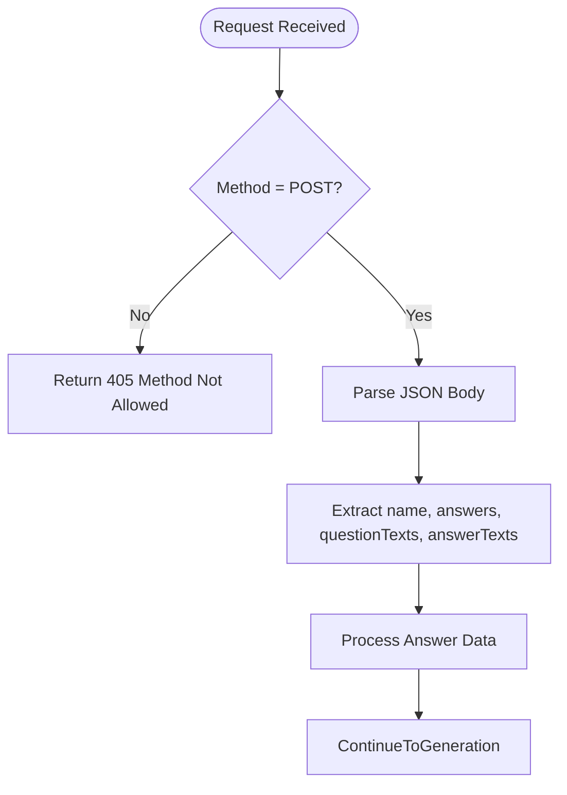
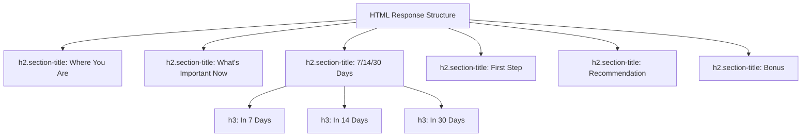
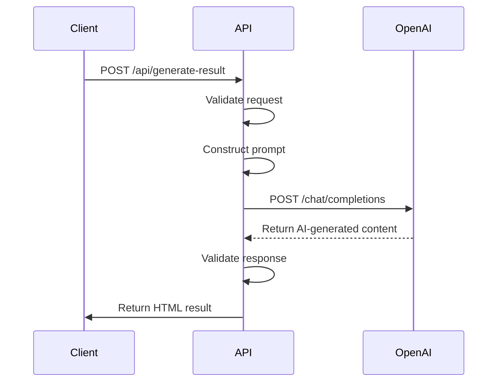
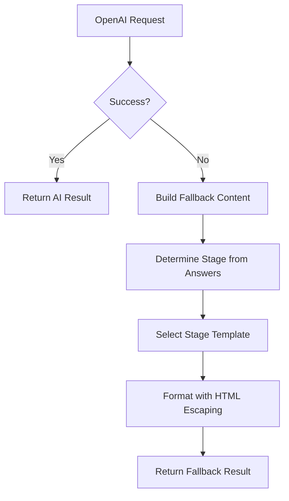
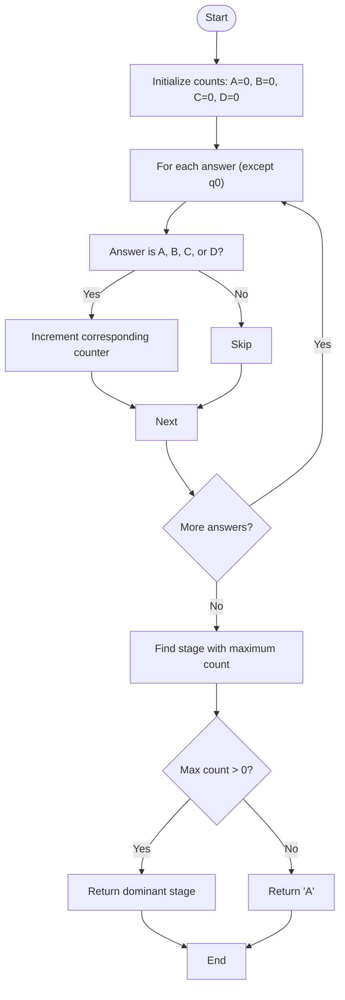
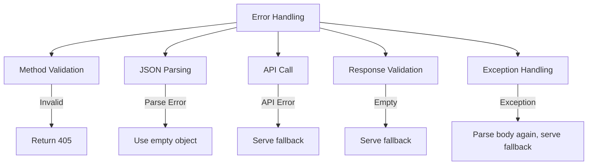

# Generate Result API

<cite>
**Referenced Files in This Document**   
- [generate-result.js](file://api/generate-result.js)
- [answers.json](file://answers.json)
- [README.md](file://README.md)
</cite>

## Table of Contents
1. [Introduction](#introduction)
2. [Request Structure](#request-structure)
3. [Response Format](#response-format)
4. [AI Integration](#ai-integration)
5. [Fallback Mechanism](#fallback-mechanism)
6. [Stage Determination Algorithm](#stage-determination-algorithm)
7. [Error Handling](#error-handling)
8. [Security and Configuration](#security-and-configuration)
9. [Example Requests and Responses](#example-requests-and-responses)
10. [Performance and Rate Limiting](#performance-and-rate-limiting)

## Introduction
The `/api/generate-result` endpoint is a POST API that generates personalized coaching feedback for users based on their quiz responses. The system analyzes user answers to determine their adaptation stage and provides tailored guidance. The API supports both AI-powered content generation using OpenAI's GPT-4o-mini model and a robust fallback mechanism for scenarios where AI services are unavailable. This documentation details the complete functionality, implementation, and usage patterns of this endpoint.

**Section sources**
- [generate-result.js](file://api/generate-result.js#L1-L242)

## Request Structure
The API accepts POST requests with a JSON payload containing user information and quiz responses. The request body must include four key fields:

- `name` (string): The user's name for personalized addressing
- `answers` (object): Key-value pairs mapping question IDs to selected answers
- `questionTexts` (object): Mapping of question IDs to their full text
- `answerTexts` (object): Nested mapping of question IDs to answer option labels

The endpoint validates the request method and parses JSON input with error recovery. Question ID "q0" is excluded from processing as it serves as a special case in the quiz logic.



**Diagram sources**
- [generate-result.js](file://api/generate-result.js#L150-L155)

**Section sources**
- [generate-result.js](file://api/generate-result.js#L145-L155)

## Response Format
The API returns JSON responses with a `result` field containing HTML content. The HTML follows a strict structure with specific CSS classes for styling:

- `<h2 class="section-title">` for section headers
- Standard HTML elements: `p`, `h3`, `ul`, `li`, `strong`, `em`
- Emojis are used sparingly for visual enhancement
- Content is properly HTML-escaped to prevent XSS

The response includes six structured sections: current state, key focus areas, 7/14/30 day timeline, first step, recommendation, and bonus. When fallback content is used, a `warning` field may be included indicating the reason (fallback, empty, or exception).



**Diagram sources**
- [generate-result.js](file://api/generate-result.js#L80-L120)

**Section sources**
- [generate-result.js](file://api/generate-result.js#L80-L120)

## AI Integration
The API integrates with OpenAI's GPT-4o-mini model to generate personalized coaching content. The integration uses the following configuration:

- **Model**: gpt-4o-mini
- **Temperature**: 0.8 (for creative but focused responses)
- **Max Tokens**: 800
- **System Prompt**: "You are an empathetic coach and marketer who helps women in immigration. Write structured content with light emojis and inspiring formulations, but without clichés."
- **User Prompt**: Includes user name, formatted answers, and detailed formatting instructions

The API constructs a prompt that instructs the AI to follow a specific HTML structure with exact CSS classes and content organization. The system ensures proper error handling for API failures and validates the response before returning it to the client.



**Diagram sources**
- [generate-result.js](file://api/generate-result.js#L188-L209)

**Section sources**
- [generate-result.js](file://api/generate-result.js#L180-L210)

## Fallback Mechanism
The API implements a comprehensive fallback mechanism that activates when:

1. OpenAI API key is missing from environment variables
2. OpenAI service returns an error response
3. AI generates an empty or invalid response
4. An exception occurs during processing

The fallback system uses pre-written content templates for four adaptation stages (A, B, C, D). Each stage includes structured guidance with title, current state description, focus areas, timeline recommendations, first step, general recommendation, and bonus suggestion. The fallback content is localized in Russian and includes emojis for visual engagement.



**Diagram sources**
- [generate-result.js](file://api/generate-result.js#L165-L185)

**Section sources**
- [generate-result.js](file://api/generate-result.js#L160-L185)

## Stage Determination Algorithm
The system determines the user's adaptation stage by analyzing answer patterns. The algorithm:

1. Initializes counters for each stage (A, B, C, D)
2. Iterates through all answers (excluding q0)
3. Increments the counter for each answered stage
4. Identifies the stage with the maximum count
5. Returns 'A' as default if no answers are provided

The algorithm handles edge cases such as empty responses and ensures a valid stage is always returned. The stage determination is used both for AI prompting context and for selecting the appropriate fallback template.



**Diagram sources**
- [generate-result.js](file://api/generate-result.js#L1-L20)

**Section sources**
- [generate-result.js](file://api/generate-result.js#L1-L20)

## Error Handling
The API implements comprehensive error handling for various failure scenarios:

- **Method validation**: Returns 405 for non-POST requests
- **JSON parsing**: Attempts to parse request body with try-catch recovery
- **OpenAI API failures**: Catches network and service errors, logs details
- **Empty AI responses**: Validates that AI returned content before use
- **Exception handling**: Catches all unexpected errors and serves fallback

The error handling strategy prioritizes user experience by ensuring a response is always returned, even when errors occur. When fallback content is served due to errors, a `warning` field indicates the reason (fallback, empty, or exception).



**Section sources**
- [generate-result.js](file://api/generate-result.js#L145-L242)

## Security and Configuration
The API implements several security and configuration features:

- **CORS**: Configured to allow all origins (*) with comprehensive header support
- **HTML escaping**: All user-provided content is escaped using `escapeHtml()` function
- **Environment variables**: OpenAI API key is securely stored in environment
- **Input validation**: Request structure is validated before processing

The CORS configuration allows credentials and supports all major HTTP methods. The HTML escaping prevents XSS attacks by converting special characters to HTML entities. The system follows security best practices by not exposing sensitive information in error messages.

```mermaid
flowchart TD
A["Security Features"] --> B["CORS Configuration"]
A --> C["HTML Escaping"]
A --> D["Environment Secrets"]
A --> E["Input Validation"]
B --> F["Access-Control-Allow-Origin: *"]
B --> G["Supports POST, OPTIONS, etc."]
C --> H["escapeHtml() function"]
C --> I["Converts &, <, >, \", '"]
D --> J["OPENAI_API_KEY in env"]
E --> K["Validate JSON structure"]
```

**Diagram sources**
- [generate-result.js](file://api/generate-result.js#L130-L140)

**Section sources**
- [generate-result.js](file://api/generate-result.js#L130-L140)

## Example Requests and Responses
### AI-Generated Scenario
**Request:**
```json
{
  "name": "Anna",
  "answers": {"q1": "A", "q2": "B", "q3": "A"},
  "questionTexts": {"q1": "How do you feel about the new environment?", "q2": "What's your energy level like?"},
  "answerTexts": {"q1": {"A": "Excited and curious", "B": "Overwhelmed"}, "q2": {"A": "High", "B": "Low"}}
}
```

**Response:**
```json
{
  "result": "<h2 class=\"section-title\">Where You Are</h2><p><strong>✈️ Stage 1. Tourist — \"Everything is new and interesting\"</strong></p>..."
}
```

### Fallback Scenario
**Request:**
```json
{
  "name": "Maria",
  "answers": {"q1": "C", "q2": "C", "q3": "D"},
  "questionTexts": {},
  "answerTexts": {}
}
```

**Response:**
```json
{
  "result": "<h2 class=\"section-title\">Где вы сейчас</h2><p><strong>🌑 Стадия 3. Усталость — «Живу, но не чувствую себя живой»</strong></p>...",
  "warning": "fallback"
}
```

**Section sources**
- [generate-result.js](file://api/generate-result.js#L80-L120)
- [answers.json](file://answers.json#L1-L18)

## Performance and Rate Limiting
The API is designed as a serverless function with considerations for performance and scalability. While explicit rate limiting is not implemented in the code, the Vercel hosting environment provides built-in protection against abuse. The system minimizes external dependencies and optimizes for fast response times. The fallback mechanism ensures availability even during AI service disruptions. For production use, implementing rate limiting headers and monitoring API usage is recommended to prevent abuse and ensure fair resource distribution.

**Section sources**
- [README.md](file://README.md#L1-L65)
- [generate-result.js](file://api/generate-result.js#L1-L242)