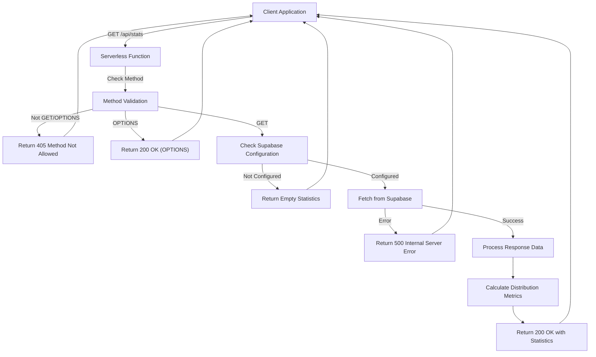
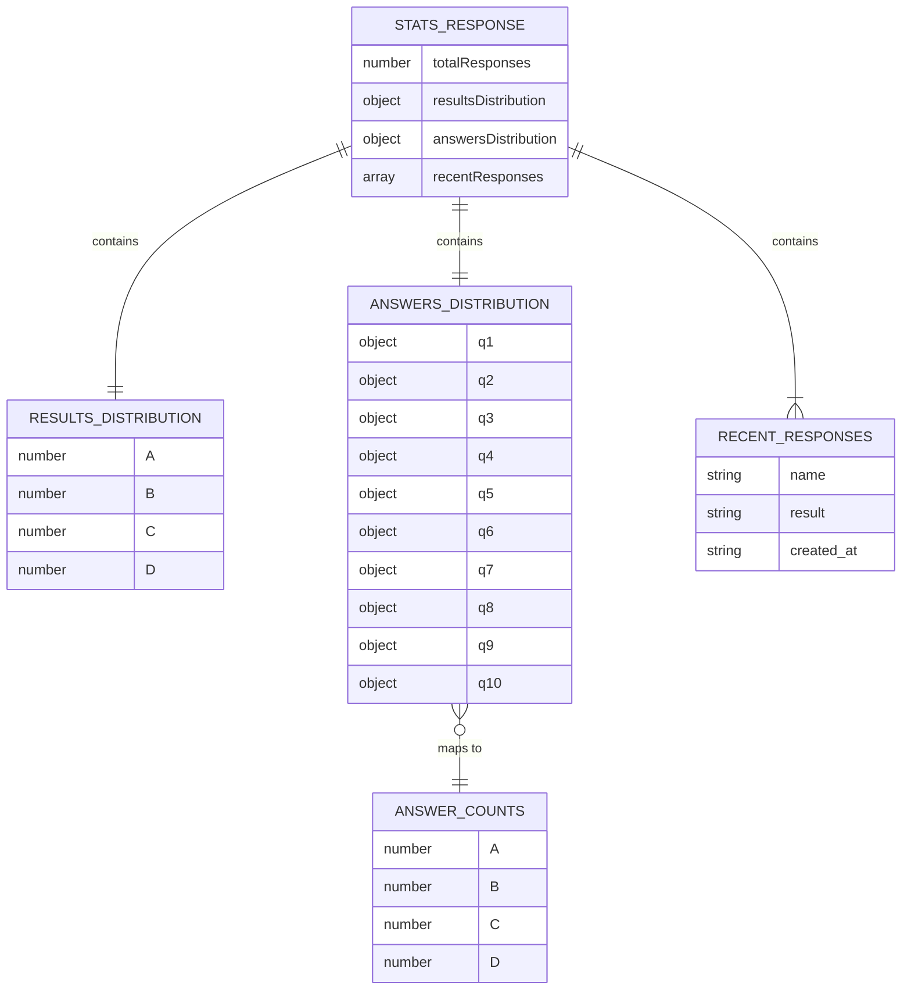
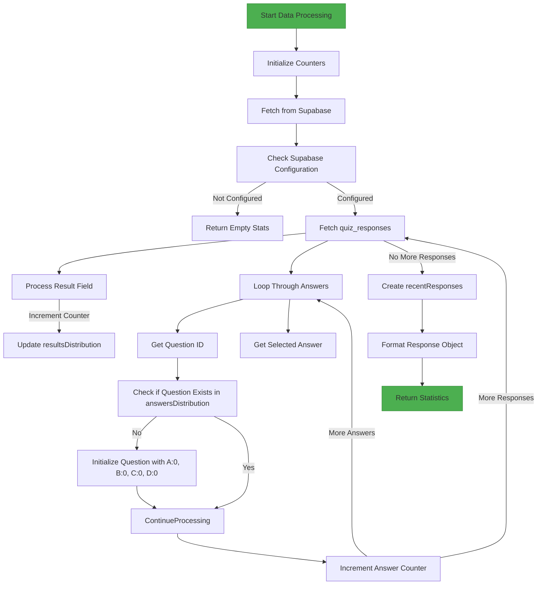
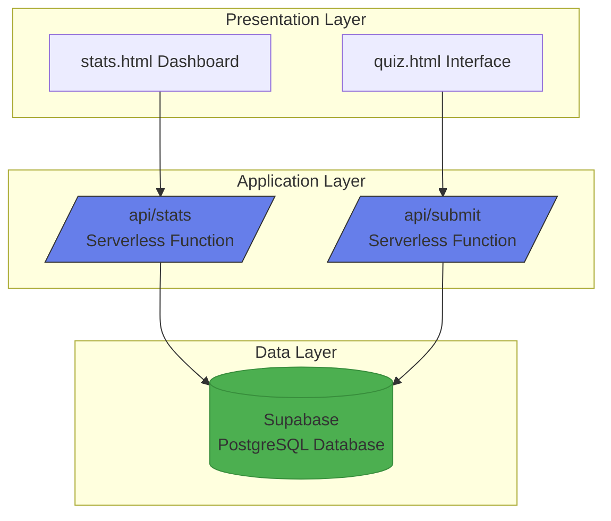

# Statistics API

<cite>
**Referenced Files in This Document**   
- [api/stats.js](file://api/stats.js) - *Updated to use Supabase in commit 34cf66e*
- [SUPABASE_SETUP.md](file://SUPABASE_SETUP.md) - *Added in recent commit*
- [stats.html](file://stats.html) - *Updated to use recentResponses in commit ebd952e*
</cite>

## Update Summary
**Changes Made**   
- Updated all sections to reflect migration from file-based storage to Supabase database
- Added new information about Supabase integration and configuration
- Removed outdated references to answers.json file storage
- Added new response field recentResponses to documentation
- Updated architecture overview to reflect new data persistence layer
- Modified error handling section to reflect new Supabase-specific errors
- Updated usage and integration section to include recentResponses field

## Table of Contents
1. [Introduction](#introduction)
2. [Endpoint Overview](#endpoint-overview)
3. [Response Structure](#response-structure)
4. [Implementation Details](#implementation-details)
5. [Data Processing Logic](#data-processing-logic)
6. [Error Handling](#error-handling)
7. [Data Source and Persistence](#data-source-and-persistence)
8. [Usage and Integration](#usage-and-integration)
9. [Example Responses](#example-responses)
10. [Performance Considerations](#performance-considerations)
11. [Security Aspects](#security-aspects)
12. [Architecture Overview](#architecture-overview)

## Introduction
The Statistics API provides analytics on user responses collected through the quiz system. This documentation details the `/api/stats` endpoint, which serves as the primary interface for retrieving aggregated statistical data about quiz completions. The endpoint is designed to support data analysis and visualization, particularly for the administrative dashboard at `stats.html`. The implementation leverages Express.js running on Vercel serverless functions, utilizing Supabase as the persistent data store. This document covers the endpoint's functionality, implementation, error handling, data processing, and integration points.

**Section sources**
- [api/stats.js](file://api/stats.js#L1-L103)
- [SUPABASE_SETUP.md](file://SUPABASE_SETUP.md#L1-L188)

## Endpoint Overview
The `/api/stats` endpoint is a GET request that returns comprehensive analytics on user quiz responses. It is specifically designed to provide aggregate statistics without exposing individual user data. The endpoint supports CORS to enable cross-origin requests from the frontend application. It only accepts GET and OPTIONS methods, with OPTIONS requests handled for preflight checks in CORS implementation. Any other HTTP method results in a 405 Method Not Allowed response. The endpoint is read-only and does not modify any data, making it safe for frequent polling by client applications.



**Diagram sources**
- [api/stats.js](file://api/stats.js#L1-L103)

**Section sources**
- [api/stats.js](file://api/stats.js#L1-L103)

## Response Structure
The `/api/stats` endpoint returns a JSON response containing four main fields that provide comprehensive analytics on quiz responses. The `totalResponses` field contains a numeric value representing the total number of completed quizzes. The `resultsDistribution` field is an object that maps each adaptation stage (A-D) to the count of users who received that result, providing insight into user distribution across different adaptation levels. The `answersDistribution` field is a nested object that contains per-question answer frequencies, with each question ID mapping to an object that counts responses for each possible answer option (A-D). The `recentResponses` field contains an array of the 10 most recent quiz completions, including user name, result, and timestamp. This structure enables detailed analysis of user preferences and patterns across all quiz questions.



**Diagram sources**
- [api/stats.js](file://api/stats.js#L45-L93)
- [SUPABASE_SETUP.md](file://SUPABASE_SETUP.md#L61-L82)

**Section sources**
- [api/stats.js](file://api/stats.js#L45-L93)
- [SUPABASE_SETUP.md](file://SUPABASE_SETUP.md#L61-L82)

## Implementation Details
The `/api/stats` endpoint is implemented as an Express.js serverless function deployed on Vercel. The implementation uses modern JavaScript features including ES modules and async/await syntax for handling asynchronous operations. The function begins by setting appropriate CORS headers to allow cross-origin requests from any domain, which facilitates integration with the frontend application. The endpoint specifically allows GET and OPTIONS methods, with OPTIONS requests handled immediately to support CORS preflight checks. When a GET request is received, the function checks for Supabase configuration, fetches all quiz responses from the Supabase database, processes the data to calculate statistical metrics, and returns the results as JSON. The implementation is designed to be stateless, which aligns with serverless architecture principles, and relies on Supabase for data persistence.

**Section sources**
- [api/stats.js](file://api/stats.js#L1-L103)

## Data Processing Logic
The data processing logic in the `/api/stats` endpoint aggregates responses from the Supabase database to calculate key distribution metrics. For `totalResponses`, the implementation simply uses the length of the fetched array, representing the count of completed quizzes. The `resultsDistribution` is calculated using the Array.reduce method to iterate through all responses and count occurrences of each adaptation stage (A-D) in the result field. The `answersDistribution` is similarly calculated by reducing the array of responses, but with additional logic to initialize counters for each question and answer option. For each response, the function iterates through the answers object, incrementing the counter for the selected answer option for each question. The `recentResponses` field is created by slicing the first 10 entries from the sorted response array and mapping them to a simplified structure. This processing occurs entirely in memory after fetching and parsing the data, with the results formatted into the response structure before being sent to the client.



**Diagram sources**
- [api/stats.js](file://api/stats.js#L45-L93)

**Section sources**
- [api/stats.js](file://api/stats.js#L45-L93)

## Error Handling
The `/api/stats` endpoint implements comprehensive error handling to ensure reliable operation under various conditions. The primary error scenario addressed is the absence of Supabase configuration, which is handled gracefully by returning an empty statistics object with zero counts rather than failing the request. This is achieved by checking for the presence of the supabase client and returning a 200 OK response with default empty values when Supabase is not configured. For database errors during the fetch operation, the endpoint returns a 500 Internal Server Error response with a detailed error message. All errors are logged to the server console for debugging purposes. The implementation also validates the HTTP method, returning a 405 Method Not Allowed response for any method other than GET or OPTIONS, preventing unintended access patterns.

**Section sources**
- [api/stats.js](file://api/stats.js#L25-L35)
- [api/stats.js](file://api/stats.js#L60-L103)

## Data Source and Persistence
The `/api/stats` endpoint relies on Supabase as its primary data source for generating statistics. The data is stored in a `quiz_responses` table within the Supabase PostgreSQL database, which contains fields for timestamp, user name, quiz answers, and result. This table serves as the persistent data store for the entire quiz system, with both the submission and statistics endpoints reading from and writing to this database. The Supabase integration provides several advantages over the previous file-based storage, including data persistence, scalability, and built-in security features. The database schema includes proper indexing for efficient querying and Row Level Security to control access. This approach eliminates the race condition risks associated with file-based storage in a serverless environment and provides a robust foundation for data integrity and scalability.

**Section sources**
- [SUPABASE_SETUP.md](file://SUPABASE_SETUP.md#L1-L188)
- [api/stats.js](file://api/stats.js#L1-L103)

## Usage and Integration
The `/api/stats` endpoint is primarily used by the `stats.html` dashboard to populate its analytics interface. The dashboard makes a fetch request to the endpoint and processes the response to update various visual elements including summary cards, bar charts, detailed question statistics, and a recent responses list. The client-side JavaScript in `stats.html` maps the API response fields to its internal statistics model, with `totalResponses` updating the total completions count, `resultsDistribution` powering the adaptation stage bar chart, `answersDistribution` driving the per-question answer frequency displays, and `recentResponses` populating the recent activity list. The integration is designed to be resilient, with error handling that provides appropriate feedback to administrators. The read-only nature of the endpoint makes it suitable for frequent polling, though the current implementation does not include caching headers, which could be added to improve performance and reduce server load.

**Section sources**
- [stats.html](file://stats.html#L395-L418)
- [stats.html](file://stats.html#L316-L341)
- [api/stats.js](file://api/stats.js#L82-L93)

## Example Responses
The `/api/stats` endpoint returns statistical data in a consistent JSON format. When Supabase is not configured, the endpoint returns an empty statistics object:

```json
{
  "totalResponses": 0,
  "resultsDistribution": {},
  "answersDistribution": {},
  "warning": "Supabase credentials not found"
}
```

With responses recorded, a typical response might appear as:

```json
{
  "totalResponses": 42,
  "resultsDistribution": {
    "A": 10,
    "B": 15,
    "C": 12,
    "D": 5
  },
  "answersDistribution": {
    "q1": {
      "A": 10,
      "B": 15,
      "C": 12,
      "D": 5
    },
    "q2": {
      "A": 8,
      "B": 18,
      "C": 10,
      "D": 6
    }
  },
  "recentResponses": [
    {
      "id": "a1b2c3d4",
      "name": "Maria",
      "result": "B",
      "created_at": "2025-10-04T01:12:16.828Z"
    }
  ]
}
```

These examples illustrate the structure and content of responses under different conditions, showing how the endpoint provides meaningful analytics even when no data is available.

**Section sources**
- [SUPABASE_SETUP.md](file://SUPABASE_SETUP.md#L61-L82)

## Performance Considerations
The current implementation of the `/api/stats` endpoint has performance implications that are significantly improved compared to the previous file-based approach. Each request requires querying the Supabase database, which benefits from proper indexing on the created_at and result fields. The time complexity is optimized by database indexing, making queries efficient even with large datasets. The implementation fetches all responses and processes them in memory, which creates O(n) time complexity relative to the number of responses for the aggregation phase. For very large datasets, this could still result in increased serverless function execution duration. Potential optimizations include implementing response caching with appropriate headers, adding database views for pre-aggregated statistics, or using Supabase's real-time features to maintain counters. For the serverless environment, these optimizations are crucial to maintain performance and control costs, as longer execution times directly impact resource consumption and expenses.

**Section sources**
- [api/stats.js](file://api/stats.js#L25-L35)
- [SUPABASE_SETUP.md](file://SUPABASE_SETUP.md#L153-L172)

## Security Aspects
The `/api/stats` endpoint exposes aggregate data about quiz responses, which raises several security considerations. Currently, the endpoint has no authentication or access controls, making the statistical data publicly accessible to anyone who can reach the API endpoint. While the data is aggregated and does not expose individual user identities directly, it could still reveal sensitive information about user behavior patterns and demographics. The documentation notes that the Supabase database contains personal data, highlighting the importance of protecting access to the underlying data source. For production deployment, the documentation recommends adding authentication to restrict access to authorized personnel only. Additionally, the use of wildcard CORS headers ('Access-Control-Allow-Origin', '*') allows any website to access the statistics, which could be exploited for data scraping. The Supabase integration provides additional security benefits through Row Level Security policies that control database access. Implementing more restrictive CORS policies and access controls would enhance the security posture of the endpoint.

**Section sources**
- [SUPABASE_SETUP.md](file://SUPABASE_SETUP.md#L111-L120)
- [api/stats.js](file://api/stats.js#L6-L10)

## Architecture Overview
The Statistics API is part of a broader architecture that includes client-side interfaces, serverless functions, and database-based data persistence. The architecture follows a modern pattern for a scalable quiz application, with the `/api/stats` endpoint serving as a key component for data analysis. The system architecture can be visualized as a three-tier structure: the presentation layer (`stats.html`), the application layer (serverless functions in the `api` directory), and the data layer (Supabase PostgreSQL database). This separation of concerns allows for independent development and deployment of each component. The use of serverless functions on Vercel provides scalability and reduces infrastructure management overhead, while the Supabase database offers robust data storage with built-in security and scalability features. This architecture addresses the limitations of the previous file-based approach, particularly regarding data consistency, concurrency, and scalability, providing a production-ready solution for the application.



**Diagram sources**
- [api/stats.js](file://api/stats.js)
- [stats.html](file://stats.html)
- [SUPABASE_SETUP.md](file://SUPABASE_SETUP.md)

**Section sources**
- [api/stats.js](file://api/stats.js)
- [stats.html](file://stats.html)
- [SUPABASE_SETUP.md](file://SUPABASE_SETUP.md)