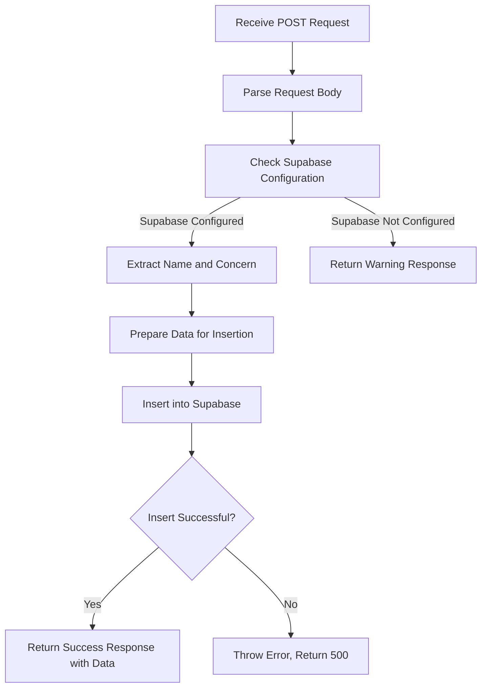

# Submit API

<cite>
**Referenced Files in This Document**   
- [submit.js](file://api/submit.js) - *Updated to integrate Supabase for persistent storage*
- [SUPABASE_SETUP.md](file://SUPABASE_SETUP.md) - *Added setup instructions for Supabase integration*
- [answers.json](file://answers.json) - *Legacy file, no longer primary storage*
- [DATA_STORAGE.md](file://DATA_STORAGE.md) - *Outdated, requires update regarding storage mechanism*
</cite>

## Update Summary
**Changes Made**   
- Updated all sections to reflect migration from file-based to Supabase database storage
- Removed outdated information about `answers.json` as primary storage
- Added details about Supabase integration, environment variables, and table structure
- Updated response format to reflect actual implementation with Supabase data
- Revised data storage implementation section to describe database insertion
- Updated security considerations to address new Supabase configuration
- Added future enhancements related to Supabase capabilities
- Removed concurrency considerations related to file system since database handles concurrency
- Updated example responses to match actual API behavior

## Table of Contents
1. [Introduction](#introduction)
2. [Request Structure](#request-structure)
3. [Response Format](#response-format)
4. [CORS Configuration](#cors-configuration)
5. [Request Validation](#request-validation)
6. [Data Storage Implementation](#data-storage-implementation)
7. [Example Requests and Responses](#example-requests-and-responses)
8. [Security Considerations](#security-considerations)
9. [Future Enhancements](#future-enhancements)

## Introduction
The `/api/submit` endpoint is a POST API designed to receive and process user quiz answers for storage and tracking purposes. This endpoint collects user responses from the interactive quiz, logs them, and returns a success confirmation. The implementation now persists data to a Supabase database table (`quiz_responses`) with proper error handling and fallback mechanisms when Supabase is not configured.

**Section sources**
- [submit.js](file://api/submit.js#L0-L78)
- [SUPABASE_SETUP.md](file://SUPABASE_SETUP.md#L0-L188)

## Request Structure
The `/api/submit` endpoint accepts a JSON payload via POST request containing user quiz responses. The expected structure includes an `answers` object with question identifiers as keys and selected answer values, along with a `result` field indicating the quiz outcome.

```json
{
  "answers": {
    "q0": "User Name",
    "q1": "A",
    "q2": "B",
    "q3": "C",
    "q4": "A",
    "q5": "B",
    "q6": "C",
    "q7": "A",
    "q8": "B",
    "q9": "C"
  },
  "result": "A"
}
```

The `answers` object contains responses to all quiz questions, with `q0` typically representing the user's name. Each subsequent question (q1-q9) contains a single letter response (A-D) corresponding to the selected answer option. The `q10` field may contain a text response about user concerns.

**Section sources**
- [submit.js](file://api/submit.js#L28-L30)
- [SUPABASE_SETUP.md](file://SUPABASE_SETUP.md#L105-L152)

## Response Format
Upon successful submission, the endpoint returns a JSON response with a success message and the submitted data including the database record with auto-generated ID and timestamp.

```json
{
  "message": "Answers submitted successfully",
  "data": {
    "id": "a1b2c3d4-e5f6-7890-g1h2-i3j4k5l6m7n8",
    "created_at": "2025-10-04T01:12:16.828Z",
    "name": "User Name",
    "result": "A",
    "answers": {
      "q0": "User Name",
      "q1": "A",
      "q2": "B",
      "q3": "C",
      "q4": "A",
      "q5": "B",
      "q6": "C",
      "q7": "A",
      "q8": "B",
      "q9": "C"
    },
    "concern": "Test concern"
  }
}
```

For error conditions, the endpoint returns appropriate HTTP status codes with error messages:
- **405 Method Not Allowed**: When a non-POST method is used
- **500 Internal Server Error**: When an internal processing error occurs
- When Supabase is not configured, returns a 200 status with a warning message indicating database storage is unavailable

**Section sources**
- [submit.js](file://api/submit.js#L70-L78)
- [SUPABASE_SETUP.md](file://SUPABASE_SETUP.md#L105-L152)

## CORS Configuration
The endpoint is configured to allow cross-origin requests from any domain through comprehensive CORS headers. This enables the quiz application to submit answers from different origins without browser security restrictions.

The following CORS headers are set:
- `Access-Control-Allow-Credentials: true`
- `Access-Control-Allow-Origin: *`
- `Access-Control-Allow-Methods: GET,OPTIONS,PATCH,DELETE,POST,PUT`
- `Access-Control-Allow-Headers: X-CSRF-Token, X-Requested-With, Accept, Accept-Version, Content-Length, Content-MD5, Content-Type, Date, X-Api-Version`

The configuration also handles preflight OPTIONS requests by returning a 200 status code, allowing the actual POST request to proceed.

**Section sources**
- [submit.js](file://api/submit.js#L4-L12)

## Request Validation
The endpoint implements request validation to ensure only appropriate requests are processed. It specifically validates the HTTP method, allowing only POST requests for answer submission.

When a request is received:
1. If the method is OPTIONS, the request is treated as a preflight check and a 200 status is returned
2. If the method is not POST, a 405 Method Not Allowed response is returned
3. Only POST requests proceed to answer processing and storage

This validation ensures the endpoint is used correctly and prevents unintended access through other HTTP methods.

**Section sources**
- [submit.js](file://api/submit.js#L14-L17)

## Data Storage Implementation
The current implementation persists quiz answers to a Supabase database table named `quiz_responses`. The process involves preparing the data from the request and inserting it into the database with proper error handling.

Each submission is stored with the following fields:
- A unique `id` generated as a UUID by the database
- A `created_at` timestamp in ISO format
- The `name` extracted from `answers.q0`
- The `result` from the request
- The complete `answers` object stored as JSONB
- The `concern` extracted from `answers.q10`

The implementation checks for Supabase configuration via environment variables (`SUPABASE_URL` and `SUPABASE_ANON_KEY`). If Supabase is not configured, the endpoint returns a success response with a warning but does not store the data. When Supabase is properly configured, the data is inserted into the database and the created record is returned in the response.



**Diagram sources**
- [submit.js](file://api/submit.js#L28-L68)
- [SUPABASE_SETUP.md](file://SUPABASE_SETUP.md#L0-L41)

**Section sources**
- [submit.js](file://api/submit.js#L28-L68)
- [SUPABASE_SETUP.md](file://SUPABASE_SETUP.md#L0-L41)

## Example Requests and Responses
### Successful Submission
**Request:**
```http
POST /api/submit HTTP/1.1
Content-Type: application/json
Origin: https://example.com

{
  "answers": {
    "q0": "Anna",
    "q1": "A",
    "q2": "B",
    "q3": "C",
    "q4": "A",
    "q5": "B",
    "q6": "C",
    "q7": "A",
    "q8": "B",
    "q9": "C"
  },
  "result": "B"
}
```

**Response:**
```http
HTTP/1.1 200 OK
Content-Type: application/json

{
  "message": "Answers submitted successfully",
  "data": {
    "id": "a1b2c3d4-e5f6-7890-g1h2-i3j4k5l6m7n8",
    "created_at": "2025-10-04T01:12:16.828Z",
    "name": "Anna",
    "result": "B",
    "answers": {
      "q0": "Anna",
      "q1": "A",
      "q2": "B",
      "q3": "C",
      "q4": "A",
      "q5": "B",
      "q6": "C",
      "q7": "A",
      "q8": "B",
      "q9": "C"
    },
    "concern": null
  }
}
```

### Method Not Allowed
**Request:**
```http
GET /api/submit HTTP/1.1
```

**Response:**
```http
HTTP/1.1 405 Method Not Allowed
Content-Type: application/json

{
  "message": "Method not allowed"
}
```

### Supabase Not Configured
**Response:**
```http
HTTP/1.1 200 OK
Content-Type: application/json

{
  "message": "Answers received (database not configured)",
  "warning": "Supabase credentials not found"
}
```

**Section sources**
- [submit.js](file://api/submit.js#L17-L18)
- [submit.js](file://api/submit.js#L42-L48)
- [SUPABASE_SETUP.md](file://SUPABASE_SETUP.md#L42-L104)

## Security Considerations
The current implementation has several security aspects that should be considered:

1. **Input Validation**: The endpoint currently accepts any JSON data without validation of answer formats. Implementing schema validation would prevent malformed or malicious data from being stored.

2. **Sensitive Data Logging**: The implementation logs the complete request body using `console.log()`, which could expose personally identifiable information (PII). In production, logging should be minimized or sanitized.

3. **Database Security**: The Supabase table uses Row Level Security with policies that allow all users to insert and select data. For enhanced security, consider implementing more restrictive policies or authentication.

4. **CORS Configuration**: While the wildcard origin (`*`) enables flexibility, it also allows submissions from any website. For production, consider restricting origins to trusted domains.

5. **Environment Variables**: Supabase credentials are stored in environment variables (`SUPABASE_URL` and `SUPABASE_ANON_KEY`), which should be properly protected in the deployment environment.

6. **Error Handling**: The implementation provides detailed error messages which could expose implementation details. Consider using generic error messages in production.

**Section sources**
- [submit.js](file://api/submit.js#L28-L78)
- [SUPABASE_SETUP.md](file://SUPABASE_SETUP.md#L42-L104)

## Future Enhancements
Several improvements can be made to enhance the functionality and reliability of the `/api/submit` endpoint:

1. **Input Validation**: Implement validation of answer formats to ensure only valid responses (A-D) are accepted for each question.

2. **Enhanced Error Handling**: Implement more granular error responses that provide specific information about validation failures or storage issues.

3. **Statistics Integration**: Connect the submission process with the statistics system to update aggregate metrics in real-time, leveraging Supabase's capabilities.

4. **Data Sanitization**: Implement sanitization of user inputs to prevent injection attacks or malformed data storage.

5. **Authentication**: Add authentication mechanisms for administrative access to the collected data, especially for the statistics endpoint.

6. **Backup System**: Implement automated backup solutions to prevent data loss and enable recovery, leveraging Supabase's built-in backup capabilities.

7. **Data Export**: Provide functionality to export collected data in various formats (CSV, Excel) for analysis purposes using Supabase's data export features.

8. **Rate Limiting**: Implement rate limiting to prevent abuse or denial-of-service attacks through excessive submissions.

9. **Webhooks**: Utilize Supabase webhooks to trigger notifications or additional processing when new submissions are received.

These enhancements would make the system more robust, secure, and suitable for production use with higher traffic volumes.

**Section sources**
- [submit.js](file://api/submit.js#L28-L78)
- [SUPABASE_SETUP.md](file://SUPABASE_SETUP.md#L0-L188)