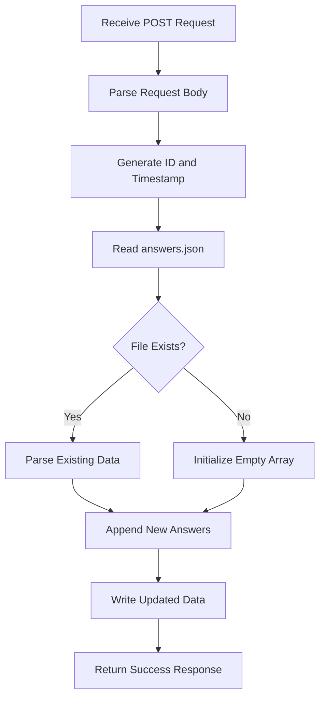

# Submit API

<cite>
**Referenced Files in This Document**   
- [submit.js](file://api/submit.js)
- [answers.json](file://answers.json)
- [DATA_STORAGE.md](file://DATA_STORAGE.md)
</cite>

## Table of Contents
1. [Introduction](#introduction)
2. [Request Structure](#request-structure)
3. [Response Format](#response-format)
4. [CORS Configuration](#cors-configuration)
5. [Request Validation](#request-validation)
6. [Data Storage Implementation](#data-storage-implementation)
7. [Concurrency Considerations](#concurrency-considerations)
8. [Example Requests and Responses](#example-requests-and-responses)
9. [Security Considerations](#security-considerations)
10. [Future Enhancements](#future-enhancements)

## Introduction
The `/api/submit` endpoint is a POST API designed to receive and process user quiz answers for storage and tracking purposes. This endpoint collects user responses from the interactive quiz, logs them, and returns a success confirmation. The implementation currently persists data to a JSON file (`answers.json`) on the server, with each submission stored as a timestamped record containing the user's answers and quiz result.

**Section sources**
- [submit.js](file://api/submit.js#L0-L62)
- [DATA_STORAGE.md](file://DATA_STORAGE.md#L30-L57)

## Request Structure
The `/api/submit` endpoint accepts a JSON payload via POST request containing user quiz responses. The expected structure includes an `answers` object with question identifiers as keys and selected answer values, along with a `result` field indicating the quiz outcome.

```json
{
  "answers": {
    "q0": "User Name",
    "q1": "A",
    "q2": "B",
    "q3": "C",
    "q4": "A",
    "q5": "B",
    "q6": "C",
    "q7": "A",
    "q8": "B",
    "q9": "C"
  },
  "result": "A"
}
```

The `answers` object contains responses to all quiz questions, with `q0` typically representing the user's name. Each subsequent question (q1-q9) contains a single letter response (A-D) corresponding to the selected answer option.

**Section sources**
- [submit.js](file://api/submit.js#L20-L22)
- [DATA_STORAGE.md](file://DATA_STORAGE.md#L34-L42)

## Response Format
Upon successful submission, the endpoint returns a JSON response with a success message and the submitted data including a unique identifier and timestamp.

```json
{
  "message": "Answers submitted successfully",
  "data": {
    "id": "quiz_1696384936828_abc123xyz",
    "timestamp": "2025-10-04T01:12:16.828Z",
    "answers": {
      "q0": "User Name",
      "q1": "A",
      "q2": "B",
      "q3": "C",
      "q4": "A",
      "q5": "B",
      "q6": "C",
      "q7": "A",
      "q8": "B",
      "q9": "C"
    },
    "result": "A"
  }
}
```

For error conditions, the endpoint returns appropriate HTTP status codes with error messages:
- **405 Method Not Allowed**: When a non-POST method is used
- **500 Internal Server Error**: When an internal processing error occurs

**Section sources**
- [submit.js](file://api/submit.js#L51-L58)
- [DATA_STORAGE.md](file://DATA_STORAGE.md#L44-L55)

## CORS Configuration
The endpoint is configured to allow cross-origin requests from any domain through comprehensive CORS headers. This enables the quiz application to submit answers from different origins without browser security restrictions.

The following CORS headers are set:
- `Access-Control-Allow-Credentials: true`
- `Access-Control-Allow-Origin: *`
- `Access-Control-Allow-Methods: GET,OPTIONS,PATCH,DELETE,POST,PUT`
- `Access-Control-Allow-Headers: X-CSRF-Token, X-Requested-With, Accept, Accept-Version, Content-Length, Content-MD5, Content-Type, Date, X-Api-Version`

The configuration also handles preflight OPTIONS requests by returning a 200 status code, allowing the actual POST request to proceed.

**Section sources**
- [submit.js](file://api/submit.js#L4-L12)

## Request Validation
The endpoint implements request validation to ensure only appropriate requests are processed. It specifically validates the HTTP method, allowing only POST requests for answer submission.

When a request is received:
1. If the method is OPTIONS, the request is treated as a preflight check and a 200 status is returned
2. If the method is not POST, a 405 Method Not Allowed response is returned
3. Only POST requests proceed to answer processing and storage

This validation ensures the endpoint is used correctly and prevents unintended access through other HTTP methods.

**Section sources**
- [submit.js](file://api/submit.js#L14-L17)

## Data Storage Implementation
The current implementation persists quiz answers to a JSON file named `answers.json` in the project root directory. The process involves reading existing data, appending the new submission, and writing the updated array back to the file.

Each submission is enhanced with:
- A unique `id` generated using timestamp and random string
- A `timestamp` in ISO format
- The original answers and result from the request

The file is stored in JSON array format, with each element representing a complete quiz submission. If the file does not exist, it is created automatically. The implementation uses asynchronous file operations to prevent blocking the event loop.



**Diagram sources**
- [submit.js](file://api/submit.js#L24-L48)
- [answers.json](file://answers.json#L0-L17)

**Section sources**
- [submit.js](file://api/submit.js#L24-L48)
- [answers.json](file://answers.json#L0-L17)

## Concurrency Considerations
While the current file-based storage works for low-traffic scenarios, it presents potential concurrency issues when multiple users submit answers simultaneously. Since each request reads the entire file, modifies it, and writes it back, there's a risk of race conditions where one submission could overwrite another.

To address this in future implementations:
1. Implement file locking mechanisms during read-write operations
2. Consider using a database system with transaction support
3. Implement queuing mechanisms to serialize write operations
4. Use atomic file operations to prevent partial writes

For production environments, migrating to a proper database system would eliminate these concurrency concerns entirely.

**Section sources**
- [submit.js](file://api/submit.js#L30-L48)

## Example Requests and Responses
### Successful Submission
**Request:**
```http
POST /api/submit HTTP/1.1
Content-Type: application/json
Origin: https://example.com

{
  "answers": {
    "q0": "Anna",
    "q1": "A",
    "q2": "B",
    "q3": "C",
    "q4": "A",
    "q5": "B",
    "q6": "C",
    "q7": "A",
    "q8": "B",
    "q9": "C"
  },
  "result": "B"
}
```

**Response:**
```http
HTTP/1.1 200 OK
Content-Type: application/json

{
  "message": "Answers submitted successfully",
  "data": {
    "id": "quiz_1730701936828_xyz789",
    "timestamp": "2025-10-04T01:12:16.828Z",
    "answers": {
      "q0": "Anna",
      "q1": "A",
      "q2": "B",
      "q3": "C",
      "q4": "A",
      "q5": "B",
      "q6": "C",
      "q7": "A",
      "q8": "B",
      "q9": "C"
    },
    "result": "B"
  }
}
```

### Method Not Allowed
**Request:**
```http
GET /api/submit HTTP/1.1
```

**Response:**
```http
HTTP/1.1 405 Method Not Allowed
Content-Type: application/json

{
  "message": "Method not allowed"
}
```

**Section sources**
- [submit.js](file://api/submit.js#L17-L18)
- [submit.js](file://api/submit.js#L51-L58)

## Security Considerations
The current implementation has several security aspects that should be considered:

1. **Input Validation**: The endpoint currently accepts any JSON data without validation of answer formats. Implementing schema validation would prevent malformed or malicious data from being stored.

2. **Sensitive Data Logging**: The implementation logs the complete request body using `console.log()`, which could expose personally identifiable information (PII). In production, logging should be minimized or sanitized.

3. **File System Exposure**: The `answers.json` file contains personal data and should be protected from public access. Currently, it's stored in the project root and may be accessible via direct URL.

4. **CORS Configuration**: While the wildcard origin (`*`) enables flexibility, it also allows submissions from any website. For production, consider restricting origins to trusted domains.

5. **Rate Limiting**: The endpoint lacks rate limiting, making it potentially vulnerable to abuse or denial-of-service attacks through excessive submissions.

**Section sources**
- [submit.js](file://api/submit.js#L22)
- [submit.js](file://api/submit.js#L56)
- [DATA_STORAGE.md](file://DATA_STORAGE.md#L158-L164)

## Future Enhancements
Several improvements can be made to enhance the functionality and reliability of the `/api/submit` endpoint:

1. **Input Validation**: Implement validation of answer formats to ensure only valid responses (A-D) are accepted for each question.

2. **Database Integration**: Migrate from file-based storage to a proper database system like Vercel Postgres or MongoDB for better reliability, scalability, and concurrency handling.

3. **Enhanced Error Handling**: Implement more granular error responses that provide specific information about validation failures or storage issues.

4. **Statistics Integration**: Connect the submission process with the statistics system to update aggregate metrics in real-time.

5. **Data Sanitization**: Implement sanitization of user inputs to prevent injection attacks or malformed data storage.

6. **Authentication**: Add authentication mechanisms for administrative access to the collected data, especially for the statistics endpoint.

7. **Backup System**: Implement automated backup solutions to prevent data loss and enable recovery.

8. **Data Export**: Provide functionality to export collected data in various formats (CSV, Excel) for analysis purposes.

These enhancements would make the system more robust, secure, and suitable for production use with higher traffic volumes.

**Section sources**
- [submit.js](file://api/submit.js#L20-L62)
- [DATA_STORAGE.md](file://DATA_STORAGE.md#L166-L172)