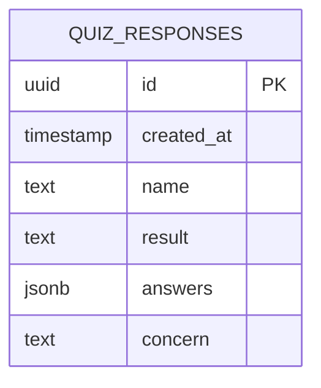
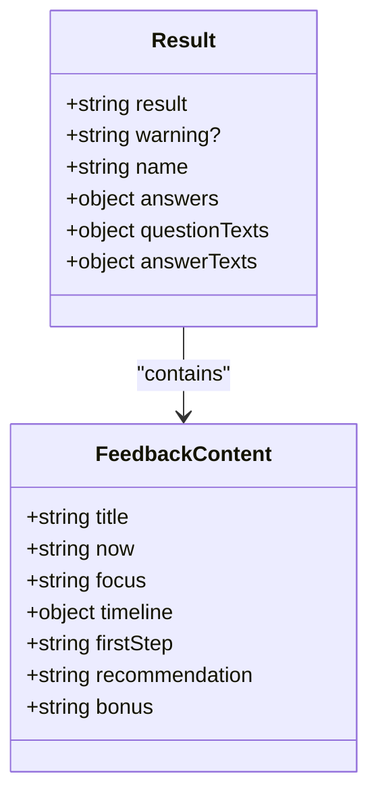
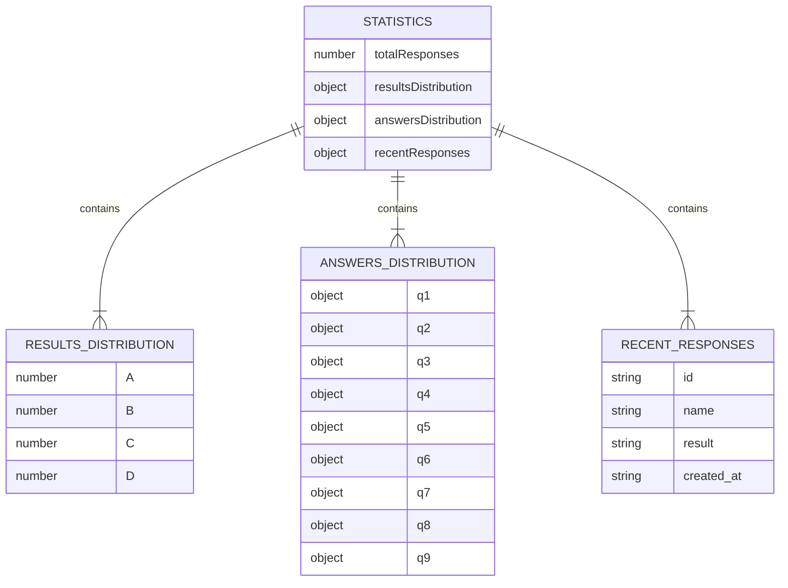
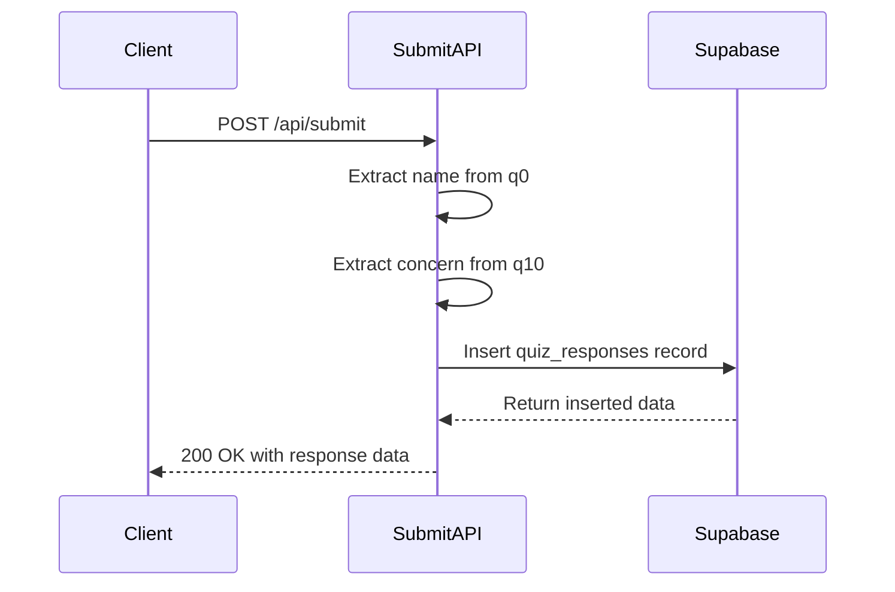

# Data Models

<cite>
**Referenced Files in This Document**   
- [answers.json](file://answers.json) - *Deprecated, replaced by Supabase storage*
- [api/submit.js](file://api/submit.js) - *Updated for Supabase integration*
- [api/generate-result.js](file://api/generate-result.js) - *Unchanged*
- [api/stats.js](file://api/stats.js) - *Updated for Supabase integration*
- [SUPABASE_SETUP.md](file://SUPABASE_SETUP.md) - *New configuration guide*
- [stats.html](file://stats.html) - *Updated to display concern field*
</cite>

## Update Summary
**Changes Made**   
- Updated User Response Object to reflect Supabase migration and q10 concern field
- Revised Data Access Patterns to describe Supabase integration instead of file-based storage
- Updated Data Privacy and Retention section to reflect improved data protection
- Added new diagram sources and updated section sources to reflect code changes
- Removed outdated references to answers.json file operations
- Updated Statistics Schema to include recentResponses field

## Table of Contents
1. [Introduction](#introduction)
2. [User Response Object](#user-response-object)
3. [Result Structure](#result-structure)
4. [Statistics Schema](#statistics-schema)
5. [Data Validation and Type Coercion](#data-validation-and-type-coercion)
6. [Data Access Patterns](#data-access-patterns)
7. [Data Privacy and Retention](#data-privacy-and-retention)
8. [Data Model Extension](#data-model-extension)

## Introduction
This document provides comprehensive documentation of the data models used in the alena application. The system captures user responses to a psychological adaptation quiz, processes them to determine user stage, and aggregates statistical data for analysis. The core data components include the User Response object stored in Supabase, the Result structure generated by the AI service, and the Statistics schema produced by the analytics service. The document details the structure, validation rules, access patterns, and extension possibilities for these data models.

## User Response Object
The User Response object represents a complete submission from a quiz participant and is stored in the Supabase database table quiz_responses. Each response contains the user's answers to all quiz questions, a timestamp, a unique identifier, and the determined adaptation stage.



**Diagram sources**
- [api/submit.js](file://api/submit.js#L28-L78)
- [SUPABASE_SETUP.md](file://SUPABASE_SETUP.md#L12-L41)

The User Response object has the following structure:

| Field | Type | Constraints | Description |
|-------|------|-------------|-------------|
| id | uuid | Required, Primary Key | Automatically generated unique identifier |
| created_at | timestamp | Required, Default NOW() | UTC timestamp of submission |
| name | text | Required | User's name extracted from q0 |
| result | text | Required, Enum [A, B, C, D] | Determined adaptation stage |
| answers | jsonb | Required, Not Null | Key-value pairs of question IDs and selected answers |
| concern | text | Optional | User's response to the open-ended concern question (q10) |

Example instance:
```json
{
  "id": "a1b2c3d4-e5f6-7890-g1h2-i3j4k5l6m7n8",
  "created_at": "2025-10-04T01:12:16.828Z",
  "name": "Anna",
  "result": "A",
  "answers": {
    "q0": "Anna",
    "q1": "A",
    "q2": "A",
    "q3": "A",
    "q4": "A",
    "q5": "A",
    "q6": "A",
    "q7": "A",
    "q8": "A",
    "q9": "A",
    "q10": "Adapting to new country"
  },
  "concern": "Adapting to new country"
}
```

The answers object contains responses to all quiz questions, with q0 storing the user's name. The result field is determined by the stage classification algorithm and represents one of four adaptation stages (A, B, C, D). The concern field captures the user's response to the open-ended question about their primary concerns, which is stored separately from the structured answers for easier analysis.

**Section sources**
- [api/submit.js](file://api/submit.js#L50-L55)
- [SUPABASE_SETUP.md](file://SUPABASE_SETUP.md#L122-L152)

## Result Structure
The Result structure is generated by the generate-result.js API endpoint and contains the stage classification along with personalized feedback content. This structure is returned as HTML content in the API response, not stored in the database.



**Diagram sources**
- [api/generate-result.js](file://api/generate-result.js#L108-L129)

The Result structure returned by the generate-result.js service has the following schema:

| Field | Type | Constraints | Description |
|-------|------|-------------|-------------|
| result | string | Required, HTML | HTML content with personalized feedback |
| warning? | string | Optional | Indicates if fallback content was used |

The result field contains a complete HTML document with personalized coaching content structured into six sections:
- Where you are now
- What's important now
- Timeline for 7/14/30 days
- First step
- Recommendation
- Bonus

The content is generated either by an AI service (OpenAI) or a fallback mechanism when the AI service is unavailable. The fallback content is pre-defined in the fallbackContent object within generate-result.js and varies based on the determined stage (A, B, C, or D).

The stage is determined by the determineStage function, which analyzes the distribution of answers across the four options (A, B, C, D), excluding the name question (q0). The stage with the highest count of answers is selected as the result.

Example result structure:
```json
{
  "result": "<h2 class=\"section-title\">Где вы сейчас</h2><p><strong>✈️ Стадия 1. Туристка — «Пока всё ново и интересно»</strong></p>..."
}
```

**Section sources**
- [api/generate-result.js](file://api/generate-result.js#L2-L21)
- [api/generate-result.js](file://api/generate-result.js#L98-L129)

## Statistics Schema
The Statistics schema is produced by the stats.js API endpoint and represents aggregated data from all user responses. This schema provides insights into response patterns, stage distribution, and answer frequencies.



**Diagram sources**
- [api/stats.js](file://api/stats.js#L40-L79)

The Statistics schema has the following structure:

| Field | Type | Constraints | Description |
|-------|------|-------------|-------------|
| totalResponses | number | Required, ≥ 0 | Total count of all user responses |
| resultsDistribution | object | Required | Count of responses by result stage |
| answersDistribution | object | Required | Count of answers by question and option |
| recentResponses | array | Required | List of recent responses with key details |

The resultsDistribution object contains the count of responses for each adaptation stage:
```json
{
  "A": 15,
  "B": 8,
  "C": 12,
  "D": 5
}
```

The answersDistribution object contains nested objects for each question (excluding q0 and q10), with counts for each answer option:
```json
{
  "q1": { "A": 10, "B": 12, "C": 8, "D": 10 },
  "q2": { "A": 15, "B": 8, "C": 10, "D": 7 },
  ...
}
```

The recentResponses array contains the most recent submissions with key information:
```json
[
  {
    "id": "a1b2c3d4-e5f6-7890-g1h2-i3j4k5l6m7n8",
    "name": "Anna",
    "result": "A",
    "created_at": "2025-10-04T01:12:16.828Z"
  }
]
```

This schema enables analysis of user patterns, identification of common adaptation stages, and understanding of answer distributions across the population.

**Section sources**
- [api/stats.js](file://api/stats.js#L40-L79)

## Data Validation and Type Coercion
The alena application implements data validation during submission in submit.js and type coercion in stats.js to ensure data integrity and proper processing.

In submit.js, the application performs the following validation:
- Verifies the HTTP method is POST
- Ensures the request body contains valid JSON
- Confirms required fields are present
- Validates the structure of the answers object

The system also applies type coercion and data transformation:
- Converts the timestamp to ISO 8601 format using new Date().toISOString()
- Extracts the name from q0 and concern from q10 for separate storage
- Parses and stringifies JSON data when interacting with Supabase

The stats.js service performs additional type coercion when aggregating data:
- Converts timestamp data from the database to JavaScript Date objects
- Initializes default values for missing data (empty objects for missing responses)
- Transforms raw response data into aggregated statistics
- Calculates percentages and distributions from raw counts

The validation process in submit.js includes error handling for database operations, ensuring that submissions are processed even if Supabase credentials are not configured. When Supabase is not available, the system logs a warning but still returns a success response to prevent user frustration.

**Section sources**
- [api/submit.js](file://api/submit.js#L28-L78)
- [api/stats.js](file://api/stats.js#L40-L79)

## Data Access Patterns
The alena application follows specific data access patterns for reading and writing user responses. The primary data store is the Supabase database, which replaces the previous file-based storage approach.

The data access pattern for submission follows a direct database insertion:
1. Extract name and concern from the answers object
2. Prepare data object with all required fields
3. Insert record into Supabase quiz_responses table
4. Return success response with inserted data



**Diagram sources**
- [api/submit.js](file://api/submit.js#L28-L78)

The stats.js service reads from the Supabase database to generate aggregated statistics:
1. Query all quiz_responses records ordered by created_at
2. Aggregate response counts by result and answer
3. Extract recent responses for display
4. Return the statistics as a JSON response

The stats service handles the case where Supabase is not configured by returning empty statistics with a warning, ensuring the API remains functional even without database access.

The data access pattern shows a shift from file-based storage to a cloud database, which improves scalability, reliability, and data protection while maintaining a simple deployment model.

**Section sources**
- [api/submit.js](file://api/submit.js#L28-L78)
- [api/stats.js](file://api/stats.js#L40-L79)

## Data Privacy and Retention
The alena application handles user data with consideration for privacy and retention policies. User responses are stored in the Supabase database, which provides enhanced privacy features compared to the previous file-based approach.

Data privacy considerations include:
- User names are stored in the name field and answers object (q0 field)
- Responses are stored indefinitely without automatic expiration
- The data is stored in a secure database with Row Level Security
- User concerns are stored in a separate text field for easier management
- Supabase provides encryption at rest and secure access controls

The current retention policy is indefinite, as there is no mechanism for automatic data deletion or expiration. User data persists in the database until manually removed or overwritten.

For improved data privacy, the Supabase implementation already includes several enhancements:
- Row Level Security allows configuration of fine-grained access controls
- Environment variables store database credentials securely
- CORS headers are properly configured to prevent unauthorized access
- The database provides built-in backup and recovery capabilities

The application could be extended to support additional privacy features such as data anonymization, user data expiration, or explicit consent tracking.

**Section sources**
- [SUPABASE_SETUP.md](file://SUPABASE_SETUP.md#L122-L152)
- [api/submit.js](file://api/submit.js#L50-L55)

## Data Model Extension
The alena application's data model can be extended to support additional user attributes or response metadata. The current Supabase-based structure provides a foundation that can be enhanced with minimal changes.

Potential extensions include:
- Adding new user attributes (email, age, country of origin)
- Including response metadata (completion time, device type, IP address)
- Supporting multiple quiz versions
- Adding user consent tracking
- Implementing response annotations or tags

To extend the User Response object, additional fields can be added to the Supabase table and processed in submit.js. For example, adding an email field would require:
1. Adding an email input field in the quiz interface
2. Including the email in the submission payload
3. Adding the email column to the quiz_responses table
4. Modifying the data object in submit.js to include the email
5. Updating any dependent services that process the data

The modular design of the API endpoints allows for independent extension of each component. The generate-result.js service could be enhanced to consider additional attributes when generating personalized feedback, while the stats.js service could be updated to aggregate data based on new dimensions.

When extending the data model, consideration should be given to backward compatibility, ensuring that existing data and functionality continue to work with the enhanced schema.

**Section sources**
- [api/submit.js](file://api/submit.js)
- [SUPABASE_SETUP.md](file://SUPABASE_SETUP.md#L12-L41)