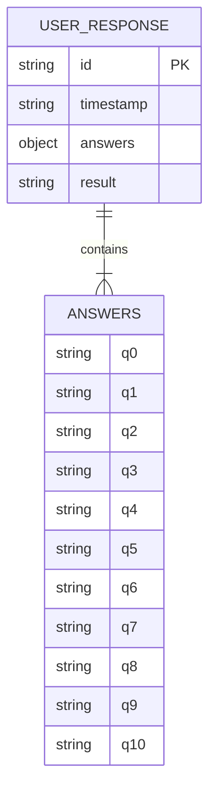
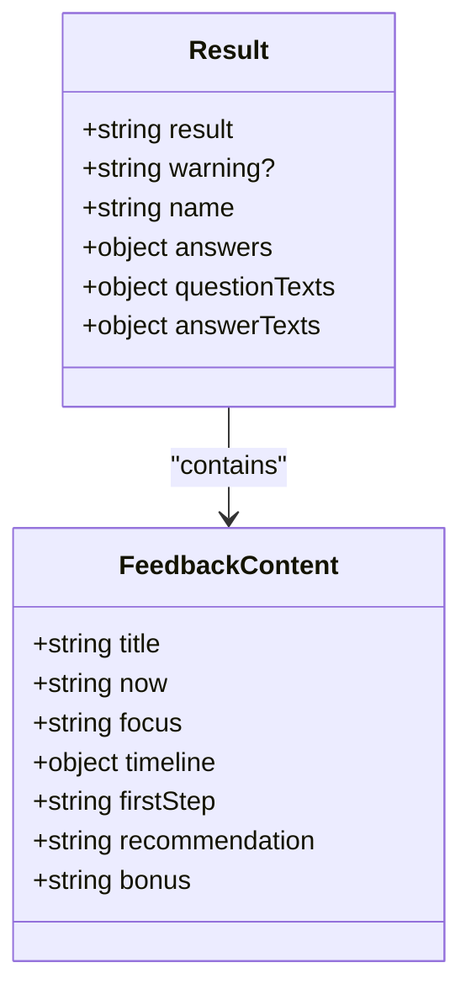
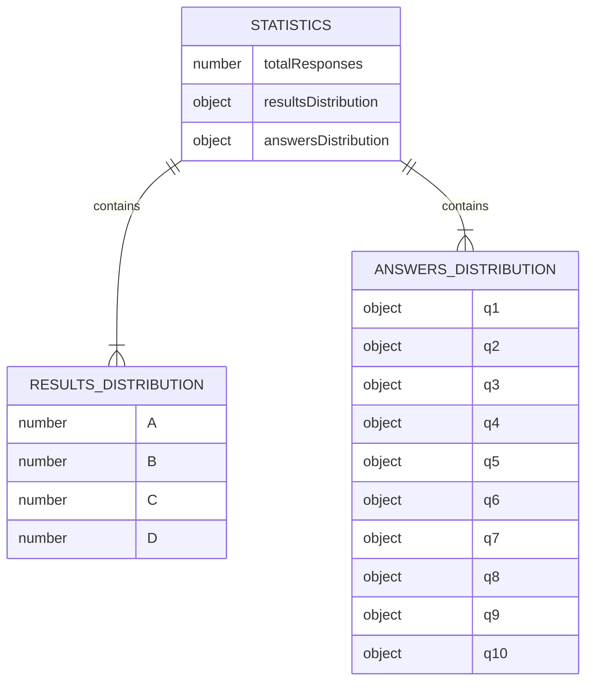
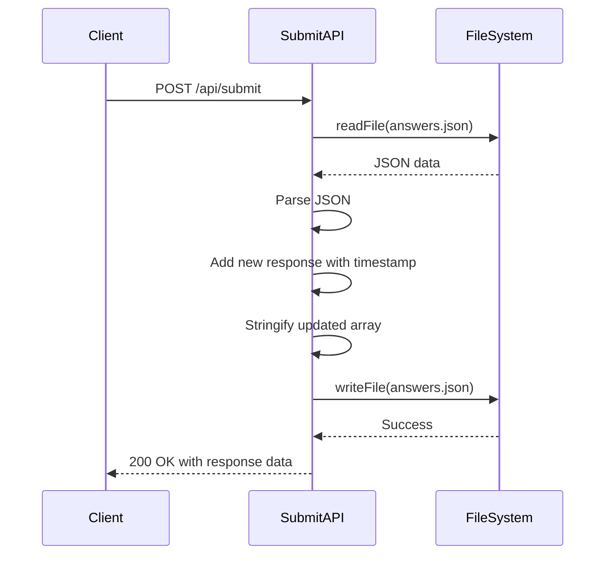

# Data Models

<cite>
**Referenced Files in This Document**   
- [answers.json](file://answers.json)
- [api/submit.js](file://api/submit.js)
- [api/generate-result.js](file://api/generate-result.js)
- [api/stats.js](file://api/stats.js)
</cite>

## Table of Contents
1. [Introduction](#introduction)
2. [User Response Object](#user-response-object)
3. [Result Structure](#result-structure)
4. [Statistics Schema](#statistics-schema)
5. [Data Validation and Type Coercion](#data-validation-and-type-coercion)
6. [Data Access Patterns](#data-access-patterns)
7. [Data Privacy and Retention](#data-privacy-and-retention)
8. [Data Model Extension](#data-model-extension)

## Introduction
This document provides comprehensive documentation of the data models used in the alena application. The system captures user responses to a psychological adaptation quiz, processes them to determine user stage, and aggregates statistical data for analysis. The core data components include the User Response object stored in answers.json, the Result structure generated by the AI service, and the Statistics schema produced by the analytics service. The document details the structure, validation rules, access patterns, and extension possibilities for these data models.

## User Response Object
The User Response object represents a complete submission from a quiz participant and is stored as a JSON array in the answers.json file. Each response contains the user's answers to all quiz questions, a timestamp, a unique identifier, and the determined adaptation stage.



**Diagram sources**
- [answers.json](file://answers.json)
- [api/submit.js](file://api/submit.js#L42-L43)

The User Response object has the following structure:

| Field | Type | Constraints | Description |
|-------|------|-------------|-------------|
| id | string | Required, Unique | Unique identifier for the response |
| timestamp | string | Required, ISO 8601 | UTC timestamp of submission |
| answers | object | Required | Key-value pairs of question IDs and selected answers |
| result | string | Required, Enum [A, B, C, D] | Determined adaptation stage |

Example instance:
```json
{
  "id": "quiz_1733274736828_abc123",
  "timestamp": "2025-10-04T01:12:16.828Z",
  "answers": {
    "q0": "Anna",
    "q1": "A",
    "q2": "A",
    "q3": "A",
    "q4": "A",
    "q5": "A",
    "q6": "A",
    "q7": "A",
    "q8": "A",
    "q9": "A",
    "q10": "A"
  },
  "result": "A"
}
```

The answers object contains responses to all quiz questions, with q0 specifically storing the user's name. The result field is determined by the stage classification algorithm and represents one of four adaptation stages (A, B, C, D).

**Section sources**
- [answers.json](file://answers.json)
- [api/submit.js](file://api/submit.js#L40-L45)

## Result Structure
The Result structure is generated by the generate-result.js API endpoint and contains the stage classification along with personalized feedback content. This structure is returned as HTML content in the API response, not stored in the answers.json file.



**Diagram sources**
- [api/generate-result.js](file://api/generate-result.js#L108-L129)

The Result structure returned by the generate-result.js service has the following schema:

| Field | Type | Constraints | Description |
|-------|------|-------------|-------------|
| result | string | Required, HTML | HTML content with personalized feedback |
| warning? | string | Optional | Indicates if fallback content was used |

The result field contains a complete HTML document with personalized coaching content structured into six sections:
- Where you are now
- What's important now
- Timeline for 7/14/30 days
- First step
- Recommendation
- Bonus

The content is generated either by an AI service (OpenAI) or a fallback mechanism when the AI service is unavailable. The fallback content is pre-defined in the fallbackContent object within generate-result.js and varies based on the determined stage (A, B, C, or D).

The stage is determined by the determineStage function, which analyzes the distribution of answers across the four options (A, B, C, D), excluding the name question (q0). The stage with the highest count of answers is selected as the result.

Example result structure:
```json
{
  "result": "<h2 class=\"section-title\">Где вы сейчас</h2><p><strong>✈️ Стадия 1. Туристка — «Пока всё ново и интересно»</strong></p>..."
}
```

**Section sources**
- [api/generate-result.js](file://api/generate-result.js#L2-L21)
- [api/generate-result.js](file://api/generate-result.js#L98-L129)

## Statistics Schema
The Statistics schema is produced by the stats.js API endpoint and represents aggregated data from all user responses. This schema provides insights into response patterns, stage distribution, and answer frequencies.



**Diagram sources**
- [api/stats.js](file://api/stats.js#L37-L67)

The Statistics schema has the following structure:

| Field | Type | Constraints | Description |
|-------|------|-------------|-------------|
| totalResponses | number | Required, ≥ 0 | Total count of all user responses |
| resultsDistribution | object | Required | Count of responses by result stage |
| answersDistribution | object | Required | Count of answers by question and option |

The resultsDistribution object contains the count of responses for each adaptation stage:
```json
{
  "A": 15,
  "B": 8,
  "C": 12,
  "D": 5
}
```

The answersDistribution object contains nested objects for each question (excluding q0), with counts for each answer option:
```json
{
  "q1": { "A": 10, "B": 12, "C": 8, "D": 10 },
  "q2": { "A": 15, "B": 8, "C": 10, "D": 7 },
  ...
}
```

This schema enables analysis of user patterns, identification of common adaptation stages, and understanding of answer distributions across the population.

**Section sources**
- [api/stats.js](file://api/stats.js#L37-L67)

## Data Validation and Type Coercion
The alena application implements data validation during submission in submit.js and type coercion in stats.js to ensure data integrity and proper processing.

In submit.js, the application performs the following validation:
- Verifies the HTTP method is POST
- Ensures the request body contains valid JSON
- Confirms required fields are present
- Validates the structure of the answers object

The system also applies type coercion and data transformation:
- Converts the timestamp to ISO 8601 format using new Date().toISOString()
- Generates a unique ID for each response using timestamp and random string
- Parses and stringifies JSON data when reading from and writing to answers.json

The stats.js service performs additional type coercion when aggregating data:
- Converts string data from the JSON file to JavaScript objects
- Initializes default values for missing data (empty arrays for missing files)
- Transforms raw response data into aggregated statistics
- Calculates percentages and distributions from raw counts

The validation process in submit.js includes error handling for file system operations, ensuring that submissions are not lost even if the answers.json file is temporarily unavailable. When reading the existing answers, the system gracefully handles the ENOENT error (file not found) by starting with an empty array.

**Section sources**
- [api/submit.js](file://api/submit.js#L30-L62)
- [api/stats.js](file://api/stats.js#L15-L35)

## Data Access Patterns
The alena application follows specific data access patterns for reading and writing user responses. The primary data store is the answers.json file, which is accessed by multiple services for different purposes.

The data access pattern for submission follows a read-modify-write cycle:
1. Read the existing answers.json file
2. Parse the JSON content into a JavaScript array
3. Append the new response with timestamp and ID
4. Write the updated array back to answers.json with pretty-printed JSON



**Diagram sources**
- [api/submit.js](file://api/submit.js#L20-L55)

The stats.js service reads the answers.json file to generate aggregated statistics:
1. Read the answers.json file
2. Parse the JSON content
3. Aggregate response counts by result and answer
4. Return the statistics as a JSON response

The stats service handles the case where answers.json does not exist by returning empty statistics, ensuring the API remains functional even with no data.

The data access pattern shows a direct file-based storage approach without a database, which simplifies deployment but may present scalability limitations with high traffic.

**Section sources**
- [api/submit.js](file://api/submit.js#L20-L55)
- [api/stats.js](file://api/stats.js#L15-L35)

## Data Privacy and Retention
The alena application handles user data with consideration for privacy and retention policies. User responses are stored in the answers.json file on the server, which presents specific privacy implications.

Data privacy considerations include:
- User names are stored in the answers object (q0 field)
- Responses are stored indefinitely without automatic expiration
- The data is stored in a publicly accessible JSON file
- No explicit data anonymization or encryption is implemented

The current retention policy is indefinite, as there is no mechanism for automatic data deletion or expiration. User data persists in answers.json until manually removed or overwritten.

For improved data privacy, potential enhancements include:
- Implementing data encryption at rest
- Adding user data expiration and automatic deletion
- Providing user data deletion functionality
- Anonymizing stored responses by removing names
- Implementing access controls for the data file

The application could be extended to support migration to a database system such as MongoDB, PostgreSQL, or Firebase, which would provide better data protection, access controls, and scalability. Database migration would also enable more sophisticated querying, indexing, and backup capabilities.

**Section sources**
- [answers.json](file://answers.json)
- [api/submit.js](file://api/submit.js#L40-L45)

## Data Model Extension
The alena application's data model can be extended to support additional user attributes or response metadata. The current structure provides a foundation that can be enhanced with minimal changes.

Potential extensions include:
- Adding new user attributes (email, age, country of origin)
- Including response metadata (completion time, device type, IP address)
- Supporting multiple quiz versions
- Adding user consent tracking
- Implementing response annotations or tags

To extend the User Response object, additional fields can be added to the submission payload in the frontend and processed in submit.js. For example, adding an email field would require:
1. Adding an email input field in the quiz interface
2. Including the email in the submission payload
3. Modifying the response object structure in submit.js
4. Updating any dependent services that process the data

The modular design of the API endpoints allows for independent extension of each component. The generate-result.js service could be enhanced to consider additional attributes when generating personalized feedback, while the stats.js service could be updated to aggregate data based on new dimensions.

When extending the data model, consideration should be given to backward compatibility, ensuring that existing data and functionality continue to work with the enhanced schema.

**Section sources**
- [api/submit.js](file://api/submit.js)
- [answers.json](file://answers.json)