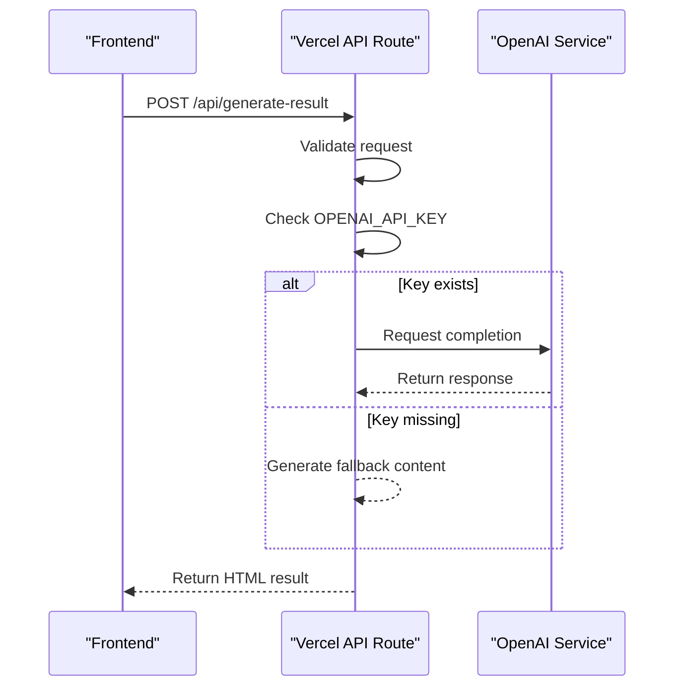

# Deployment Configuration

<cite>
**Referenced Files in This Document**   
- [vercel.json](file://vercel.json)
- [package.json](file://package.json)
- [README.md](file://README.md)
- [api/generate-result.js](file://api/generate-result.js)
- [tests/openai-connection.test.js](file://tests/openai-connection.test.js)
- [api/submit.js](file://api/submit.js)
- [api/stats.js](file://api/stats.js)
- [index.html](file://index.html)
- [quiz.html](file://quiz.html)
- [thank-you.html](file://thank-you.html)
</cite>

## Table of Contents
1. [Vercel Configuration Overview](#vercel-configuration-overview)
2. [Deployment Process](#deployment-process)
3. [Environment Variables and API Integration](#environment-variables-and-api-integration)
4. [Package.json Scripts and DevDependencies](#packagejson-scripts-and-devdependencies)
5. [Manual and Automated Deployment Methods](#manual-and-automated-deployment-methods)
6. [Custom Domains and SSL Setup](#custom-domains-and-ssl-setup)
7. [Vercel Insights for Monitoring](#vercel-insights-for-monitoring)
8. [Rollback and Preview Deployments](#rollback-and-preview-deployments)
9. [Production Best Practices](#production-best-practices)
10. [Troubleshooting Common Issues](#troubleshooting-common-issues)

## Vercel Configuration Overview

The `vercel.json` file in the root directory defines the deployment configuration for the alena application. It specifies the project version, installation command, build command, and output directory. The current configuration uses `"version": 2`, indicating compatibility with Vercel's latest deployment platform. The `"installCommand": "npm install"` ensures dependencies are installed during deployment, while `"buildCommand": "echo Build ready"` serves as a placeholder since this is a static site with serverless functions. The `"outputDirectory": "."` setting indicates that all files in the project root should be deployed.

This configuration enables clean URL routing to both static pages (e.g., index.html, quiz.html) and API endpoints under the `/api` directory. Vercel automatically detects API routes in the `/api` folder and deploys them as serverless functions with RESTful endpoints.

**Section sources**
- [vercel.json](file://vercel.json#L1-L6)

## Deployment Process

The deployment process for the alena application can be executed through either automated GitHub integration or manual CLI deployment. When connected to GitHub, Vercel automatically triggers a new deployment whenever changes are pushed to the main branch. This continuous deployment workflow ensures that updates are immediately reflected in the production environment.

For manual deployments, developers can use the Vercel CLI after installing it globally via `npm install -g vercel`. Running `vercel --prod` from the project root initiates a production deployment. Each deployment generates a unique URL for preview purposes before being promoted to production.

**Section sources**
- [README.md](file://README.md#L29-L40)

## Environment Variables and API Integration

The application integrates with the OpenAI API through environment variables. The `OPENAI_API_KEY` must be configured in Vercel's project settings under Environment Variables. This key is accessed in the `api/generate-result.js` file where it's used to authenticate requests to the OpenAI service. If the environment variable is missing, the application falls back to predefined content to ensure functionality continues.

The same environment variable is referenced in the test file `openai-connection.test.js`, which validates the presence of the API key before running connectivity tests. This approach ensures secure handling of sensitive credentials while maintaining application resilience.



**Diagram sources**
- [api/generate-result.js](file://api/generate-result.js#L182-L192)
- [tests/openai-connection.test.js](file://tests/openai-connection.test.js#L4-L6)

**Section sources**
- [api/generate-result.js](file://api/generate-result.js#L182-L192)
- [tests/openai-connection.test.js](file://tests/openai-connection.test.js#L4-L6)

## Package.json Scripts and DevDependencies

The `package.json` file includes essential metadata and dependency declarations. The application depends on the `openai` package (`^4.104.0`) for AI-powered result generation. Development dependencies include `vercel` (`^48.2.9`), which provides the CLI tool for manual deployments and local development.

These devDependencies play a crucial role in the deployment workflow by enabling developers to test and deploy the application directly from their local environment. The Vercel CLI allows for preview deployments, debugging, and production promotion without requiring GitHub integration.

**Section sources**
- [package.json](file://package.json#L1-L10)

## Manual and Automated Deployment Methods

Two deployment methods are supported: automated (GitHub-connected) and manual (Vercel CLI). 

For **automated deployment**:
1. Connect the GitHub repository to a Vercel project
2. Configure the root directory and environment variables
3. Set the production branch (typically main)
4. Vercel automatically deploys on every push

For **manual deployment**:
1. Install Vercel CLI: `npm install -g vercel`
2. Authenticate: `vercel login`
3. Deploy to production: `vercel --prod`
4. Confirm deployment and verify the production URL

Both methods utilize the same build configuration and environment variables, ensuring consistency across deployment types.

**Section sources**
- [README.md](file://README.md#L29-L40)

## Custom Domains and SSL Setup

Custom domains can be configured through the Vercel dashboard by adding a domain to the project settings. Once added, Vercel automatically provisions SSL certificates via Let's Encrypt, ensuring HTTPS encryption for all traffic. DNS records must be updated at the domain registrar to point to Vercel's assigned target.

The application's static assets and API endpoints will be accessible through the custom domain with proper routing maintained. For example, `https://yourdomain.com/api/generate-result` will route to the corresponding serverless function.

**Section sources**
- [vercel.json](file://vercel.json#L1-L6)
- [index.html](file://index.html)
- [quiz.html](file://quiz.html)

## Vercel Insights for Monitoring

Vercel Insights provides monitoring capabilities for API usage and performance metrics. The application includes the Vercel Insights script in several HTML files (`thank-you.html`, `strategy-map.html`), implemented via:

```html
<script>
    window.va = window.va || function () { (window.vaq = window.vaq || []).push(arguments); };
</script>
<script defer src="/_vercel/insights/script.js"></script>
```

This integration enables tracking of page views, user interactions, and performance metrics. For API endpoints, Insights can monitor invocation frequency, response times, and error rates, helping identify bottlenecks in functions like `generate-result.js`, `submit.js`, and `stats.js`.

**Section sources**
- [thank-you.html](file://thank-you.html#L103-L156)
- [strategy-map.html](file://strategy-map.html#L83-L127)
- [api/generate-result.js](file://api/generate-result.js)
- [api/submit.js](file://api/submit.js)
- [api/stats.js](file://api/stats.js)

## Rollback and Preview Deployments

Vercel supports instant rollback to previous deployments through the dashboard. Each deployment is versioned, allowing teams to revert to a stable version if issues arise in production. Preview deployments are automatically created for pull requests, providing a unique URL to test changes before merging.

These preview deployments include all environment variables (except those marked as production-only) and allow full testing of both static content and API functionality. This workflow enables safe iteration and quality assurance before production release.

**Section sources**
- [README.md](file://README.md#L29-L40)

## Production Best Practices

Key production best practices for this application include:
- Securing the `OPENAI_API_KEY` as a protected environment variable
- Using semantic versioning in package.json
- Maintaining a clear separation between static assets and API routes
- Implementing proper error handling and fallback mechanisms
- Regularly monitoring deployment logs and performance metrics
- Using preview deployments for testing changes
- Configuring appropriate caching headers for static assets

The current configuration follows these practices by isolating API logic in the `/api` directory and using environment variables for sensitive data.

**Section sources**
- [vercel.json](file://vercel.json)
- [package.json](file://package.json)
- [api/generate-result.js](file://api/generate-result.js)

## Troubleshooting Common Issues

Common deployment issues and their solutions:

**Missing Environment Variables**: If `OPENAI_API_KEY` is not set, the `generate-result` API will return fallback content. Solution: Add the variable in Vercel project settings.

**Routing Errors**: Ensure HTML files are properly named and referenced. The current setup maps `/quiz` to `quiz.html` automatically through Vercel's static file serving.

**API Deployment Failures**: Verify that all API files in `/api` export a default handler function. Files like `submit.js` and `stats.js` follow this pattern correctly.

**CORS Issues**: The API routes include proper CORS headers allowing requests from any origin, which is suitable for this static site deployment.

**Build Failures**: Check that the `installCommand` and `buildCommand` in `vercel.json` match the project requirements. The current configuration is minimal but sufficient for this application.

**Section sources**
- [vercel.json](file://vercel.json)
- [api/generate-result.js](file://api/generate-result.js#L182)
- [api/submit.js](file://api/submit.js#L4-L18)
- [api/stats.js](file://api/stats.js#L4-L18)