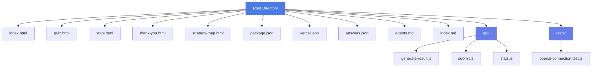

# Directory Structure

<cite>
**Referenced Files in This Document**   
- [index.html](file://index.html)
- [quiz.html](file://quiz.html)
- [stats.html](file://stats.html)
- [thank-you.html](file://thank-you.html)
- [strategy-map.html](file://strategy-map.html)
- [api/generate-result.js](file://api/generate-result.js)
- [api/submit.js](file://api/submit.js)
- [api/stats.js](file://api/stats.js)
- [package.json](file://package.json)
- [vercel.json](file://vercel.json)
- [answers.json](file://answers.json)
- [agents.md](file://agents.md)
- [index.md](file://index.md)
</cite>

## Table of Contents
1. [Root-Level HTML Files](#root-level-html-files)
2. [API Directory](#api-directory)
3. [Configuration Files](#configuration-files)
4. [Supporting Documentation Files](#supporting-documentation-files)
5. [File Structure Visualization](#file-structure-visualization)
6. [Best Practices and Extension Points](#best-practices-and-extension-points)

## Root-Level HTML Files

The root directory contains five primary HTML files that serve as entry points for distinct user journeys within the application. Each file corresponds to a specific stage in the user experience flow, from initial access to post-quiz engagement.

- **index.html**: Serves as the default landing page and automatically redirects users to quiz.html using a meta refresh script. It acts as a gateway rather than a standalone content page.
- **quiz.html**: The main interactive interface where users complete a 10-question assessment to determine their stage of adaptation in a new country. This is the primary user engagement point.
- **stats.html**: A statistics dashboard that visualizes aggregated user responses, including response counts, result distributions, and question-level analytics. It allows administrators to review collected data.
- **thank-you.html**: Displayed after form submission, this page confirms successful data submission and provides a Cal.com booking widget for scheduling a free 30-minute coaching session.
- **strategy-map.html**: Presents a visual representation of the adaptation journey, showing stages from initial research through integration, intended as a preview of the personalized plan users will receive.

These HTML files are designed to support a linear user journey while allowing direct access to specific functionality (e.g., viewing stats or reviewing the strategy map).

**Section sources**
- [index.html](file://index.html#L0-L14)
- [quiz.html](file://quiz.html#L0-L799)
- [stats.html](file://stats.html#L0-L682)
- [thank-you.html](file://thank-you.html#L0-L188)
- [strategy-map.html](file://strategy-map.html#L0-L204)

## API Directory

The `api/` directory contains serverless functions deployed on Vercel that handle backend operations for the application. These functions process user data, generate personalized results, and provide statistical insights.

- **generate-result.js**: Processes quiz answers and generates personalized feedback using OpenAI's GPT model. It determines the user's adaptation stage based on answer distribution and constructs an HTML response with tailored advice. Includes fallback content if the API key is missing or the request fails.
- **submit.js**: Accepts POST requests containing user answers, logs them, and returns a success confirmation. Currently does not persist data but serves as a placeholder for future storage implementation.
- **stats.js**: Retrieves and aggregates data from answers.json to provide statistical insights about user responses, including total submissions and answer distributions across questions.

These functions follow Vercel's serverless function structure, include proper CORS headers, and handle errors gracefully with appropriate HTTP status codes.

**Section sources**
- [api/generate-result.js](file://api/generate-result.js#L0-L242)
- [api/submit.js](file://api/submit.js#L0-L31)
- [api/stats.js](file://api/stats.js#L0-L58)

## Configuration Files

Key configuration files define dependencies, deployment settings, and data storage for the application.

- **package.json**: Specifies project metadata, dependencies (including OpenAI SDK), and devDependencies (Vercel CLI). Defines the project name, version, description, and required packages.
- **vercel.json**: Configures Vercel deployment with version specification, custom install and build commands, and output directory settings. Ensures proper deployment behavior on the Vercel platform.
- **answers.json**: Stores user response data in JSON format, maintaining a record of timestamps, individual answers, and determined results. Acts as the primary data persistence layer for the application.

These files enable proper dependency management, deployment configuration, and data storage for the application's functionality.

**Section sources**
- [package.json](file://package.json#L0-L11)
- [vercel.json](file://vercel.json#L0-L5)
- [answers.json](file://answers.json#L0-L17)

## Supporting Documentation Files

Additional files provide project documentation, maintenance guidelines, and operational instructions.

- **agents.md**: Contains operational guidelines for deployment and testing, including instructions to wait for Vercel deployment after GitHub pushes, test solutions using Playwright MCP, and validate the appearance of personalized response content.
- **index.md**: Serves as project documentation with an overview of the quiz functionality, demo link, features, result types, and Telegram integration settings including Chat ID and API key.

These files support ongoing maintenance and provide context for developers working on the project.

**Section sources**
- [agents.md](file://agents.md#L0-L2)
- [index.md](file://index.md#L0-L23)

## File Structure Visualization

**Diagram sources**
- [index.html](file://index.html)
- [quiz.html](file://quiz.html)
- [stats.html](file://stats.html)
- [thank-you.html](file://thank-you.html)
- [strategy-map.html](file://strategy-map.html)
- [api/generate-result.js](file://api/generate-result.js)
- [api/submit.js](file://api/submit.js)
- [api/stats.js](file://api/stats.js)
- [package.json](file://package.json)
- [vercel.json](file://vercel.json)
- [answers.json](file://answers.json)
- [agents.md](file://agents.md)
- [index.md](file://index.md)

## Best Practices and Extension Points

The current structure follows several best practices for static web applications with serverless backend functionality:

1. **Separation of Concerns**: Clear distinction between frontend (HTML files), backend logic (API functions), configuration, and documentation.
2. **Scalable API Design**: Serverless functions in the api/ directory can be easily extended to support additional endpoints.
3. **Configurable Deployment**: Vercel-specific settings in vercel.json allow for customized deployment behavior.
4. **Data Persistence**: answers.json provides a simple mechanism for storing user responses that can be migrated to a database later.

Potential extension points include:
- Migrating answers.json to a database system for improved scalability
- Adding authentication to the stats.html page for protected access
- Expanding the API with additional analytics endpoints
- Implementing data validation in the submit.js function
- Adding internationalization support for multiple languages
- Enhancing error handling and logging across all components

The structure supports incremental improvements while maintaining functionality, making it suitable for both immediate use and future development.

**Section sources**
- [package.json](file://package.json#L0-L11)
- [vercel.json](file://vercel.json#L0-L5)
- [answers.json](file://answers.json#L0-L17)
- [agents.md](file://agents.md#L0-L2)
- [index.md](file://index.md#L0-L23)