```mermaid
flowchart TD
Mobile["Mobile View (<768px)"] --> Layout["Layout Adjustments"]
Desktop["Desktop View (≥768px)"] --> Layout
Layout --> Container["Container: margin 10px, border-radius 15px"]
Layout --> Header["Header: padding 30px 20px, font-size 2rem"]
Layout --> Quiz["Quiz Container: padding 30px 20px"]
Layout --> Progress["Progress Bar: full width"]
Layout --> Navigation["Navigation: flex layout"]
Layout --> Options["Options: stacked vertically"]
Desktop --> DesktopContainer["Container: margin auto, border-radius 20px"]
Desktop --> DesktopHeader["Header: padding 30px 20px, font-size 2.5rem"]
Desktop --> DesktopQuiz["Quiz Container: padding 30px 20px"]
Desktop --> DesktopProgress["Progress Bar: full width"]
Desktop --> DesktopNavigation["Navigation: flex with space-between"]
Desktop --> DesktopOptions["Options: stacked vertically"]
StrategyMobile["Strategy Map Mobile"] --> StrategyLayout["Grid: 1 column"]
StrategyDesktop["Strategy Map Desktop"] --> StrategyLayout["Grid: auto-fit minmax(250px, 1fr)"]
StatsMobile["Stats Page Mobile"] --> StatsLayout["Grid: 1 column"]
StatsDesktop["Stats Page Desktop"] --> StatsLayout["Grid: repeat(auto-fit, minmax(300px, 1fr))"]
style Mobile fill:#2196F3,stroke:#1976D2
style Desktop fill:#2196F3,stroke:#1976D2
style MobileContainer fill:#4CAF50,stroke:#388E3C
style DesktopContainer fill:#4CAF50,stroke:#388E3C
style StrategyMobile fill:#FF9800,stroke:#F57C00
style StrategyDesktop fill:#FF9800,stroke:#F57C00
style StatsMobile fill:#9C27B0,stroke:#7B1FA2
style StatsDesktop fill:#9C27B0,stroke:#7B1FA2
```

# Frontend Architecture

<cite>
**Referenced Files in This Document**   
- [index.html](file://index.html)
- [quiz.html](file://quiz.html)
- [thank-you.html](file://thank-you.html)
- [stats.html](file://stats.html)
- [strategy-map.html](file://strategy-map.html)
- [api/generate-result.js](file://api/generate-result.js)
- [api/submit.js](file://api/submit.js)
- [api/stats.js](file://api/stats.js)
</cite>

## Table of Contents
1. [Introduction](#introduction)
2. [Project Structure](#project-structure)
3. [Core Components](#core-components)
4. [Architecture Overview](#architecture-overview)
5. [Detailed Component Analysis](#detailed-component-analysis)
6. [Dependency Analysis](#dependency-analysis)
7. [Performance Considerations](#performance-considerations)
8. [Troubleshooting Guide](#troubleshooting-guide)
9. [Conclusion](#conclusion)

## Introduction
This document provides comprehensive architectural documentation for the frontend components of the alena application. The application is designed as a static HTML-based quiz platform that assesses users' adaptation stages in a new country through a 9-question assessment. The frontend architecture consists of multiple standalone HTML pages that serve different user flows: index.html (landing), quiz.html (assessment interface), thank-you.html (post-submission actions), stats.html (analytics dashboard), and strategy-map.html (coaching guidance). The system implements client-side JavaScript logic for question navigation, answer collection, and API communication with backend services. The UI flow guides users through an automatic progression quiz, displays personalized results, and facilitates coaching session scheduling via Cal.com integration. The design follows responsive principles to ensure optimal user experience across various devices.

## Project Structure
The alena application follows a flat, static file structure with HTML pages serving as the primary entry points for different user journeys. The root directory contains all HTML templates that represent distinct user flows, with a dedicated `api` directory housing serverless functions that handle data processing and storage. The architecture is intentionally simple, leveraging static hosting capabilities while maintaining dynamic functionality through client-side JavaScript and API endpoints. This structure enables easy deployment and maintenance while supporting the core functionality of user assessment, result generation, and data analytics.

**Diagram sources**
- [index.html](file://index.html)
- [quiz.html](file://quiz.html)
- [thank-you.html](file://thank-you.html)
- [stats.html](file://stats.html)
- [strategy-map.html](file://strategy-map.html)
- [api/generate-result.js](file://api/generate-result.js)
- [api/submit.js](file://api/submit.js)
- [api/stats.js](file://api/stats.js)

**Section sources**
- [index.html](file://index.html)
- [quiz.html](file://quiz.html)
- [thank-you.html](file://thank-you.html)
- [stats.html](file://stats.html)
- [strategy-map.html](file://strategy-map.html)

## Core Components
The core components of the alena application are centered around the quiz assessment functionality, with the quiz.html page serving as the primary interactive interface. This component handles the complete user journey from question presentation to result generation, implementing sophisticated client-side logic for question navigation, answer collection, and state management. The component interacts with backend APIs through fetch calls to /api/generate-result and /api/submit, enabling dynamic content generation and persistent data storage. The result display mechanism incorporates a loading state with countdown animation before revealing personalized coaching recommendations. The architecture separates concerns between static content presentation and dynamic functionality, with CSS handling responsive design and visual feedback while JavaScript manages the application state and API communications.

**Section sources**
- [quiz.html](file://quiz.html)
- [api/generate-result.js](file://api/generate-result.js)
- [api/submit.js](file://api/submit.js)

## Architecture Overview
The frontend architecture of the alena application follows a static site pattern with dynamic capabilities enabled through serverless functions. The system is built on multiple independent HTML pages, each serving a specific user flow, with quiz.html acting as the central component for user interaction. The architecture implements a client-server model where the frontend handles user interface presentation and interaction logic, while backend API endpoints process data and generate responses. The quiz interface manages its state through DOM manipulation and JavaScript variables, tracking the current question, user answers, and navigation state. Communication with the backend occurs through RESTful API calls, with the /api/submit endpoint storing user responses and the /api/generate-result endpoint generating personalized coaching content using OpenAI's GPT model. The system incorporates fallback mechanisms to ensure functionality even when external services are unavailable, demonstrating robust error handling and user experience considerations.

**Diagram sources**
- [quiz.html](file://quiz.html)
- [api/generate-result.js](file://api/generate-result.js)
- [api/submit.js](file://api/submit.js)

## Detailed Component Analysis

### Quiz Interface Analysis
The quiz.html component implements a comprehensive assessment interface with sophisticated client-side logic for managing the 9-question quiz flow. The component handles question navigation through DOM manipulation, dynamically showing and hiding questions while updating the progress bar and question counter. Answer collection is managed through event listeners on radio inputs, with visual feedback provided through CSS transitions and class toggling when options are selected. The interface enforces sequential progression, requiring users to answer each question before advancing, while allowing backward navigation to modify previous answers. The component maintains state through JavaScript variables that track the current question index, collected answers, and form validity.

#### For Complex Logic Components:

**Diagram sources**
- [quiz.html](file://quiz.html)

**Section sources**
- [quiz.html](file://quiz.html)

### API Integration Analysis
The frontend components interact with backend APIs through well-defined endpoints that handle specific functionality. The /api/submit endpoint receives user answers and stores them in a JSON file, implementing proper error handling and CORS configuration to support cross-origin requests. The /api/generate-result endpoint processes user responses and generates personalized coaching content, either through OpenAI's GPT model or a fallback mechanism when the external service is unavailable. The system demonstrates robust error handling with multiple fallback layers, ensuring that users receive meaningful content even when external dependencies fail. The API integration follows RESTful principles with appropriate HTTP methods and status codes, providing a reliable interface between the frontend and backend components.

#### For API/Service Components:

**Diagram sources**
- [api/generate-result.js](file://api/generate-result.js)
- [api/submit.js](file://api/submit.js)

**Section sources**
- [api/generate-result.js](file://api/generate-result.js)
- [api/submit.js](file://api/submit.js)

### Responsive Design Analysis
The application implements comprehensive responsive design principles to ensure optimal user experience across various devices and screen sizes. The CSS utilizes a mobile-first approach with media queries that adapt the layout for larger screens. Key responsive features include flexible container widths with max-width constraints, responsive padding and margins, and adaptive grid layouts for statistics and strategy map components. The design maintains visual hierarchy and usability on mobile devices through appropriately sized touch targets, readable font sizes, and simplified layouts. The progress bar, navigation buttons, and form elements are optimized for touch interaction, with sufficient spacing and visual feedback. The responsive design ensures that the application remains accessible and user-friendly regardless of the device being used.

#### For Complex Logic Components:

**Diagram sources**
- [quiz.html](file://quiz.html)
- [stats.html](file://stats.html)
- [strategy-map.html](file://strategy-map.html)

**Section sources**
- [quiz.html](file://quiz.html)
- [stats.html](file://stats.html)
- [strategy-map.html](file://strategy-map.html)

## Dependency Analysis
The frontend architecture demonstrates a clean dependency structure with minimal external dependencies. The primary dependencies are the Vercel analytics script and the Cal.com booking widget, both loaded asynchronously to avoid blocking page rendering. The application relies on native browser APIs for DOM manipulation, event handling, and network requests, avoiding the need for external JavaScript frameworks. The CSS is self-contained within each HTML file, with no external stylesheet dependencies. The backend API endpoints have dependencies on Node.js modules (fs, path, express) for file operations and server functionality, but these are isolated from the frontend components. This dependency structure contributes to the application's reliability and performance, with fast load times and minimal points of failure.

**Diagram sources**
- [quiz.html](file://quiz.html)
- [thank-you.html](file://thank-you.html)
- [api/stats.js](file://api/stats.js)
- [api/submit.js](file://api/submit.js)

**Section sources**
- [quiz.html](file://quiz.html)
- [thank-you.html](file://thank-you.html)
- [api/stats.js](file://api/stats.js)
- [api/submit.js](file://api/submit.js)

## Performance Considerations
The alena application demonstrates strong performance characteristics through its static file architecture and efficient resource utilization. By serving HTML files directly from a CDN, the application achieves fast initial load times and high availability. The inline CSS and JavaScript reduce HTTP requests, further improving performance. The application implements lazy loading for external scripts like the Cal.com widget and Vercel analytics, ensuring they don't block the main content rendering. The quiz interface uses efficient DOM manipulation techniques, minimizing reflows and repaints during question transitions. The API endpoints are optimized for quick response times, with the /api/submit endpoint performing simple file operations and the /api/generate-result endpoint implementing caching and fallback mechanisms to handle external service latency. The responsive design ensures optimal performance across devices by serving appropriately sized assets and layouts.

## Troubleshooting Guide
When troubleshooting issues with the alena application, consider the following common scenarios and solutions:

1. **Quiz not progressing to next question**: Ensure an answer is selected before clicking "Next". The interface requires a selection to enable the next button.

2. **Results not displaying**: Check browser console for JavaScript errors. Verify that the /api/generate-result endpoint is accessible and that OPENAI_API_KEY is configured in environment variables.

3. **Answers not being saved**: Confirm that the answers.json file is writable and that the /api/submit endpoint has proper file system permissions.

4. **Cal.com scheduler not loading**: Verify the Cal.com embed code is correctly configured in thank-you.html and that the internet connection is stable.

5. **Styling issues on mobile**: Clear browser cache and ensure viewport meta tag is present in HTML files.

6. **Analytics not tracking**: Confirm Vercel analytics script is properly loaded and that the environment supports the tracking functionality.

**Section sources**
- [quiz.html](file://quiz.html)
- [api/generate-result.js](file://api/generate-result.js)
- [api/submit.js](file://api/submit.js)
- [thank-you.html](file://thank-you.html)

## Conclusion
The frontend architecture of the alena application effectively combines simplicity with functionality, creating a robust platform for user assessment and coaching guidance. The static HTML-based approach ensures reliability and performance while client-side JavaScript provides dynamic interactivity. The clean separation of concerns between frontend pages and backend API endpoints enables maintainable code and scalable functionality. The responsive design principles ensure accessibility across devices, while the thoughtful user flow guides participants from assessment to actionable insights. The integration with external services like OpenAI and Cal.com extends the application's capabilities without compromising its core stability. This architecture serves as an excellent example of how modern web applications can leverage both static and dynamic elements to create engaging user experiences with minimal complexity.