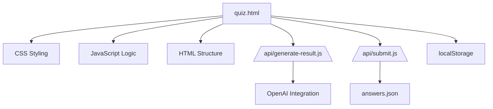
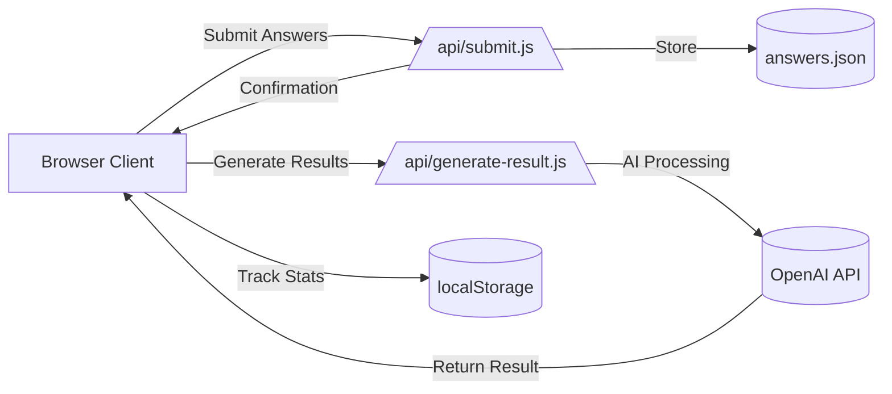
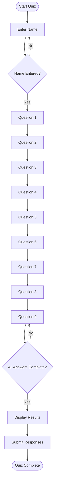
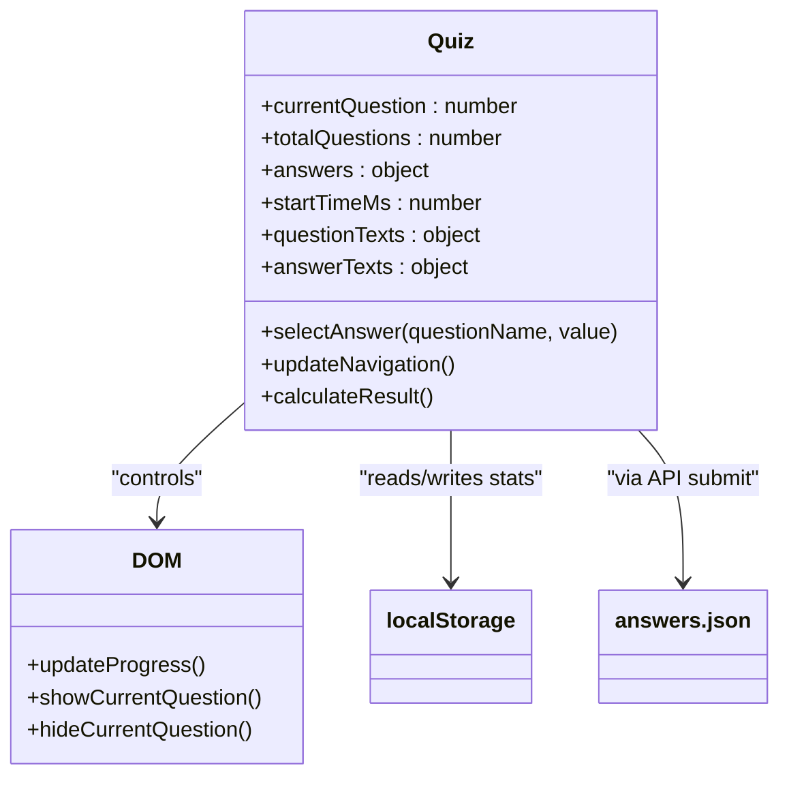
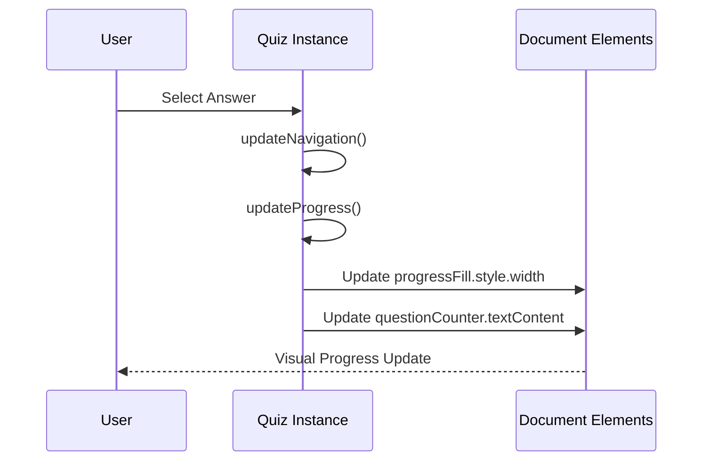
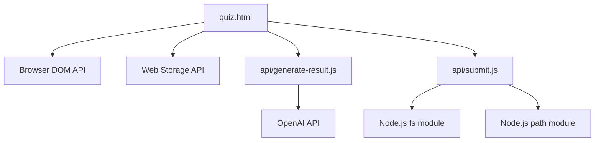

# Quiz Interface

<cite>
**Referenced Files in This Document**   
- [quiz.html](file://quiz.html)
- [api/generate-result.js](file://api/generate-result.js)
- [api/submit.js](file://api/submit.js)
- [answers.json](file://answers.json)
</cite>

## Table of Contents
1. [Introduction](#introduction)
2. [Project Structure](#project-structure)
3. [Core Components](#core-components)
4. [Architecture Overview](#architecture-overview)
5. [Detailed Component Analysis](#detailed-component-analysis)
6. [Dependency Analysis](#dependency-analysis)
7. [Performance Considerations](#performance-considerations)
8. [Troubleshooting Guide](#troubleshooting-guide)
9. [Conclusion](#conclusion)

## Introduction
The Quiz Interface is a dynamic web-based assessment tool designed to evaluate an individual's stage of adaptation in a new country through a 9-question interactive flow. The interface combines responsive HTML structure, CSS styling for visual appeal and mobile compatibility, and JavaScript functionality for seamless user interaction. It features progressive question navigation, real-time answer selection feedback, and a visually engaging progress tracking system. Upon completion, the quiz connects to backend APIs to generate personalized results and submit user responses. The design emphasizes accessibility, user experience, and emotional engagement through thoughtful animations, color gradients, and micro-interactions.

## Project Structure
The quiz interface is implemented as a standalone HTML file (`quiz.html`) that incorporates inline CSS and JavaScript, making it self-contained while maintaining modular functionality. The project includes backend API endpoints in the `api/` directory for result generation and response submission. User responses are stored in `answers.json`, and the overall structure follows a client-server model with localStorage used for client-side statistics tracking. The interface is part of a larger ecosystem that includes additional pages like `stats.html` and `thank-you.html`, indicating a comprehensive user journey from assessment to results and follow-up.

**Diagram sources**
- [quiz.html](file://quiz.html)
- [api/generate-result.js](file://api/generate-result.js)
- [api/submit.js](file://api/submit.js)
- [answers.json](file://answers.json)

**Section sources**
- [quiz.html](file://quiz.html)
- [api/generate-result.js](file://api/generate-result.js)
- [api/submit.js](file://api/submit.js)

## Core Components
The quiz interface consists of several core components that work together to create a seamless user experience. The primary components include the question container with dynamic visibility, the progress bar for visual feedback, navigation controls for moving between questions, and the result display system that presents personalized feedback. The interface handles both text input (for the user's name) and radio button selections (for the nine assessment questions), with JavaScript managing the state of user responses throughout the quiz flow. The system also includes a booking form that appears after quiz completion, enabling users to schedule a coaching session.

**Section sources**
- [quiz.html](file://quiz.html#L120-L1599)
- [api/generate-result.js](file://api/generate-result.js#L1-L243)

## Architecture Overview
The quiz interface follows a client-server architecture where the client-side HTML application handles user interaction and state management, while serverless functions process and store data. The frontend manages the complete quiz flow including question progression, answer selection, and progress tracking, while the backend handles result generation through AI processing and persistent storage of user responses. The system uses localStorage for client-side statistics and a JSON file for server-side response storage, creating a hybrid data persistence model. The architecture is designed for deployment on Vercel, as evidenced by the presence of Vercel-specific scripts and serverless function patterns.

**Diagram sources**
- [quiz.html](file://quiz.html)
- [api/generate-result.js](file://api/generate-result.js)
- [api/submit.js](file://api/submit.js)
- [answers.json](file://answers.json)

## Detailed Component Analysis

### Quiz Flow and Navigation
The quiz interface implements a linear 9-question assessment flow with dynamic question progression. Users begin with a name input field (question 0) followed by nine multiple-choice questions that assess various aspects of cultural adaptation. The navigation system allows users to move forward and backward through the questions using dedicated buttons, with JavaScript controlling the visibility of each question through CSS class manipulation. The system enforces answer validation by disabling the "Next" button until a response is selected, ensuring data completeness.

**Diagram sources**
- [quiz.html](file://quiz.html#L1204-L1238)
- [quiz.html](file://quiz.html#L1240-L1269)

**Section sources**
- [quiz.html](file://quiz.html#L1204-L1292)

### Answer Selection and State Management
The answer selection mechanism uses radio buttons styled as interactive cards, providing visual feedback when selected. JavaScript handles the selection events, updating both the visual state (by adding a "selected" class) and the internal state object that tracks user responses. The system maintains state in a JavaScript object that maps question identifiers to selected answers, with special handling for the initial name input field. This state management approach allows the quiz to preserve user responses throughout the navigation flow and when moving backward through questions.

**Diagram sources**
- [quiz.html](file://quiz.html#L1166-L1193)
- [quiz.html](file://quiz.html#L1271-L1292)

**Section sources**
- [quiz.html](file://quiz.html#L1166-L1292)

### Progress Tracking and Visual Feedback
The progress tracking system consists of a visual progress bar and a question counter that update in real-time as users navigate through the quiz. The progress bar uses CSS width animation to provide smooth visual feedback, while the counter displays the current question number out of the total. The system calculates progress as a percentage of completed questions and updates both the visual bar width and text counter simultaneously. This dual feedback mechanism helps users understand their position in the quiz flow and provides motivation to complete the assessment.

**Diagram sources**
- [quiz.html](file://quiz.html#L1240-L1269)
- [quiz.html](file://quiz.html#L1271-L1292)

**Section sources**
- [quiz.html](file://quiz.html#L1240-L1292)

## Dependency Analysis
The quiz interface has minimal external dependencies, relying primarily on browser-native technologies. The frontend depends on the DOM API for element manipulation and event handling, while the backend functions depend on Node.js filesystem operations for data persistence. The result generation component has a conditional dependency on the OpenAI API, with a fallback mechanism implemented when the API key is not available. The system uses localStorage for client-side data storage and a JSON file for server-side response collection, creating a lightweight persistence layer without requiring a traditional database.

**Diagram sources**
- [quiz.html](file://quiz.html)
- [api/generate-result.js](file://api/generate-result.js)
- [api/submit.js](file://api/submit.js)

**Section sources**
- [quiz.html](file://quiz.html)
- [api/generate-result.js](file://api/generate-result.js)
- [api/submit.js](file://api/submit.js)

## Performance Considerations
The quiz interface is optimized for performance through several design choices. The single HTML file with inline CSS and JavaScript reduces HTTP requests and improves load times. The use of CSS transitions and transforms for animations ensures smooth visual effects without blocking the main thread. The system implements debouncing and throttling patterns for event handlers to prevent performance issues from rapid user interactions. The result generation process uses a countdown animation that runs independently of the API call, providing immediate feedback while the backend processes the request. The fallback mechanism in the result generation API ensures that users receive feedback even if the OpenAI service is unavailable, maintaining a positive user experience under various conditions.

## Troubleshooting Guide
Common issues with the quiz interface typically relate to event handling and state synchronization. The code includes extensive console logging to help diagnose problems with navigation, answer selection, and progress updates. Issues with the "Next" button not enabling are usually caused by missing event listeners on the name input field or radio buttons, which the system attempts to resolve through multiple event binding strategies. Problems with result display may occur if the OpenAI API is unreachable, but the system provides a fallback result generation mechanism in such cases. Data persistence issues can be diagnosed by checking both the localStorage entry for quiz statistics and the answers.json file on the server.

**Section sources**
- [quiz.html](file://quiz.html#L1204-L1387)
- [api/generate-result.js](file://api/generate-result.js#L1-L243)
- [api/submit.js](file://api/submit.js#L1-L63)

## Conclusion
The Quiz Interface represents a well-structured, self-contained web application that effectively combines frontend interactivity with backend processing to deliver a personalized user experience. Its architecture balances simplicity with functionality, using minimal dependencies while providing a rich interactive experience. The system demonstrates thoughtful design in its state management, navigation flow, and error handling, with particular attention to user experience through visual feedback and progressive disclosure. The integration with AI-powered result generation adds significant value by providing personalized insights, while the fallback mechanisms ensure reliability. The codebase shows evidence of iterative development with comprehensive event handling and debugging support, making it maintainable and extensible for future enhancements.