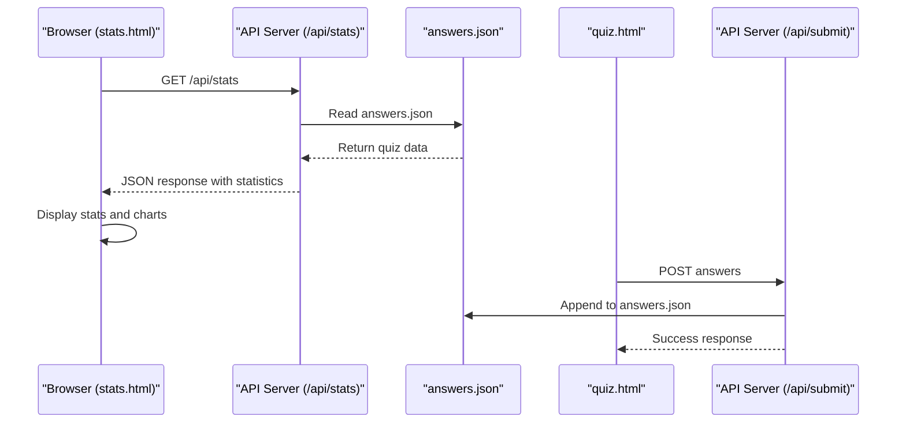
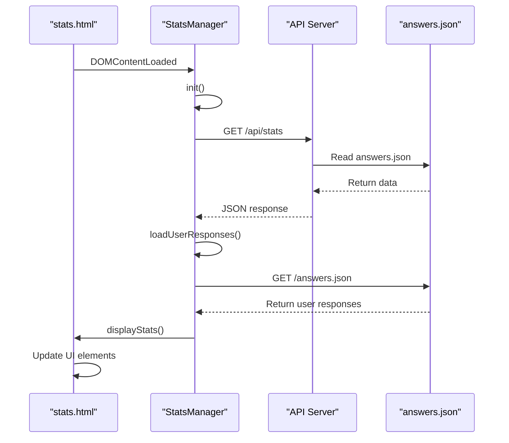
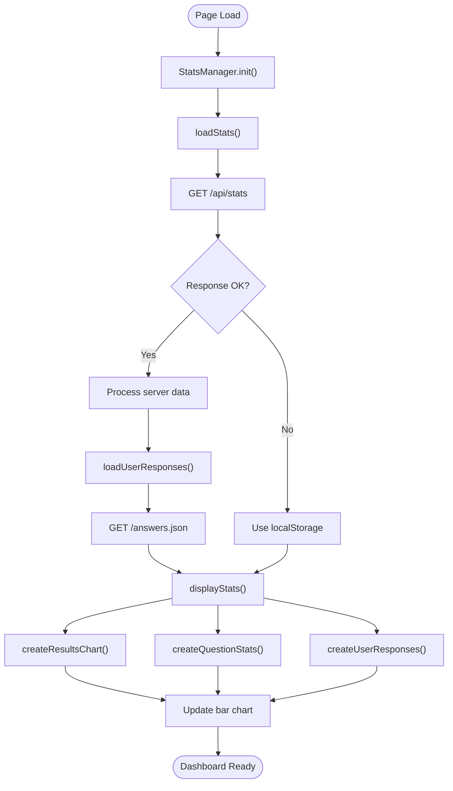
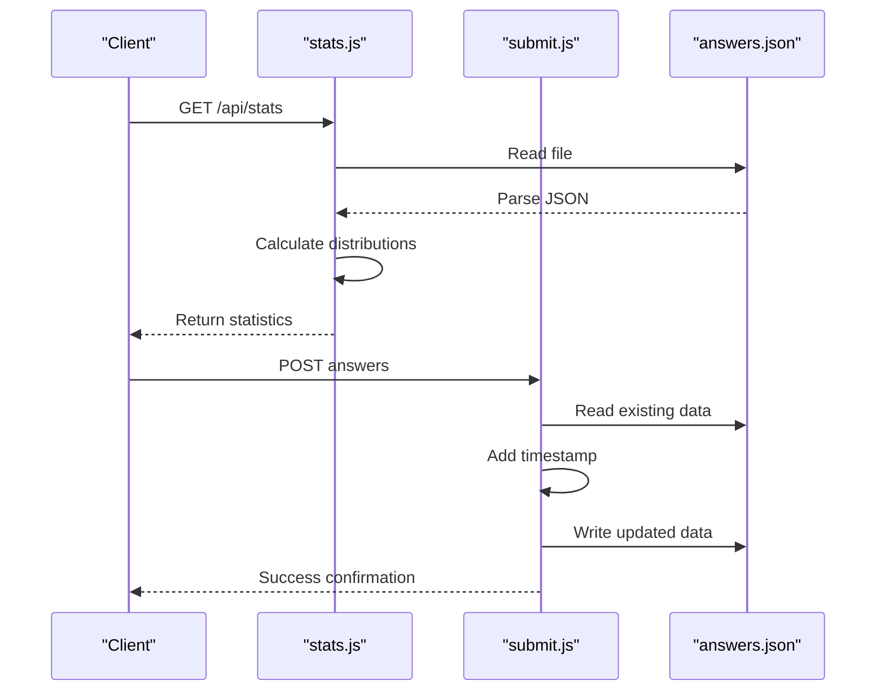

# Statistics Dashboard

<cite>
**Referenced Files in This Document**   
- [stats.html](file://stats.html)
- [api/stats.js](file://api/stats.js)
- [api/submit.js](file://api/submit.js)
- [answers.json](file://answers.json)
</cite>

## Table of Contents
1. [Introduction](#introduction)
2. [Project Structure](#project-structure)
3. [Core Components](#core-components)
4. [Architecture Overview](#architecture-overview)
5. [Detailed Component Analysis](#detailed-component-analysis)
6. [Dependency Analysis](#dependency-analysis)
7. [Performance Considerations](#performance-considerations)
8. [Troubleshooting Guide](#troubleshooting-guide)
9. [Conclusion](#conclusion)

## Introduction
The Statistics Dashboard provides an administrative interface for viewing response analytics from a cultural adaptation quiz. The dashboard displays key metrics including total submissions, unique users, completion rates, and average completion time. It visualizes result distribution across four adaptation stages using a bar chart and provides detailed question-level statistics showing answer distributions. The interface also displays individual user responses with timestamps and results. The system is built using client-side JavaScript with server-side API endpoints for data retrieval and storage.

## Project Structure
The project structure reveals a web application with HTML pages, API endpoints, and data storage. The statistics dashboard is implemented in stats.html with backend API functionality in the api/ directory. User responses are stored in answers.json, which serves as the persistent data store for quiz submissions.

```mermaid
graph TB
subgraph "Frontend"
Stats[stats.html]
Quiz[quiz.html]
end
subgraph "Backend"
API[/api/stats.js]
Submit[/api/submit.js]
end
subgraph "Data"
Answers[answers.json]
end
Stats --> API
Quiz --> Submit
Submit --> Answers
API --> Answers
```

**Diagram sources**
- [stats.html](file://stats.html#L1-L715)
- [api/stats.js](file://api/stats.js#L1-L67)
- [api/submit.js](file://api/submit.js#L1-L62)
- [answers.json](file://answers.json#L1-L17)

**Section sources**
- [stats.html](file://stats.html#L1-L715)
- [api/stats.js](file://api/stats.js#L1-L67)
- [api/submit.js](file://api/submit.js#L1-L62)
- [answers.json](file://answers.json#L1-L17)

## Core Components
The core components of the statistics dashboard include the StatsManager class for handling data loading and display, the API endpoints for retrieving and submitting quiz data, and the answers.json file as the data persistence layer. The dashboard provides a comprehensive view of user engagement and response patterns for the cultural adaptation quiz.

**Section sources**
- [stats.html](file://stats.html#L1-L715)
- [api/stats.js](file://api/stats.js#L1-L67)

## Architecture Overview
The statistics dashboard follows a client-server architecture where the client (stats.html) requests data from server-side API endpoints. The system uses a simple file-based storage approach with answers.json storing all quiz submissions. The StatsManager class on the client side handles data retrieval, processing, and visualization.



**Diagram sources**
- [stats.html](file://stats.html#L1-L715)
- [api/stats.js](file://api/stats.js#L1-L67)
- [api/submit.js](file://api/submit.js#L1-L62)
- [answers.json](file://answers.json#L1-L17)

## Detailed Component Analysis

### Statistics Dashboard Analysis
The statistics dashboard provides a comprehensive administrative interface for analyzing user responses to the cultural adaptation quiz. The interface displays key metrics and visualizations that help understand user engagement and response patterns.

#### For API/Service Components:


**Diagram sources**
- [stats.html](file://stats.html#L1-L715)

#### For Complex Logic Components:


**Diagram sources**
- [stats.html](file://stats.html#L1-L715)

**Section sources**
- [stats.html](file://stats.html#L1-L715)

### API Endpoint Analysis
The API endpoints provide the backend functionality for the quiz application, handling both data retrieval for statistics and submission of new quiz responses.

#### For API/Service Components:


**Diagram sources**
- [api/stats.js](file://api/stats.js#L1-L67)
- [api/submit.js](file://api/submit.js#L1-L62)
- [answers.json](file://answers.json#L1-L17)

**Section sources**
- [api/stats.js](file://api/stats.js#L1-L67)
- [api/submit.js](file://api/submit.js#L1-L62)

## Dependency Analysis
The statistics dashboard and its supporting components have a clear dependency structure. The client-side dashboard depends on server-side API endpoints to retrieve statistical data and user responses. The API endpoints depend on the file system to read and write the answers.json data file.

```mermaid
graph TD
A[stats.html] --> B[StatsManager]
B --> C[/api/stats]
C --> D[answers.json]
E[quiz.html] --> F[/api/submit]
F --> D[answers.json]
B --> G[localStorage]
H[resetStats] --> G[localStorage]
```

**Diagram sources**
- [stats.html](file://stats.html#L1-L715)
- [api/stats.js](file://api/stats.js#L1-L67)
- [api/submit.js](file://api/submit.js#L1-L62)
- [answers.json](file://answers.json#L1-L17)

**Section sources**
- [stats.html](file://stats.html#L1-L715)
- [api/stats.js](file://api/stats.js#L1-L67)
- [api/submit.js](file://api/submit.js#L1-L62)
- [answers.json](file://answers.json#L1-L17)

## Performance Considerations
The current implementation has several performance considerations. The dashboard loads all user responses from answers.json in a separate request, which could lead to performance issues as the dataset grows. The client-side processing of statistics means that larger datasets will impact browser performance. The file-based storage approach may become a bottleneck with high concurrent access. For improved performance, consider implementing pagination for user responses, server-side aggregation of statistics, and a proper database system for data storage.

## Troubleshooting Guide
The statistics dashboard includes error handling for cases where data cannot be loaded from the API. In such cases, the system attempts to fall back to localStorage data, though this is not typically populated in the current implementation. Common issues include CORS configuration (already handled in the API), file permission issues with answers.json, and malformed JSON data. The reset statistics functionality removes data from localStorage but does not affect the server-side answers.json file, which requires manual deletion.

**Section sources**
- [stats.html](file://stats.html#L1-L715)
- [api/stats.js](file://api/stats.js#L1-L67)
- [api/submit.js](file://api/submit.js#L1-L62)

## Conclusion
The Statistics Dashboard provides a comprehensive interface for analyzing user responses to the cultural adaptation quiz. It effectively visualizes key metrics and response patterns through a well-designed interface. The system architecture is straightforward, using client-server communication with file-based data persistence. While functional for small datasets, the implementation could benefit from server-side data processing and a more robust storage solution for scalability. The clear separation of concerns between the frontend dashboard and backend API makes the system maintainable and extensible.