# Strategy Map

<cite>
**Referenced Files in This Document**   
- [strategy-map.html](file://strategy-map.html)
- [quiz.html](file://quiz.html)
</cite>

## Table of Contents
1. [Introduction](#introduction)
2. [Visual Representation of Adaptation Journey](#visual-representation-of-adaptation-journey)
3. [Grid-Based Layout and Color-Coded Stages](#grid-based-layout-and-color-coded-stages)
4. [Central START Node and Surrounding Elements](#central-start-node-and-surrounding-elements)
5. [CSS Styling and Responsive Design](#css-styling-and-responsive-design)
6. [Purpose as Personalized Coaching Deliverable Preview](#purpose-as-personalized-coaching-deliverable-preview)
7. [Call-to-Action Button and Navigation](#call-to-action-button-and-navigation)
8. [Design Philosophy of Long-Term Adaptation Path](#design-philosophy-of-long-term-adaptation-path)

## Introduction
The Strategy Map page serves as a visual representation of the immigration adaptation journey, illustrating a structured three-stage progression from initial adaptation to full integration. This HTML document presents a preview of the personalized coaching deliverable that clients receive during their 30-minute consultation session. The page is designed to communicate the long-term path of adaptation through a clear, intuitive layout that organizes key life domains into a progressive framework.

**Section sources**
- [strategy-map.html](file://strategy-map.html#L1-L205)

## Visual Representation of Adaptation Journey
The strategy map visually represents the adaptation journey through a three-stage progression: Adaptation (1-2 years), Development (3-5 years), and Integration (5+ years). This temporal framework provides a realistic timeline for immigrants to navigate their transition, acknowledging that meaningful adaptation occurs over several years rather than immediately. Each stage contains specific focus areas appropriate to that phase of the journey, creating a roadmap that guides individuals from initial settlement to full integration.

The visual progression moves from foundational concerns in the early stages to more advanced integration goals in later phases. This reflects the natural evolution of priorities as immigrants become more established in their new country. The timeline acknowledges that adaptation is not instantaneous but requires deliberate steps and time to develop language skills, establish social networks, achieve financial stability, and ultimately integrate fully into the new society.

**Diagram sources**
- [strategy-map.html](file://strategy-map.html#L100-L127)

**Section sources**
- [strategy-map.html](file://strategy-map.html#L100-L127)

## Grid-Based Layout and Color-Coded Stages
The strategy map employs a responsive grid-based layout implemented with CSS Grid, specifically using the property `grid-template-columns: repeat(auto-fit, minmax(250px, 1fr))` to create a flexible, adaptive design that works across different screen sizes. This layout automatically adjusts the number of columns based on available space, ensuring optimal display on both desktop and mobile devices.

The stages are color-coded to provide immediate visual differentiation between the three phases of adaptation:
- **Stage 1 (Adaptation)**: Green gradient background (#d4edda to #c3e6cb) with green border (#28a745), symbolizing growth, new beginnings, and the foundational nature of this phase
- **Stage 2 (Development)**: Yellow-orange gradient background (#fff3cd to #ffeaa7) with yellow border (#ffc107), representing energy, progress, and the developmental nature of this middle phase
- **Stage 3 (Integration)**: Light red-pink gradient background (#f8d7da to #f5c6cb) with red border (#dc3545), indicating passion, commitment, and the deep integration achieved in this final phase

This color-coding system allows users to quickly identify which elements belong to each stage of their adaptation journey, creating an intuitive visual taxonomy that enhances comprehension.

**Diagram sources**
- [strategy-map.html](file://strategy-map.html#L40-L86)

**Section sources**
- [strategy-map.html](file://strategy-map.html#L40-L86)

## Central START Node and Surrounding Elements
The strategy map features a prominent central "START" node that serves as the focal point of the entire visualization. Styled with a blue gradient background (#007bff to #0056b3) and white text, this central element represents the beginning of the adaptation journey: "START: DECISION AND PREPARATION". Positioned prominently in the layout, it anchors the entire map and symbolizes the initial commitment to immigration.

Surrounding the central START node are key elements that represent the primary domains of focus during the early stages of adaptation:
- **Research Countries**: Covering finances, visas, documents, and education
- **Housing and Work**: Addressing accommodation search, employment, business opportunities, and networking
- **Financial Activities**: Including bank accounts, credit history, and tax planning
- **Investment Projects**: Focusing on real estate, business investments, and pension planning

These surrounding elements are strategically positioned to radiate outward from the central START node, visually representing how the initial decision to immigrate expands into multiple concurrent focus areas that must be addressed during the adaptation process.

```mermaid
graph TD
START["🚀 START: DECISION AND PREPARATION"] --> Research["📋 RESEARCH COUNTRIES"]
START --> Housing["🏠 HOUSING AND WORK"]
START --> Finance["💰 FINANCIAL ACTIVITIES"]
START --> Investment["🎯 INVESTMENT PROJECTS"]
Research --> Adaptation["📈 STAGE 1: ADAPTATION"]
Housing --> Adaptation
Finance --> Development["📈 STAGE 2: DEVELOPMENT"]
Investment --> Integration["🌟 STAGE 3: INTEGRATION"]
```

**Diagram sources**
- [strategy-map.html](file://strategy-map.html#L100-L127)

**Section sources**
- [strategy-map.html](file://strategy-map.html#L100-L127)

## CSS Styling and Responsive Design
The strategy map implements comprehensive CSS styling to create an engaging, modern user interface with visual depth and responsiveness. The page uses multiple design techniques including gradients, shadows, and responsive layout principles to enhance usability and aesthetic appeal.

Key styling features include:
- **Background gradient**: A purple-blue gradient (#667eea to #764ba2) creates an engaging backdrop that sets a professional tone
- **Glass-morphism effect**: The container uses `backdrop-filter: blur(10px)` and semi-transparent backgrounds to create a modern glass-like appearance
- **Card shadows**: Elements use box-shadow properties (e.g., `0 10px 30px rgba(0,0,0,0.2)`) to create depth and visual hierarchy
- **Responsive grid**: The strategy-map class uses CSS Grid with `repeat(auto-fit, minmax(250px, 1fr))` to ensure the layout adapts to different screen sizes
- **Interactive elements**: The back button includes hover effects with `transform: translateY(-2px)` and enhanced shadows for tactile feedback

The design prioritizes readability with appropriate font sizes, sufficient padding, and clear visual separation between elements. Text colors are carefully chosen to ensure contrast against various background colors, with dark text (#333, #666) on light backgrounds and white text on dark backgrounds.

**Section sources**
- [strategy-map.html](file://strategy-map.html#L4-L44)

## Purpose as Personalized Coaching Deliverable Preview
The strategy map page functions as a preview of the personalized coaching deliverable that clients receive during their 30-minute consultation session. As explicitly stated in the page content, it represents "an example document you will receive in a 30-minute meeting" – a personalized adaptation roadmap with specific steps and timelines tailored to the individual's circumstances.

This preview serves multiple purposes in the coaching funnel:
- It demonstrates the value proposition of the coaching service by showing tangible outcomes
- It establishes credibility by presenting a structured, professional framework for adaptation
- It manages client expectations by illustrating the comprehensive nature of the personalized deliverable
- It creates anticipation for the personalized session where the client will receive their own customized version

The page content emphasizes that during the actual session, the coach will help create a personal map with "specific steps for your situation," "timelines and priorities," "resources and contacts," and "an action plan for the coming months." This positions the static preview as merely a template that will be customized based on the client's unique needs and circumstances.

**Section sources**
- [strategy-map.html](file://strategy-map.html#L20-L35)

## Call-to-Action Button and Navigation
The strategy map includes a prominent call-to-action button that links back to the quiz, creating a cohesive user journey between assessment and coaching services. The button is styled as "← Return to quiz" with a distinctive orange-red gradient background (#ff6b6b to #ee5a24) that contrasts with the rest of the page, making it highly visible and encouraging user interaction.

The button implements modern UI/UX principles:
- **Visual prominence**: The warm, energetic colors stand out against the cooler tones of the main content
- **Hover effects**: Includes a subtle upward transform and enhanced shadow on hover to provide tactile feedback
- **Smooth transitions**: Uses `transition: all 0.3s ease` for fluid state changes
- **Clear labeling**: The text clearly indicates the navigation action and destination

This call-to-action serves as a conversion point in the user journey, guiding visitors who have seen the strategy map preview back to the quiz where they can begin the process of receiving their personalized adaptation plan. The navigation flow (quiz → strategy map preview → return to quiz) creates a loop that encourages engagement with the coaching service.

**Diagram sources**
- [strategy-map.html](file://strategy-map.html#L180-L185)

**Section sources**
- [strategy-map.html](file://strategy-map.html#L180-L185)

## Design Philosophy of Long-Term Adaptation Path
The strategy map embodies a design philosophy that frames immigration adaptation as a structured, long-term journey rather than an immediate destination. By dividing the process into three distinct stages with associated timeframes (1-2 years, 3-5 years, 5+ years), the design acknowledges the complexity and duration of meaningful cultural integration.

This philosophical approach counters the common misconception that adaptation should happen quickly, instead normalizing the extended timeline required to develop language proficiency, establish professional networks, achieve financial security, and build deep social connections. The progression from Adaptation to Development to Integration reflects a maturation process where initial survival concerns gradually give way to growth-oriented and legacy-building activities.

The design also emphasizes that adaptation is multidimensional, requiring concurrent attention to various life domains including housing, employment, finances, and social connections. Rather than presenting adaptation as a linear checklist, the grid layout suggests that these elements interact and influence one another throughout the journey.

By presenting this comprehensive view, the strategy map serves as both an educational tool that sets realistic expectations and a motivational framework that helps immigrants visualize their progress and future possibilities.

**Section sources**
- [strategy-map.html](file://strategy-map.html#L100-L127)
- [quiz.html](file://quiz.html#L752-L766)