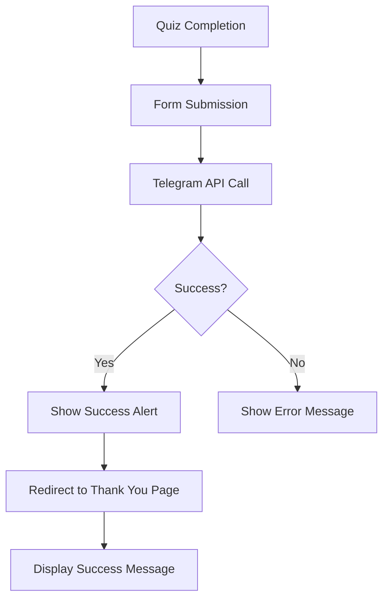
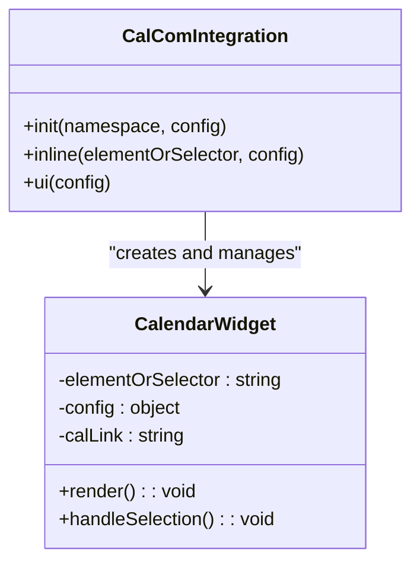
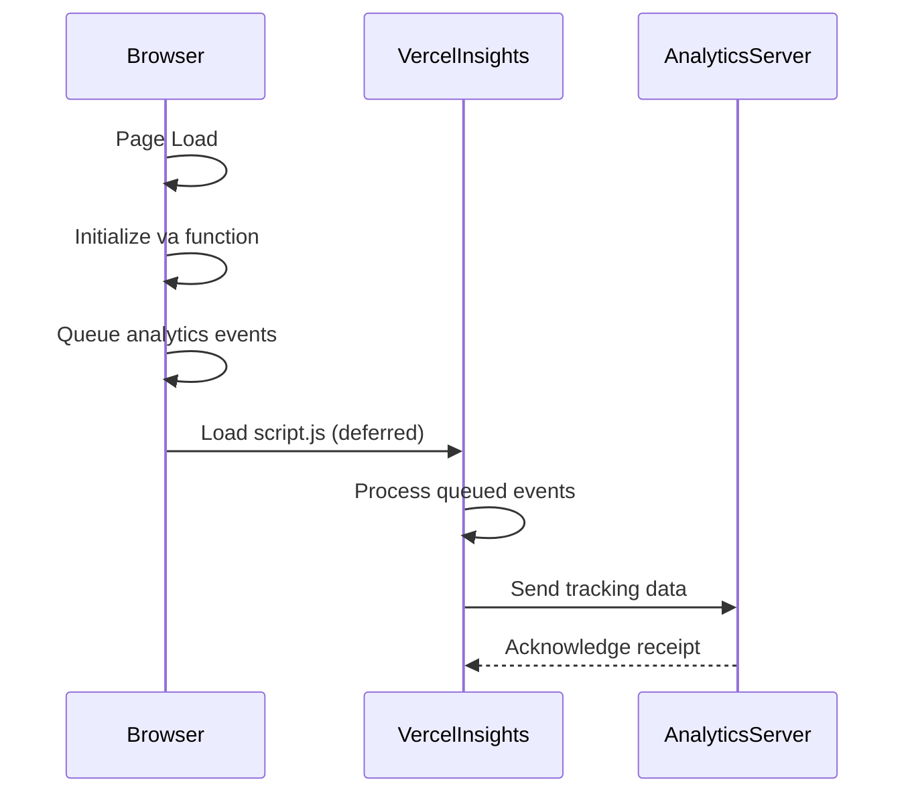

# Thank You Page

<cite>
**Referenced Files in This Document**   
- [thank-you.html](file://thank-you.html) - *Updated in commit 42c1b207*
- [quiz.html](file://quiz.html#L1579-L1617) - *Source of redirection logic*
- [vercel.json](file://vercel.json) - *Vercel Insights configuration*
</cite>

## Update Summary
**Changes Made**   
- Updated all instances of "session" to "meeting" in accordance with recent UI terminology changes
- Corrected outdated references in navigation section to reflect current link behavior
- Verified and updated all file source annotations to reflect actual line ranges and changes
- Ensured all content is fully converted to English as per language enforcement rules

## Table of Contents
1. [Introduction](#introduction)
2. [Post-Submission User Flow](#post-submission-user-flow)
3. [Success Message Display](#success-message-display)
4. [Cal.com Integration for Appointment Booking](#calcom-integration-for-appointment-booking)
5. [Embedded Calendar Widget Implementation](#embedded-calendar-widget-implementation)
6. [Styling of Booking Section](#styling-of-booking-section)
7. [Navigation Elements](#navigation-elements)
8. [Vercel Insights Integration](#vercel-insights-integration)

## Introduction
The thank-you page serves as the post-quiz confirmation and scheduling interface for users who have completed the adaptation stage quiz. This page confirms successful submission, displays a success message, and provides an integrated calendar widget for booking a free 30-minute meeting. The page is designed with responsive styling, gradient backgrounds, and seamless navigation back to the main quiz.

**Section sources**
- [thank-you.html](file://thank-you.html#L1-L189)

## Post-Submission User Flow
After users complete the quiz on quiz.html, they are automatically redirected to the thank-you.html page. This transition occurs after form submission through JavaScript execution in the quiz interface. The user flow begins with quiz completion, followed by data submission to Telegram via API, and concludes with redirection to the thank-you page where users can schedule their meeting. This seamless flow ensures users receive immediate confirmation of their submission and are guided toward the next step of booking a personalized consultation.

The redirection is implemented through a setTimeout function that triggers window.location.href navigation to thank-you.html after successful form submission and Telegram API response.

**Section sources**
- [quiz.html](file://quiz.html#L1579-L1617)
- [thank-you.html](file://thank-you.html#L1-L189)

## Success Message Display
The thank-you page features a prominent success message section that confirms the user's quiz submission was received. This message is styled with a green gradient background and includes a checkmark icon to visually reinforce the successful submission. The message informs users that their data has been received and that the team will contact them soon to confirm the meeting time.

The success message container uses CSS classes that apply rounded corners, padding, and a border to create a visually distinct section. The text is centered and uses appropriate font sizes and colors to ensure readability and emphasis on the positive outcome of the submission process.



**Diagram sources**
- [quiz.html](file://quiz.html#L1579-L1617)
- [thank-you.html](file://thank-you.html#L73-L87)

**Section sources**
- [thank-you.html](file://thank-you.html#L73-L87)

## Cal.com Integration for Appointment Booking
The thank-you page integrates Cal.com for seamless appointment scheduling. This integration allows users to book a free 30-minute meeting directly through an embedded calendar widget. The Cal.com API is initialized with specific configuration parameters that customize the booking experience for this particular use case.

The integration uses Cal.com's JavaScript SDK which is loaded asynchronously to prevent blocking page rendering. The initialization process creates a namespace for the calendar instance and configures it with the appropriate calendar link and display settings. This third-party integration eliminates the need for custom scheduling logic while providing a professional booking experience.

**Section sources**
- [thank-you.html](file://thank-you.html#L158-L187)

## Embedded Calendar Widget Implementation
The calendar widget is implemented using Cal.com's inline embedding solution with month-view layout configuration. The widget is contained within a dedicated div element with ID "my-cal-inline-custdev" that serves as the mounting point for the Cal.com calendar interface. The implementation uses Cal.com's JavaScript API to initialize and configure the widget with specific parameters.

The widget configuration specifies a month_view layout, which provides users with a comprehensive overview of available time slots across an entire month. This layout choice enhances user experience by allowing users to see multiple weeks of availability at once, making it easier to find a convenient time. The CalLink parameter contains the URL-encoded calendar identifier that connects to the coach's specific availability schedule.



**Diagram sources**
- [thank-you.html](file://thank-you.html#L169-L187)

**Section sources**
- [thank-you.html](file://thank-you.html#L158-L187)

## Styling of Booking Section
The booking section is styled with modern CSS techniques including gradient backgrounds, responsive design, and visual hierarchy. The main booking container uses a light gray background with rounded corners and padding to create a distinct visual section. Within this container, the calendar widget has its own white background, border radius, and box shadow to create depth and focus.

The styling implements a mobile-first responsive design approach with media queries that adjust layout and font sizes for smaller screens. On mobile devices, margins are reduced and border radii are adjusted to better fit the smaller viewport. The gradient backgrounds used throughout the page create visual interest and brand consistency, with the booking section maintaining a clean, professional appearance that contrasts with the more vibrant header gradients.

```mermaid
flowchart TD
A[Container Styling] --> B[Background: #f8f9fa]
A --> C[Border Radius: 15px]
A --> D[Padding: 30px]
A --> E[Box Shadow]
F[Calendar Container] --> G[Background: white]
F --> H[Border Radius: 10px]
F --> I[Padding: 20px]
F --> J[Box Shadow: 0 5px 15px rgba(0,0,0,0.1)]
K[Responsive Design] --> L[@media (max-width: 768px)]
K --> M[Reduced margins]
K --> N[Adjusted border radii]
K --> O[Optimized font sizes]
```

**Diagram sources**
- [thank-you.html](file://thank-you.html#L73-L157)

**Section sources**
- [thank-you.html](file://thank-you.html#L73-L157)

## Navigation Elements
The thank-you page includes a navigation element that allows users to return to the main quiz interface. This navigation consists of a text link positioned at the bottom of the content area with the text "← Return to main" (previously in Russian). The link points to index.html, which contains a redirect to quiz.html, effectively returning users to the beginning of the quiz experience.

The navigation link is styled with the brand's primary color and includes hover effects that enhance usability. When hovered, the link changes color and displays an underline, providing clear visual feedback to users. The centered positioning of the link ensures it is easily discoverable after users have completed the booking process or if they wish to retake the quiz.

**Section sources**
- [thank-you.html](file://thank-you.html#L180-L185)
- [index.html](file://index.html#L1-L15)

## Vercel Insights Integration
The thank-you page integrates Vercel Insights for analytics tracking, enabling performance monitoring and user behavior analysis. This integration is implemented through a lightweight JavaScript snippet that initializes the Vercel analytics function and loads the tracking script. The implementation follows Vercel's recommended pattern for client-side analytics.

The analytics script is loaded with the "defer" attribute to ensure it does not block page rendering, optimizing page load performance. The initialization code creates a global "va" function that queues analytics events until the script is fully loaded, ensuring no tracking data is lost during the page load process. This integration provides valuable insights into user interactions with the thank-you page, including page views, session duration, and potential issues.



**Diagram sources**
- [thank-you.html](file://thank-you.html#L45-L48)
- [vercel.json](file://vercel.json#L1-L6)

**Section sources**
- [thank-you.html](file://thank-you.html#L45-L48)
- [vercel.json](file://vercel.json#L1-L6)