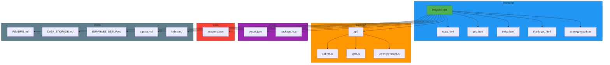
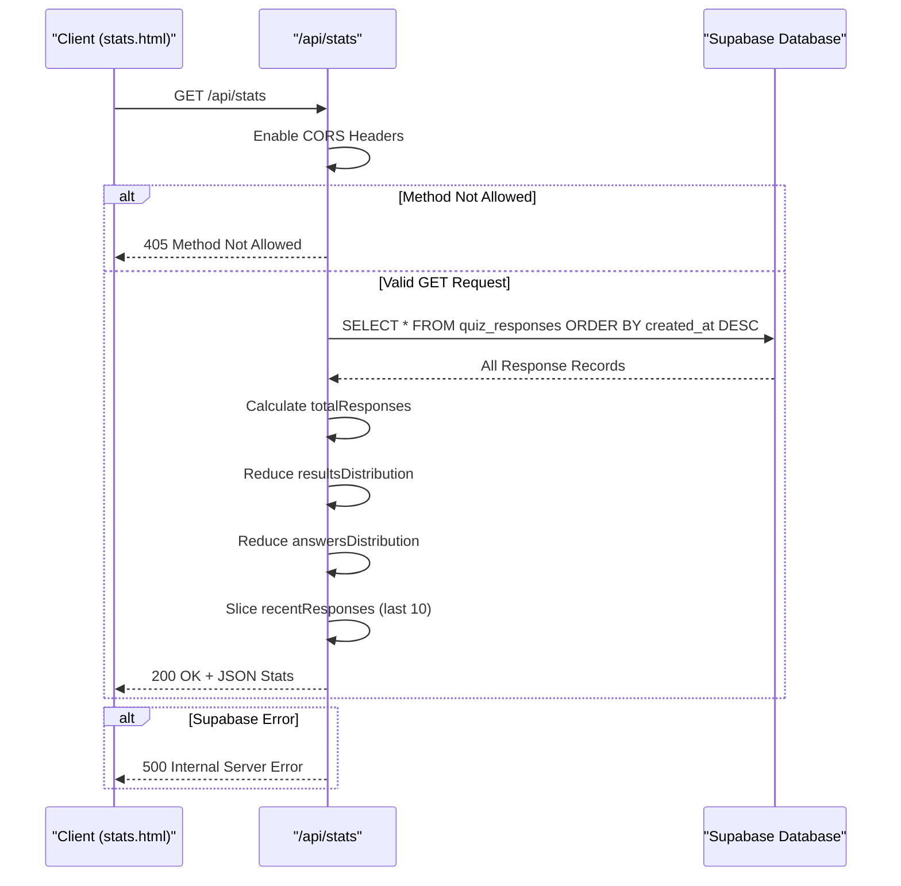
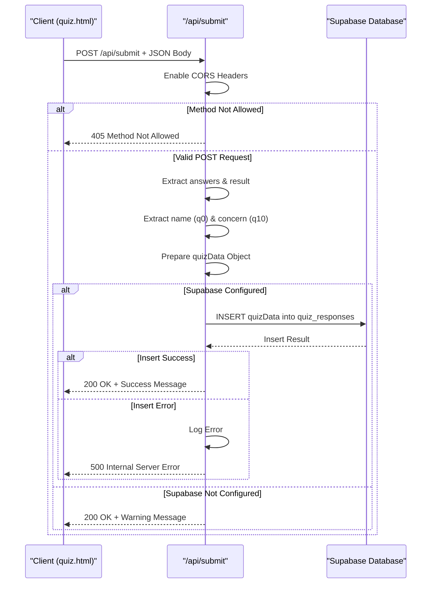
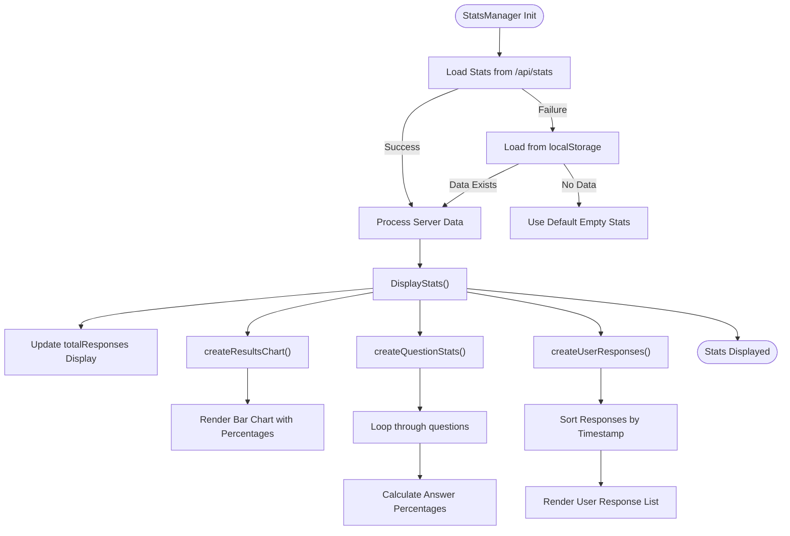

# Statistics Dashboard

<cite>
**Referenced Files in This Document**   
- [api/stats.js](file://api/stats.js)
- [api/submit.js](file://api/submit.js)
- [stats.html](file://stats.html)
- [DATA_STORAGE.md](file://DATA_STORAGE.md)
- [SUPABASE_SETUP.md](file://SUPABASE_SETUP.md)
- [package.json](file://package.json)
- [answers.json](file://answers.json)
</cite>

## Table of Contents
1. [Introduction](#introduction)
2. [Project Structure](#project-structure)
3. [Core Components](#core-components)
4. [Architecture Overview](#architecture-overview)
5. [Detailed Component Analysis](#detailed-component-analysis)
6. [Dependency Analysis](#dependency-analysis)
7. [Performance Considerations](#performance-considerations)
8. [Troubleshooting Guide](#troubleshooting-guide)
9. [Conclusion](#conclusion)

## Introduction
The Statistics Dashboard is a central component of the "Adaptation Stage Quiz" web application, designed to collect, process, and visualize user responses from individuals navigating life in a new country. This dashboard provides real-time insights into user behavior, result distributions, and answer patterns through an interactive web interface (`stats.html`) powered by serverless API endpoints. The system is built using modern web technologies including HTML5, CSS3, JavaScript, and leverages Supabase for persistent data storage, replacing the initial file-based `answers.json` approach. The architecture is hosted on Vercel, utilizing its serverless functions to handle data submission and retrieval securely and scalably.

## Project Structure
The project follows a simple yet effective structure optimized for static hosting with dynamic serverless functionality. The core components are organized into distinct directories and files that separate concerns between frontend presentation, backend logic, configuration, and documentation.



**Diagram sources**
- [stats.html](file://stats.html)
- [api/submit.js](file://api/submit.js)
- [api/stats.js](file://api/stats.js)
- [vercel.json](file://vercel.json)
- [package.json](file://package.json)
- [answers.json](file://answers.json)

**Section sources**
- [stats.html](file://stats.html)
- [api/submit.js](file://api/submit.js)
- [api/stats.js](file://api/stats.js)
- [vercel.json](file://vercel.json)
- [package.json](file://package.json)
- [answers.json](file://answers.json)

## Core Components
The Statistics Dashboard revolves around three core components: the `stats.html` frontend interface, the `/api/stats` endpoint for data retrieval, and the `/api/submit` endpoint for data ingestion. These components work in concert to provide a seamless data visualization experience. The `stats.html` page initializes a `StatsManager` class that fetches aggregated statistics from the `/api/stats` endpoint, which in turn queries the Supabase database for all quiz responses. The data is then processed to calculate distributions and generate dynamic visualizations such as bar charts and response lists. The system is designed with fallback mechanisms, using `localStorage` as a client-side backup when server data is unavailable. The architecture supports both real-time monitoring and historical analysis, making it a comprehensive tool for understanding user engagement and adaptation patterns.

**Section sources**
- [stats.html](file://stats.html#L126-L265)
- [api/stats.js](file://api/stats.js#L12-L103)
- [api/submit.js](file://api/submit.js#L12-L78)

## Architecture Overview
The Statistics Dashboard employs a client-server architecture with a decoupled frontend and backend, leveraging Vercel's serverless platform for scalability and ease of deployment. The frontend, implemented in `stats.html`, is a static HTML page enhanced with JavaScript for dynamic content rendering. It communicates with two primary serverless functions: `/api/submit` for storing quiz results and `/api/stats` for retrieving aggregated statistics. Both functions are written in JavaScript and run in isolated serverless environments on Vercel. The backend logic uses the Supabase client library to interact with a PostgreSQL database hosted on Supabase, ensuring persistent and reliable data storage. The system implements CORS headers to allow cross-origin requests from the frontend, and uses environment variables (`SUPABASE_URL` and `SUPABASE_ANON_KEY`) for secure configuration. This architecture eliminates the limitations of file-based storage on serverless platforms and provides a robust foundation for data analytics.

```mermaid
graph LR
A[Client Browser] --> B[stats.html]
B --> C[/api/stats]
B --> D[/api/submit]
C --> E[Supabase Database]
D --> E
E --> C
E --> D
F[Vercel Serverless Functions] --> C
F --> D
G[Environment Variables] --> C
G --> D
H[Supabase Dashboard] --> E
style A fill:#E8F5E9,stroke:#4CAF50
style B fill:#BBDEFB,stroke:#2196F3
style C fill:#FFECB3,stroke:#FF9800
style D fill:#FFECB3,stroke:#FF9800
style E fill:#FFCDD2,stroke:#F44336
style F fill:#C8E6C9,stroke:#4CAF50
style G fill:#D1C4E9,stroke:#9C27B0
style H fill:#CFD8DC,stroke:#607D8B
```

**Diagram sources**
- [api/stats.js](file://api/stats.js#L12-L103)
- [api/submit.js](file://api/submit.js#L12-L78)
- [SUPABASE_SETUP.md](file://SUPABASE_SETUP.md)
- [vercel.json](file://vercel.json)

## Detailed Component Analysis

### Stats API Endpoint Analysis
The `/api/stats` endpoint is responsible for aggregating and serving statistical data about quiz responses. It performs several key operations: fetching all records from the `quiz_responses` table, calculating the distribution of results (A, B, C, D), computing the frequency of answers for each question, and preparing a list of recent responses for display. The function is designed to handle the absence of Supabase configuration gracefully, returning an empty statistics object with a warning instead of failing. This ensures that the frontend can still render a meaningful interface even during configuration issues. The use of `reduce` functions to aggregate data demonstrates efficient functional programming practices, and the inclusion of `recentResponses` provides a quick snapshot of user activity without requiring additional queries.



**Diagram sources**
- [api/stats.js](file://api/stats.js#L12-L103)

**Section sources**
- [api/stats.js](file://api/stats.js#L12-L103)

### Submit API Endpoint Analysis
The `/api/submit` endpoint handles the ingestion of new quiz responses into the system. It validates incoming POST requests, extracts relevant data (name, result, answers, concern), and inserts it into the Supabase `quiz_responses` table. The function includes comprehensive error handling and logging, ensuring that any issues during the database operation are captured and reported. A key design feature is its graceful degradation when Supabase is not configured; instead of rejecting the submission, it returns a success message indicating that the database is not configured, allowing the frontend to proceed without interrupting the user experience. This makes the system resilient during development or configuration changes. The use of `created_at` timestamps ensures that all entries are properly time-stamped for chronological analysis.



**Diagram sources**
- [api/submit.js](file://api/submit.js#L12-L78)

**Section sources**
- [api/submit.js](file://api/submit.js#L12-L78)

### Frontend Statistics Manager Analysis
The `StatsManager` class in `stats.html` is the heart of the frontend statistics visualization. It orchestrates the entire process of loading, processing, and displaying statistical data. Upon initialization, it attempts to fetch data from the `/api/stats` endpoint, with a fallback to `localStorage` if the server is unreachable. This dual-source approach ensures high availability and a smooth user experience. The class then processes the raw data to generate visual elements such as the results bar chart, question-level statistics, and a list of recent user responses. The use of dynamic DOM manipulation allows for real-time updates without page reloads. The `createResultsChart` method transforms numerical data into a visually intuitive bar chart, while `createQuestionStats` and `createUserResponses` provide detailed breakdowns of user behavior, making complex data accessible and actionable.



**Diagram sources**
- [stats.html](file://stats.html#L126-L265)

**Section sources**
- [stats.html](file://stats.html#L126-L265)

## Dependency Analysis
The Statistics Dashboard has a well-defined dependency graph that ensures modularity and maintainability. The primary dependencies are documented in `package.json`, which lists `@supabase/supabase-js` as a core runtime dependency for database interactions and `vercel` as a development dependency for deployment. The system relies on external services such as Supabase for data persistence and Vercel for hosting and serverless function execution. Environment variables (`SUPABASE_URL` and `SUPABASE_ANON_KEY`) are used to inject configuration securely, preventing hardcoded credentials. The frontend has no external JavaScript dependencies, relying solely on vanilla JavaScript for its functionality, which minimizes bundle size and potential security vulnerabilities. The architecture avoids circular dependencies by clearly separating concerns: the API endpoints handle data I/O, while the frontend handles presentation.

```mermaid
graph TD
A[package.json] --> B["@supabase/supabase-js"]
A --> C["vercel"]
B --> D[Supabase Database]
C --> E[Vercel Platform]
F[api/stats.js] --> B
G[api/submit.js] --> B
H[stats.html] --> I[/api/stats]
I --> F
J[/api/submit] --> G
K[vercel.json] --> E
L[Environment Variables] --> F
L --> G
M[SUPABASE_SETUP.md] --> B
M --> D
M --> K
style A fill:#9C27B0,stroke:#7B1FA2
style B fill:#F44336,stroke:#D32F2F
style C fill:#F44336,stroke:#D32F2F
style D fill:#FFCDD2,stroke:#F44336
style E fill:#C8E6C9,stroke:#4CAF50
style F fill:#FFECB3,stroke:#FF9800
style G fill:#FFECB3,stroke:#FF9800
style H fill:#BBDEFB,stroke:#2196F3
style I fill:#FF9800,stroke:#F57C00
style J fill:#FF9800,stroke:#F57C00
style K fill:#C8E6C9,stroke:#4CAF50
style L fill:#D1C4E9,stroke:#9C27B0
style M fill:#607D8B,stroke:#455A64
```

**Diagram sources**
- [package.json](file://package.json)
- [api/stats.js](file://api/stats.js)
- [api/submit.js](file://api/submit.js)
- [vercel.json](file://vercel.json)
- [SUPABASE_SETUP.md](file://SUPABASE_SETUP.md)

**Section sources**
- [package.json](file://package.json)
- [vercel.json](file://vercel.json)
- [SUPABASE_SETUP.md](file://SUPABASE_SETUP.md)

## Performance Considerations
The Statistics Dashboard is designed with performance and scalability in mind. By migrating from file-based storage (`answers.json`) to Supabase, the system overcomes the inherent limitations of serverless environments where file persistence between requests is not guaranteed. The use of database indexes on `created_at` and `result` columns ensures fast query performance even as the dataset grows. The `/api/stats` endpoint fetches all responses in a single query, minimizing database round trips, and performs aggregation in memory using efficient JavaScript `reduce` operations. The frontend implements client-side caching via `localStorage`, reducing the need for repeated API calls and improving load times for returning users. The system is optimized for read-heavy workloads, typical of analytics dashboards, with the trade-off of increased memory usage during aggregation. For very large datasets, future optimizations could include server-side aggregation in Supabase or pagination of results.

## Troubleshooting Guide
Common issues with the Statistics Dashboard typically revolve around configuration and connectivity. If the dashboard shows no data or an error, first verify that the Supabase environment variables (`SUPABASE_URL` and `SUPABASE_ANON_KEY`) are correctly set in the Vercel project settings. Check the Vercel deployment logs for any runtime errors in the `/api/stats` or `/api/submit` functions. Ensure that the `quiz_responses` table exists in the Supabase database and that Row Level Security (RLS) policies are properly configured to allow public read and insert operations. If the frontend fails to load data, inspect the browser's developer console for CORS or network errors. The system is designed to degrade gracefully: if Supabase is unreachable, the API endpoints return empty or warning responses, and the frontend falls back to `localStorage` data. Regular monitoring of Vercel function logs and Supabase database performance metrics is recommended for proactive issue detection.

**Section sources**
- [SUPABASE_SETUP.md](file://SUPABASE_SETUP.md)
- [api/stats.js](file://api/stats.js#L12-L103)
- [api/submit.js](file://api/submit.js#L12-L78)
- [stats.html](file://stats.html#L126-L265)

## Conclusion
The Statistics Dashboard provides a robust and scalable solution for collecting and visualizing user data from the Adaptation Stage Quiz. By leveraging modern web technologies and cloud services like Vercel and Supabase, the system achieves high availability, real-time analytics, and easy maintainability. The architecture demonstrates best practices in decoupled design, graceful error handling, and secure configuration management. Future enhancements could include user authentication for admin access, CSV export functionality, and more advanced data visualizations. The current implementation successfully addresses the core requirements of data persistence, aggregation, and presentation, making it a valuable tool for understanding user adaptation patterns and improving the overall user experience.