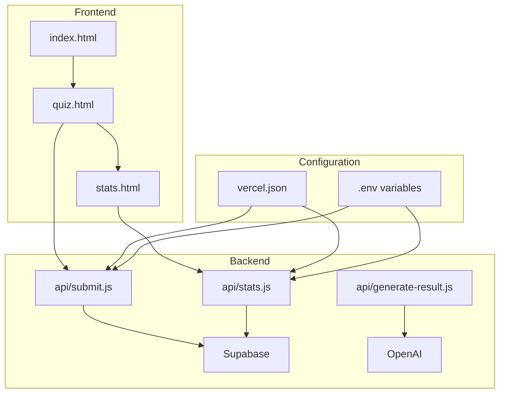
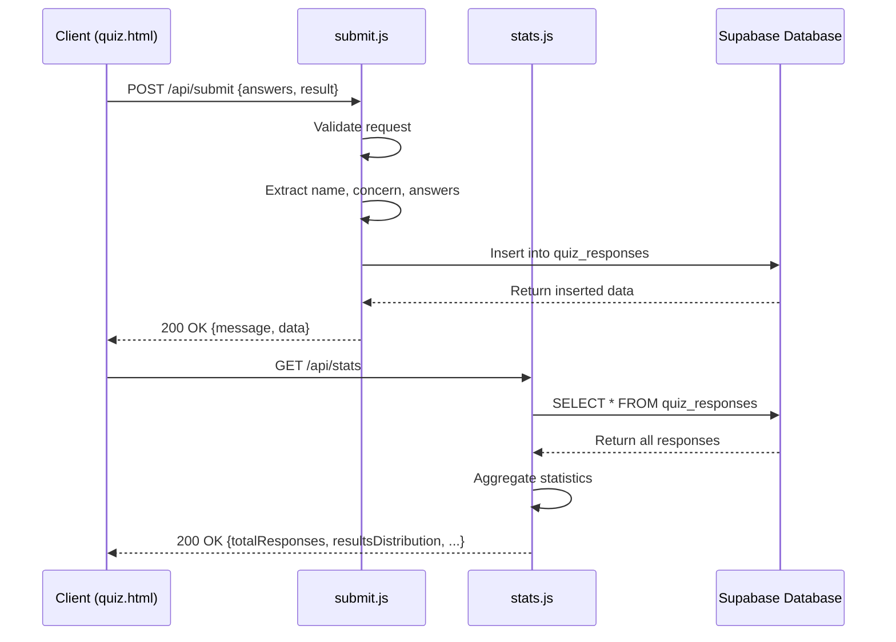
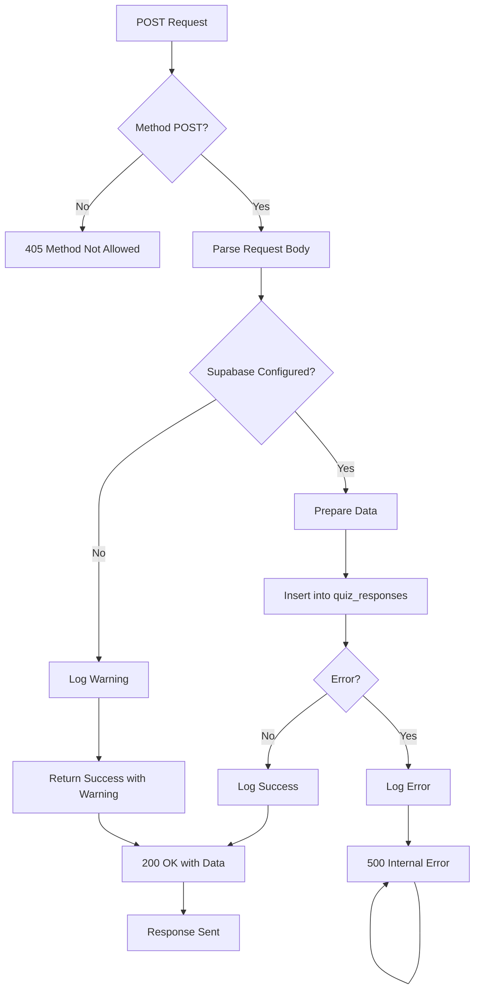
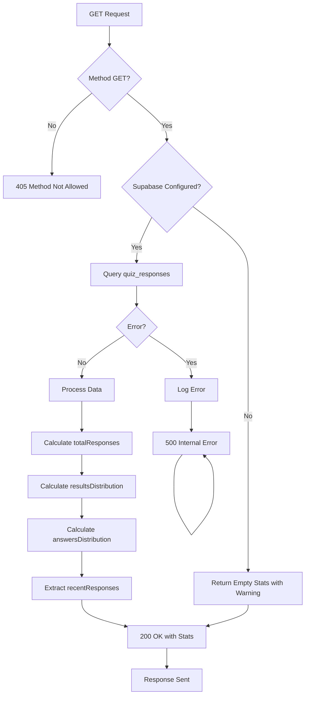

# Supabase Integration

<cite>
**Referenced Files in This Document**   
- [SUPABASE_SETUP.md](file://SUPABASE_SETUP.md)
- [DATA_STORAGE.md](file://DATA_STORAGE.md)
- [api/submit.js](file://api/submit.js)
- [api/stats.js](file://api/stats.js)
- [package.json](file://package.json)
- [vercel.json](file://vercel.json)
</cite>

## Table of Contents
1. [Introduction](#introduction)
2. [Project Structure](#project-structure)
3. [Core Components](#core-components)
4. [Architecture Overview](#architecture-overview)
5. [Detailed Component Analysis](#detailed-component-analysis)
6. [Dependency Analysis](#dependency-analysis)
7. [Performance Considerations](#performance-considerations)
8. [Troubleshooting Guide](#troubleshooting-guide)
9. [Conclusion](#conclusion)

## Introduction

This document provides comprehensive documentation for the Supabase integration within the Alena quiz application. The integration enables persistent storage of user quiz responses and retrieval of aggregated statistics through a serverless architecture hosted on Vercel. The system leverages Supabase as a backend-as-a-service solution for PostgreSQL database operations, providing scalable and secure data management for the application's analytics needs.

The integration was implemented to replace the previous file-based storage mechanism (`answers.json`) with a robust, cloud-native database solution. This transition ensures data persistence across deployments, enables real-time analytics, and supports future scalability requirements. The implementation follows modern web development practices with environment-based configuration, error handling, and CORS support.

**Section sources**
- [SUPABASE_SETUP.md](file://SUPABASE_SETUP.md#L1-L188)
- [DATA_STORAGE.md](file://DATA_STORAGE.md#L1-L172)

## Project Structure

The project follows a standard serverless function architecture with API endpoints implemented as Vercel functions. The core Supabase integration resides in the `api/` directory, which contains three primary files:

- `submit.js`: Handles submission of quiz responses to Supabase
- `stats.js`: Retrieves and aggregates statistical data from Supabase
- `generate-result.js`: Generates personalized coaching content (independent of Supabase)

The configuration for Supabase is managed through environment variables stored in Vercel, while the database schema and setup instructions are documented in markdown files. The `package.json` includes the `@supabase/supabase-js` client library as a dependency, enabling JavaScript/TypeScript applications to interact with Supabase services.



**Diagram sources **
- [api/submit.js](file://api/submit.js#L1-L78)
- [api/stats.js](file://api/stats.js#L1-L103)
- [vercel.json](file://vercel.json#L1-L6)

**Section sources**
- [api/submit.js](file://api/submit.js#L1-L78)
- [api/stats.js](file://api/stats.js#L1-L103)
- [vercel.json](file://vercel.json#L1-L6)

## Core Components

The Supabase integration consists of two primary API endpoints: `submit.js` for data ingestion and `stats.js` for data retrieval. Both components follow a similar initialization pattern, creating a Supabase client instance using environment variables. The components implement proper error handling, CORS configuration, and graceful degradation when Supabase credentials are not configured.

The integration uses Supabase's JavaScript client to perform database operations, specifically inserting records into the `quiz_responses` table and selecting aggregated data for analytics. Both functions include comprehensive logging for debugging and monitoring purposes. The implementation follows a defensive programming approach, checking for the presence of the Supabase client before attempting database operations and providing appropriate fallback responses.

**Section sources**
- [api/submit.js](file://api/submit.js#L1-L78)
- [api/stats.js](file://api/stats.js#L1-L103)
- [SUPABASE_SETUP.md](file://SUPABASE_SETUP.md#L1-L188)

## Architecture Overview

The Supabase integration follows a serverless architecture pattern where API endpoints run as isolated functions on Vercel's edge network. The architecture separates concerns between frontend presentation, business logic processing, and data persistence. When a user completes the quiz, the frontend sends a POST request to the `submit` endpoint, which validates the input and stores it in Supabase. The `stats` endpoint provides GET access to aggregated data for analytics visualization.

The architecture implements environment-based configuration through Vercel's environment variables, allowing different configurations for development, preview, and production environments. The system uses Supabase's Row Level Security (RLS) policies to control data access, with permissive policies allowing public read and write operations. The database schema is optimized for the application's access patterns with appropriate indexes on frequently queried columns.



**Diagram sources **
- [api/submit.js](file://api/submit.js#L1-L78)
- [api/stats.js](file://api/stats.js#L1-L103)
- [SUPABASE_SETUP.md](file://SUPABASE_SETUP.md#L1-L188)

## Detailed Component Analysis

### Submit Endpoint Analysis

The `submit.js` function handles the ingestion of quiz responses into the Supabase database. It implements a robust error handling strategy and graceful degradation when Supabase is not configured. The function extracts relevant data from the answers object, including the user's name (from q0) and their primary concern (from q10), while storing all answers in a JSONB field for flexibility.

The implementation includes comprehensive logging for monitoring and debugging purposes. When Supabase credentials are not found in the environment variables, the function logs a warning and returns a success response with a warning message rather than failing completely. This design choice ensures that the frontend experience remains functional even when the database integration is temporarily unavailable.



**Diagram sources **
- [api/submit.js](file://api/submit.js#L1-L78)

**Section sources**
- [api/submit.js](file://api/submit.js#L1-L78)
- [SUPABASE_SETUP.md](file://SUPABASE_SETUP.md#L1-L188)

### Stats Endpoint Analysis

The `stats.js` function provides analytical insights by aggregating data from the Supabase database. It retrieves all quiz responses and calculates various distribution metrics, including total responses, results distribution by type (A, B, C, D), and answers distribution by question. The function implements efficient data processing by using JavaScript's reduce method to aggregate statistics in memory after retrieving data from the database.

The implementation includes a recent responses feature that returns the last 10 submissions for display purposes. The function handles the case when Supabase is not configured by returning an empty statistics object with a warning, ensuring that the frontend can still render without errors. The answers distribution calculation specifically excludes the name (q0) and concern (q10) questions, focusing only on the core quiz responses.



**Diagram sources **
- [api/stats.js](file://api/stats.js#L1-L103)

**Section sources**
- [api/stats.js](file://api/stats.js#L1-L103)
- [DATA_STORAGE.md](file://DATA_STORAGE.md#L1-L172)

## Dependency Analysis

The Supabase integration has a minimal dependency footprint, relying primarily on the official `@supabase/supabase-js` client library. This dependency is explicitly declared in the `package.json` file and is used for all database interactions. The integration does not introduce additional dependencies beyond what is required for the core functionality.

The architecture demonstrates loose coupling between components, with the Supabase integration isolated to the two API endpoints (`submit.js` and `stats.js`). Other components, such as `generate-result.js`, remain independent and do not depend on the database integration. This modular design allows for independent testing and potential replacement of the storage mechanism without affecting other parts of the application.

The deployment configuration in `vercel.json` does not include specific build steps for the Supabase integration, as the functions are executed directly by Vercel's serverless runtime. The environment variables required for Supabase (SUPABASE_URL and SUPABASE_ANON_KEY) are managed externally through Vercel's dashboard, following security best practices by avoiding hardcoded credentials.

```mermaid
graph LR
A[submit.js] --> B[@supabase/supabase-js]
C[stats.js] --> B[@supabase/supabase-js]
D[package.json] --> B[@supabase/supabase-js]
E[vercel.json] --> A[submit.js]
E[vercel.json] --> C[stats.js]
F[Environment Variables] --> A[submit.js]
F[Environment Variables] --> C[stats.js]
style B fill:#f9f,stroke:#333
style D fill:#ccf,stroke:#333
style E fill:#ccf,stroke:#333
style F fill:#ccf,stroke:#333
```

**Diagram sources **
- [package.json](file://package.json#L1-L12)
- [vercel.json](file://vercel.json#L1-L6)
- [api/submit.js](file://api/submit.js#L1-L78)
- [api/stats.js](file://api/stats.js#L1-L103)

**Section sources**
- [package.json](file://package.json#L1-L12)
- [vercel.json](file://vercel.json#L1-L6)
- [api/submit.js](file://api/submit.js#L1-L78)
- [api/stats.js](file://api/stats.js#L1-L103)

## Performance Considerations

The Supabase integration is designed with performance and scalability in mind. The database schema includes appropriate indexes on frequently queried columns (`created_at` and `result`), enabling efficient data retrieval for both individual records and aggregated statistics. The use of JSONB for storing answers provides flexibility while maintaining good query performance for the structured portions of the data.

The serverless functions are optimized to minimize execution time by performing database operations asynchronously and processing data efficiently in memory. The stats endpoint retrieves all responses in a single query and performs aggregation in memory, which is appropriate given the expected scale of the application. For larger datasets, pagination or database-side aggregation could be implemented to improve performance.

The implementation includes proper error handling and logging, which helps identify performance bottlenecks and connectivity issues. The graceful degradation strategy ensures that temporary database connectivity issues do not result in complete service failure, maintaining availability for end users. The use of environment variables for configuration allows for easy tuning of connection parameters and potential implementation of connection pooling if needed.

## Troubleshooting Guide

This section provides guidance for diagnosing and resolving common issues with the Supabase integration. The most frequent problems typically relate to configuration, connectivity, and database schema.

### Supabase Credentials Not Found

**Symptoms**: Console warnings about Supabase not being configured, with responses containing warnings but no database storage.

**Resolution**: 
1. Verify that `SUPABASE_URL` and `SUPABASE_ANON_KEY` environment variables are set in Vercel Dashboard → Project Settings → Environment Variables
2. Ensure variables are configured for all environments (Production, Preview, Development)
3. Redeploy the project after adding environment variables

### Database Table Not Found

**Symptoms**: 500 Internal Server Error with "relation 'quiz_responses' does not exist" message.

**Resolution**:
1. Access the Supabase Dashboard and navigate to SQL Editor
2. Execute the table creation script provided in SUPABASE_SETUP.md
3. Verify the table appears in Table Editor

### Data Not Persisting

**Symptoms**: Successful responses but no data appearing in Supabase dashboard.

**Resolution**:
1. Check Vercel function logs for database errors
2. Verify Row Level Security policies are correctly configured
3. Test the API endpoint directly using curl as shown in SUPABASE_SETUP.md
4. Confirm the Supabase project URL and API key are correct

### CORS Issues

**Symptoms**: Browser console errors about blocked cross-origin requests.

**Resolution**:
1. Verify the API endpoints include proper CORS headers (already implemented in code)
2. Check that the frontend is making requests to the correct domain
3. Ensure Vercel deployment is successful and accessible

**Section sources**
- [SUPABASE_SETUP.md](file://SUPABASE_SETUP.md#L1-L188)
- [api/submit.js](file://api/submit.js#L1-L78)
- [api/stats.js](file://api/stats.js#L1-L103)

## Conclusion

The Supabase integration successfully provides persistent, scalable data storage for the Alena quiz application. By replacing the file-based storage mechanism with a cloud-native database solution, the application gains improved reliability, security, and analytical capabilities. The implementation follows best practices for serverless architectures, including proper error handling, environment-based configuration, and graceful degradation.

The integration demonstrates a clean separation of concerns, with well-defined API endpoints for data ingestion and retrieval. The use of Supabase's PostgreSQL backend enables complex queries and aggregations while maintaining simplicity in the application code. Future enhancements could include authentication for admin access, data export capabilities, and more sophisticated analytics.

The documentation and setup instructions provided in the repository enable smooth deployment and maintenance of the integration. With proper configuration and monitoring, the Supabase integration provides a robust foundation for the application's data needs.