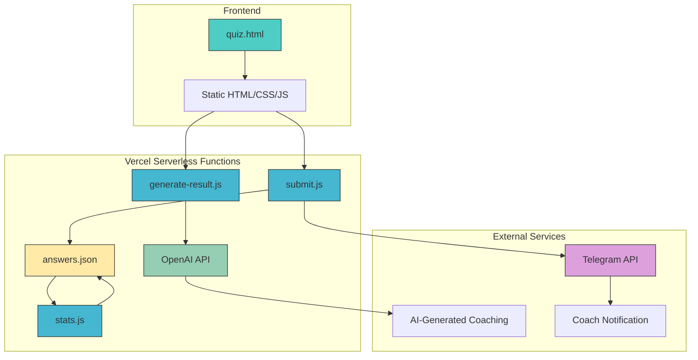
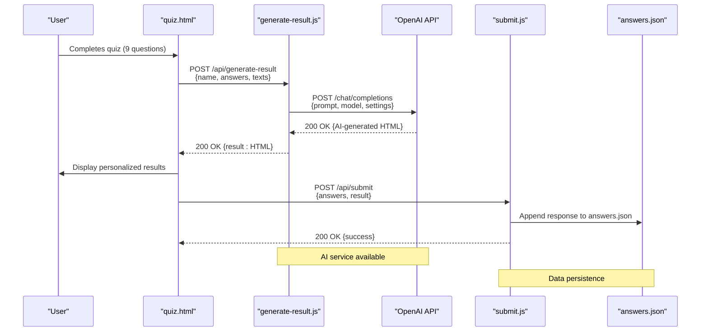

# System Overview

<cite>
**Referenced Files in This Document**   
- [quiz.html](file://quiz.html)
- [api/generate-result.js](file://api/generate-result.js)
- [api/submit.js](file://api/submit.js)
- [answers.json](file://answers.json)
- [README.md](file://README.md)
</cite>

## Table of Contents
1. [Introduction](#introduction)
2. [Core Features](#core-features)
3. [User Journey](#user-journey)
4. [System Architecture](#system-architecture)
5. [Backend Processing](#backend-processing)
6. [Adaptation Stage Determination](#adaptation-stage-determination)
7. [AI Integration and Fallback System](#ai-integration-and-fallback-system)
8. [Data Persistence](#data-persistence)
9. [Technical Workflow](#technical-workflow)

## Introduction
The Alena quiz application is an interactive assessment tool designed to support women navigating the emotional and psychological stages of immigration adaptation. By combining a user-friendly frontend interface with intelligent backend processing, the application evaluates responses to a 9-question assessment and delivers personalized coaching advice tailored to the user's current stage of adaptation. The system leverages AI-generated insights while maintaining robust fallback mechanisms to ensure consistent user experience even during external service interruptions. Built with a static HTML frontend hosted on Vercel and powered by serverless functions for backend logic, the application provides a seamless journey from quiz completion to result generation and coaching session scheduling.

## Core Features
The Alena quiz application offers several key features that support its mission of guiding women through immigration adaptation:

- **9-Question Assessment**: A structured questionnaire targeting emotional, physical, social, and professional aspects of life in a new country.
- **Adaptation Stage Determination**: Algorithmic analysis of responses to identify one of four distinct adaptation stages: Tourist, Immersion, Fatigue, or New Self.
- **AI-Generated Results**: Personalized coaching advice generated via OpenAI integration, formatted in a warm, supportive tone.
- **Fallback Response System**: Predefined content templates that activate when AI services are unavailable, ensuring uninterrupted service.
- **Serverless Submission**: Secure data transmission through Vercel serverless functions handling form submissions and result generation.
- **Data Persistence**: Response storage in `answers.json` for statistical analysis and user behavior tracking.
- **Coaching Session Scheduling**: Integration with Cal.com (implied by booking form) to facilitate free 30-minute coaching sessions.

These features work in concert to deliver a holistic support system that combines psychological insight with technical reliability.

**Section sources**
- [quiz.html](file://quiz.html#L0-L1705)
- [api/generate-result.js](file://api/generate-result.js#L0-L242)
- [README.md](file://README.md#L0-L64)

## User Journey
The user journey begins when a participant accesses the quiz via the `quiz.html` page. The experience unfolds in three distinct phases:

1. **Quiz Completion**: Users progress through nine questions covering time in the new country, emotional state, physical reactions, social connections, career fulfillment, internal feelings, future outlook, coping mechanisms, and self-perception. Each question uses a multiple-choice format with options A–D. The interface includes animated transitions, real-time progress tracking, and responsive design for optimal viewing across devices.

2. **Result Generation**: Upon completing the quiz, the system processes responses through the `/api/generate-result` endpoint. Users see a 20-second countdown animation while the backend communicates with OpenAI to generate personalized coaching content. This content is structured into six sections: current stage, key focus areas, 7/14/30-day timeline, first step, recommendation, and bonus insight.

3. **Coaching Session Scheduling**: After viewing their results, users can schedule a free coaching session by providing their Telegram username through a booking form. This initiates a serverless submission to `/api/submit`, which logs the response data and potentially triggers a notification to the coach via Telegram API.

The entire journey is designed to be intuitive, emotionally supportive, and technically seamless, guiding users from self-assessment to actionable next steps.

**Section sources**
- [quiz.html](file://quiz.html#L0-L1705)
- [api/generate-result.js](file://api/generate-result.js#L0-L242)
- [api/submit.js](file://api/submit.js#L0-L31)

## System Architecture
The Alena application follows a decoupled architecture with a static frontend and serverless backend components hosted on Vercel. The frontend consists of a single `quiz.html` file containing all HTML, CSS, and JavaScript necessary for the interactive quiz experience. This static approach ensures fast loading times and high availability.

The backend comprises three Vercel serverless functions in the `api/` directory:
- `generate-result.js`: Handles AI-powered result generation
- `submit.js`: Processes and logs quiz submissions
- `stats.js`: Provides statistical insights from collected responses

External services include OpenAI for AI-generated content and Telegram for coach notifications. Data persistence occurs through the `answers.json` file, which stores anonymized response records including timestamps, answers, and determined adaptation stages.

This architecture enables scalability, low maintenance overhead, and reliable performance while maintaining separation between user interface and business logic.



**Diagram sources**
- [quiz.html](file://quiz.html#L0-L1705)
- [api/generate-result.js](file://api/generate-result.js#L0-L242)
- [api/submit.js](file://api/submit.js#L0-L31)
- [answers.json](file://answers.json#L0-L17)

## Backend Processing
The backend processing pipeline is orchestrated through Vercel serverless functions that handle different aspects of the application workflow. When a user completes the quiz, their responses are sent via POST request to `/api/generate-result`, which initiates the result generation process. This endpoint implements CORS headers to allow cross-origin requests from the frontend domain.

The `generate-result.js` function parses the incoming JSON payload containing user responses, name, and question/answer texts. It constructs a detailed prompt for OpenAI that includes instructions for tone, structure, and personalization. The system uses the gpt-4o-mini model with temperature 0.8 and maximum 800 tokens to generate coaching content that adheres to specific formatting requirements.

Simultaneously, the `/api/submit` endpoint receives the raw answers and logs them to the system. This function validates the request method, processes the JSON body, and writes the data to the `answers.json` file for long-term storage and statistical analysis. Both endpoints include comprehensive error handling to manage network issues, parsing errors, and service interruptions.

**Section sources**
- [api/generate-result.js](file://api/generate-result.js#L0-L242)
- [api/submit.js](file://api/submit.js#L0-L31)

## Adaptation Stage Determination
The adaptation stage determination logic is implemented in the `determineStage` function within `generate-result.js`. This algorithm analyzes the distribution of user responses across the four possible options (A, B, C, D) to identify the dominant pattern. The function iterates through all answers (excluding the name field q0), counts occurrences of each response type, and returns the letter with the highest frequency.

When multiple options tie for the highest count, the function returns the first one encountered. If no valid answers are provided, it defaults to 'A' representing the Tourist stage. This simple yet effective voting mechanism maps user responses to one of four adaptation stages:

- **A (Tourist)**: Initial excitement with underlying tension
- **B (Immersion)**: Adjustment phase with emotional challenges
- **C (Fatigue)**: Functional but emotionally drained
- **D (New Self)**: Established but seeking deeper meaning

The stage determination serves as the foundation for both AI-generated and fallback content, ensuring consistency in the coaching advice delivered to users.

```mermaid
graph TD
A[Start] --> B[Initialize counters A=0, B=0, C=0, D=0]
B --> C{For each answer}
C --> D[Skip q0 (name)]
D --> E[Increment counter for answer value]
E --> F{More answers?}
F --> |Yes| C
F --> |No| G[Find maximum count]
G --> H{Maximum exists?}
H --> |Yes| I[Return letter with highest count]
H --> |No| J[Return default 'A']
I --> K[End]
J --> K
```

**Diagram sources**
- [api/generate-result.js](file://api/generate-result.js#L2-L21)

## AI Integration and Fallback System
The application's AI integration is centered around the OpenAI API, specifically using the gpt-4o-mini model to generate personalized coaching advice. The `generate-result.js` function constructs a detailed prompt that includes the user's name, responses, and specific formatting instructions to ensure consistent output structure. This prompt instructs the AI to adopt the persona of Alena, a professional coach and marketer who supports women in immigration.

The system includes a comprehensive fallback mechanism that activates under several conditions:
- Missing OpenAI API key in environment variables
- Failed API response from OpenAI
- Empty or invalid response from AI service
- Exception during request processing

When the fallback system engages, it uses the `buildFallbackResult` function to generate coaching content from predefined templates in the `fallbackContent` object. These templates mirror the structure of AI-generated responses but contain static, carefully crafted advice for each adaptation stage. The fallback system ensures that users always receive meaningful feedback regardless of external service availability, maintaining the application's reliability and user trust.

**Section sources**
- [api/generate-result.js](file://api/generate-result.js#L0-L242)

## Data Persistence
Data persistence in the Alena application is implemented through file-based storage using the `answers.json` file. This JSON file maintains an array of response objects, each containing a timestamp, the user's answers to all nine questions, and the determined adaptation stage. The structure allows for straightforward appending of new responses and efficient retrieval for statistical analysis.

The `stats.js` serverless function reads from this file to provide aggregate statistics including total responses, result distribution across adaptation stages, and answer distribution for each question. When the file does not exist, the system gracefully handles the ENOENT error by returning empty statistics, demonstrating robust error handling.

While the current implementation uses file storage, the architecture could easily accommodate database integration for larger-scale deployments. The data collection serves dual purposes: enabling statistical insights for the coach and potentially supporting future machine learning models to refine stage determination algorithms.

**Section sources**
- [answers.json](file://answers.json#L0-L17)
- [api/stats.js](file://api/stats.js#L0-L58)

## Technical Workflow
The technical workflow of the Alena quiz application illustrates the end-to-end interaction between components, from user input to result delivery. This sequence diagram captures the critical path of execution when a user completes the assessment.



**Diagram sources**
- [quiz.html](file://quiz.html#L0-L1705)
- [api/generate-result.js](file://api/generate-result.js#L0-L242)
- [api/submit.js](file://api/submit.js#L0-L31)
- [answers.json](file://answers.json#L0-L17)