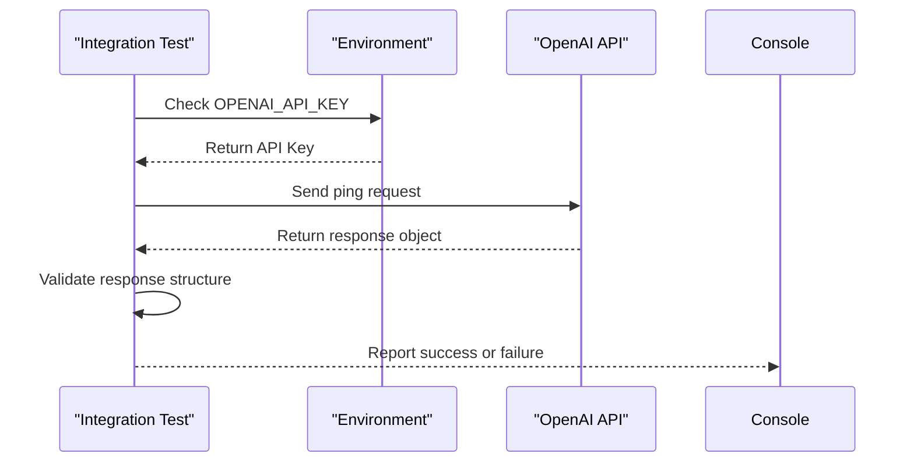
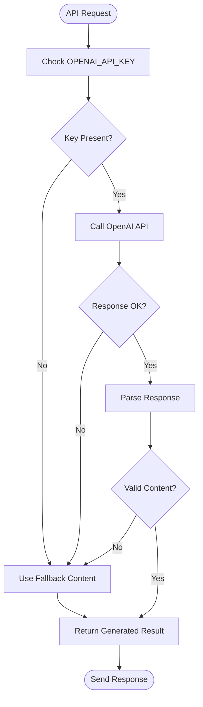

# Testing Strategy

<cite>
**Referenced Files in This Document**   
- [openai-connection.test.js](file://tests/openai-connection.test.js)
- [generate-result.js](file://api/generate-result.js)
- [submit.js](file://api/submit.js)
- [stats.js](file://api/stats.js)
- [quiz.html](file://quiz.html)
- [package.json](file://package.json)
- [answers.json](file://answers.json)
</cite>

## Table of Contents
1. [Introduction](#introduction)
2. [Core Components](#core-components)
3. [Integration Testing for External Dependencies](#integration-testing-for-external-dependencies)
4. [Test Setup and Assertion Patterns](#test-setup-and-assertion-patterns)
5. [Failure Conditions and Error Handling](#failure-conditions-and-error-handling)
6. [Expanding the Test Suite](#expanding-the-test-suite)
7. [Mock Strategies for External APIs](#mock-strategies-for-external-apis)
8. [Frontend Interaction and User Flow Testing](#frontend-interaction-and-user-flow-testing)
9. [Test Automation and CI/CD Integration](#test-automation-and-cicd-integration)
10. [Performance Testing for Serverless Functions](#performance-testing-for-serverless-functions)
11. [Running Tests Locally and Interpreting Results](#running-tests-locally-and-interpreting-results)

## Introduction
The Alena application is an interactive quiz platform designed to assess the adaptation stage of women in migration through personalized feedback generated via OpenAI. The system relies on external API integrations, serverless functions, and JSON-based persistence. This document outlines a comprehensive testing strategy focused on validating connectivity, ensuring robust error handling, and maintaining reliability across deployment environments. The existing test suite includes integration tests for OpenAI connectivity, which serve as a critical safeguard against misconfigured deployments.

## Core Components

The application consists of three primary API endpoints: `generate-result`, `submit`, and `stats`. These functions handle personalized content generation, user response persistence, and analytics retrieval, respectively. The frontend (`quiz.html`) orchestrates user interactions and communicates with these endpoints. The fallback mechanism in `generate-result.js` ensures service continuity even when the OpenAI API is unreachable.

**Section sources**
- [generate-result.js](file://api/generate-result.js#L0-L242)
- [submit.js](file://api/submit.js#L0-L62)
- [stats.js](file://api/stats.js#L0-L67)
- [quiz.html](file://quiz.html#L1320-L1341)

## Integration Testing for External Dependencies

Integration testing plays a crucial role in verifying that the application can successfully communicate with external services such as the OpenAI API. The `openai-connection.test.js` file implements a test that validates both the presence of the `OPENAI_API_KEY` environment variable and the ability to receive a valid response from the API.

This test prevents deployment of misconfigured instances by failing early during CI/CD pipelines or local development if credentials are missing or invalid. It ensures that the core generative functionality will operate as expected in production, reducing the risk of runtime failures due to configuration drift.



**Diagram sources**
- [openai-connection.test.js](file://tests/openai-connection.test.js#L0-L16)
- [generate-result.js](file://api/generate-result.js#L211-L242)

## Test Setup and Assertion Patterns

The `openai-connection.test.js` test uses Jest as the testing framework and follows a standard setup pattern: it checks for the existence of the `OPENAI_API_KEY` environment variable before attempting any API call. If the key is not set, the test throws an error to prevent false positives.

The assertion pattern verifies two key conditions:
1. The response from the OpenAI API is an object (ensuring deserialization and network success).
2. The expected property `output_text` exists in the response (validating payload structure).

These assertions ensure that both the transport layer and the data schema meet expectations, providing confidence in the stability of the integration.

**Section sources**
- [openai-connection.test.js](file://tests/openai-connection.test.js#L0-L16)

## Failure Conditions and Error Handling

The application implements multiple layers of error handling to maintain availability under failure conditions. In `generate-result.js`, if the OpenAI API call fails (due to network issues, invalid responses, or authentication errors), the system gracefully falls back to a pre-defined static response based on the user's answers.

The fallback logic includes:
- Handling missing or malformed API keys
- Managing non-200 HTTP responses from OpenAI
- Recovering from empty or invalid JSON responses
- Catching unhandled exceptions during processing

This resilience ensures users always receive a meaningful result, even when external dependencies are unavailable.



**Diagram sources**
- [generate-result.js](file://api/generate-result.js#L211-L242)

## Expanding the Test Suite

To ensure comprehensive coverage, the test suite should be expanded to include:

### Unit Tests for Stage Determination Logic
The `determineStage` function in `generate-result.js` calculates the user's adaptation stage based on their quiz responses. Unit tests should validate:
- Correct counting of answer frequencies
- Proper handling of edge cases (e.g., no answers, tied counts)
- Accurate mapping to stages A–D

```mermaid
classDiagram
class determineStage {
+answers : Object
+counts : {A : 0, B : 0, C : 0, D : 0}
+max : Number
+return : String
}
class buildFallbackResult {
+name : String
+answers : Object
+questionTexts : Object
+answerTexts : Object
+return : String (HTML)
}
buildFallbackResult --> determineStage : "uses"
```

**Diagram sources**
- [generate-result.js](file://api/generate-result.js#L2-L21)
- [generate-result.js](file://api/generate-result.js#L98-L129)

### Integration Tests for JSON File Operations
The `submit.js` and `stats.js` functions read from and write to `answers.json`. Integration tests should verify:
- Correct file I/O operations using `fs/promises`
- Proper timestamping and ID generation for submissions
- Atomic write operations to prevent data corruption
- Schema consistency of stored data

**Section sources**
- [submit.js](file://api/submit.js#L0-L62)
- [stats.js](file://api/stats.js#L0-L67)
- [answers.json](file://answers.json#L0-L17)

## Mock Strategies for External APIs

To avoid rate limits and reduce test execution time, external API calls should be mocked in non-production environments. Recommended approaches include:
- Using Jest’s `jest.mock()` to intercept `fetch` calls to OpenAI
- Creating fixture responses for different scenarios (success, error, empty)
- Simulating network latency and timeouts
- Validating that fallback content is returned correctly when mocks simulate failures

This enables reliable, fast, and repeatable testing without dependency on external service availability.

## Frontend Interaction and User Flow Testing

End-to-end testing should validate the complete user journey:
1. Answer submission via `quiz.html`
2. API call to `/api/generate-result`
3. Display of personalized feedback
4. Optional booking form submission

Tools like Playwright can automate this flow, ensuring that frontend logic correctly formats and transmits data to backend endpoints. Special attention should be paid to error states, such as failed API calls or malformed responses.

**Section sources**
- [quiz.html](file://quiz.html#L1320-L1341)
- [quiz.html](file://quiz.html#L1572-L1582)

## Test Automation and CI/CD Integration

The testing strategy must be integrated into the CI/CD pipeline using Vercel and npm scripts. Recommended practices include:
- Running `openai-connection.test.js` before every deployment
- Executing unit and integration tests on pull requests
- Using environment-specific configurations (e.g., mock API in staging)
- Reporting test results in build logs

The `vercel.json` configuration indicates a simple build process, which can be extended to include test execution as a pre-build step.

**Section sources**
- [vercel.json](file://vercel.json#L0-L5)
- [package.json](file://package.json#L0-L11)

## Performance Testing for Serverless Functions

Given the serverless nature of the API (hosted on Vercel), performance testing should focus on:
- Cold start latency of `/api/generate-result`
- Concurrent request handling capacity
- Response time under load
- Memory usage during OpenAI API calls

Load testing tools like Artillery or k6 can simulate multiple users submitting quizzes simultaneously, helping identify bottlenecks and optimize function performance.

## Running Tests Locally and Interpreting Results

To run tests locally:
1. Set the `OPENAI_API_KEY` environment variable
2. Execute `npx jest` in the project root
3. Review console output for pass/fail status

A successful test run will show:
```
PASS tests/openai-connection.test.js
OpenAI connectivity › responds to a minimal ping
```

A failure indicates either a missing API key or connectivity issue with OpenAI, requiring immediate attention before deployment.

**Section sources**
- [openai-connection.test.js](file://tests/openai-connection.test.js#L0-L16)
- [package.json](file://package.json#L0-L11)