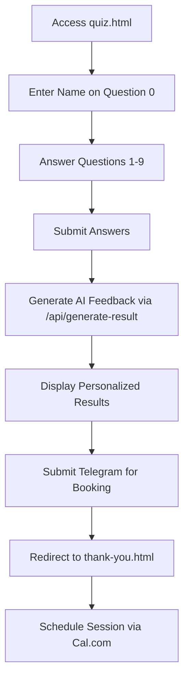
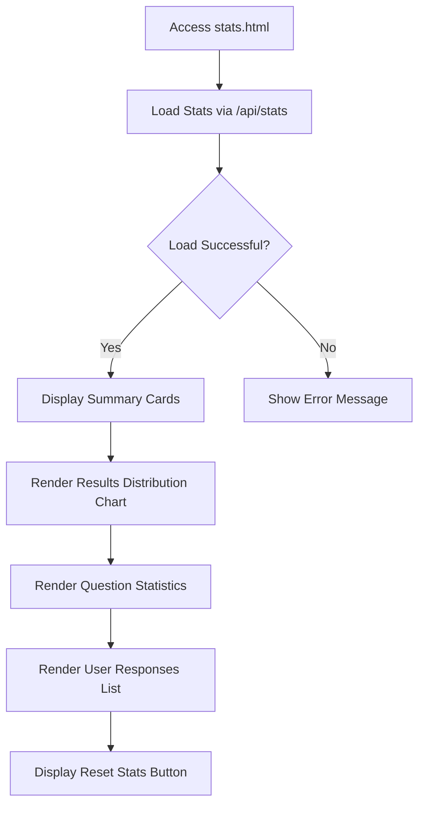
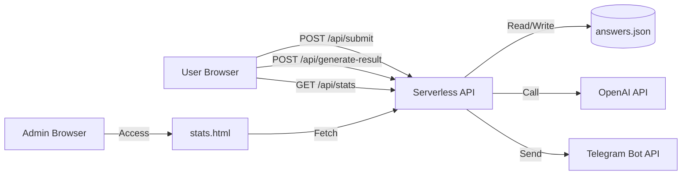

# User Workflows

<cite>
**Referenced Files in This Document**   
- [quiz.html](file://quiz.html) - *Updated in commit 9b0da9b8cf8fe241385e68b207124127f104022c*
- [thank-you.html](file://thank-you.html)
- [stats.html](file://stats.html)
- [api/submit.js](file://api/submit.js)
- [api/generate-result.js](file://api/generate-result.js)
- [api/stats.js](file://api/stats.js)
- [answers.json](file://answers.json)
</cite>

## Update Summary
**Changes Made**   
- Updated user workflow to reflect reorganized question flow and new concern question
- Modified quiz completion process to reflect updated question order and count
- Added information about informal tone usage in user interface
- Updated section sources to reflect changes in quiz.html
- Corrected quiz question count from 9 to 10 questions total (including name input)

## Table of Contents
1. [Introduction](#introduction)
2. [User Workflow](#user-workflow)
3. [Administrative Workflow](#administrative-workflow)
4. [Edge Cases and Error Handling](#edge-cases-and-error-handling)
5. [System Integration and Data Flow](#system-integration-and-data-flow)

## Introduction
This document details the primary user and administrative workflows in the alena application, a quiz-based tool designed to assess the adaptation stage of individuals in a new country. The application guides users through a 10-question assessment (including name input), delivers AI-generated personalized feedback, and facilitates scheduling coaching sessions. Administrators can view aggregated response statistics through a dedicated interface. The system leverages client-side JavaScript, serverless API endpoints on Vercel, and Supabase for persistent data storage. Recent updates have reorganized the quiz flow, added a new concern question, and enhanced the result prompt.

## User Workflow

The user journey begins at quiz.html and progresses through assessment completion, AI feedback generation, and session scheduling.

**Diagram sources**
- [quiz.html](file://quiz.html#L1500-L1704)
- [thank-you.html](file://thank-you.html#L50-L100)

**Section sources**
- [quiz.html](file://quiz.html#L1-L1705) - *Updated in commit 9b0da9b8cf8fe241385e68b207124127f104022c*
- [thank-you.html](file://thank-you.html#L1-L189)
- [api/generate-result.js](file://api/generate-result.js#L1-L243)
- [api/submit.js](file://api/submit.js#L1-L63)

### Accessing Quiz and Completing Assessment
The user accesses the application via quiz.html. The quiz presents 10 questions including an initial name input field. The user interface features a progress bar, navigation buttons, and a responsive design. Users navigate through questions using "Next" and "Previous" buttons. The "Next" button is disabled until an answer is selected or a name is entered. The system tracks the current question, user answers, and start time in the Quiz class instance. The quiz flow has been reorganized with a new concern question added, and the questions now use informal 'ты' instead of formal 'вы' for a more personal user experience. The estimated time for completion is under 1 minute, aligning with the user expectation of a quick assessment.

### Receiving AI-Generated Feedback
Upon answering the final question, the user clicks "Next" to trigger the `showResults()` method. This method first updates local statistics, then calls the `/api/generate-result` endpoint with the user's name, answers, and question/answer text mappings. While the AI processes the request, a 20-second countdown animation is displayed to manage user expectations. The API uses the OpenAI GPT-4o-mini model to generate personalized HTML content based on the user's responses. If the API is unavailable (e.g., missing API key), a fallback static result is generated based on the dominant answer choice (A, B, C, or D). The generated feedback is structured into six sections: "Where You Are," "What's Important Now," "In 7/14/30 Days," "First Step," "Recommendation," and "Bonus," providing a comprehensive and supportive analysis.

### Scheduling a Coaching Session
After the results are displayed, the user can schedule a coaching session by entering their Telegram username in a form and clicking "Get Plan." This triggers the `handleBooking()` method, which packages the user's name, Telegram handle, quiz result, and all answers into a message. The system attempts to send this message to a Telegram bot using the Telegram Bot API. On success, the user sees a confirmation message and is automatically redirected to thank-you.html after 2 seconds. This page embeds a Cal.com booking widget, allowing the user to select a convenient time for a 30-minute strategic meeting. The Cal.com integration is implemented via an inline embed script, providing a seamless scheduling experience.

## Administrative Workflow

Administrators access response statistics and analysis through the stats.html page.

**Diagram sources**
- [stats.html](file://stats.html#L100-L700)
- [api/stats.js](file://api/stats.js#L1-L68)

**Section sources**
- [stats.html](file://stats.html#L1-L716)
- [api/stats.js](file://api/stats.js#L1-L68)
- [answers.json](file://answers.json#L1-L18)

### Viewing Response Statistics
An administrator accesses the stats.html page, which initializes a `StatsManager` class upon loading. This class fetches aggregated statistics by calling the `/api/stats` endpoint. The API reads the answers.json file, calculates the total number of responses, the distribution of results (A, B, C, D), and the distribution of answers for each question. The stats.html page then renders this data into a user-friendly interface. Key metrics are displayed in summary cards (total responses, unique users, completion rate, average time). A bar chart visualizes the results distribution. A detailed section breaks down the statistics for each question, showing the count and percentage for each answer choice. Finally, a list displays individual user responses, sorted by timestamp, showing the user's name, result, and their answers to each question.

### Data Visualization and Analysis Capabilities
The stats.html page provides several visualization and analysis capabilities. The bar chart uses a gradient color scheme to represent the number of responses for each result type. The question statistics section uses a grid layout to present answer counts and percentages clearly. The user responses list allows administrators to see raw data, including the timestamp of each submission, which enables temporal analysis. The page also includes a "Reset Statistics" button that clears the answers.json file, useful for starting a new data collection cycle. The interface is designed to be intuitive, allowing non-technical administrators to understand user behavior and the effectiveness of the quiz.

## Edge Cases and Error Handling

The application includes mechanisms to handle various edge cases and failures.

### Incomplete Quizzes
The application prevents users from progressing without providing an answer. The "Next" button is disabled if no answer is selected for the current question or if the name field is empty. This ensures that all submitted responses are complete. However, a user could potentially close the browser before finishing, resulting in no data being submitted.

### Network Failures During Submission
Network failures are handled at multiple points. If the `/api/generate-result` call fails, the system falls back to a static result based on the dominant answer, ensuring the user still receives feedback. If the `/api/submit` call fails, the error is logged, but the user journey continues. The most critical failure point is the Telegram message submission. If the network request to the Telegram API fails, the system attempts to copy the user's data to the clipboard using the `navigator.clipboard` API. If this is not available, the user is prompted to contact the coach directly, ensuring no data is lost.

### Handling Duplicate Responses
The system does not explicitly prevent duplicate responses from the same user. Each submission is treated as a unique entry and is stored in the answers.json file with a unique ID generated from a timestamp and random string. This allows users to retake the quiz, which could be useful for tracking progress over time. The `StatsManager` in stats.html treats each entry as a unique user for the "uniqueUsers" metric, which may not be accurate but provides a simple count of total interactions.

## System Integration and Data Flow

The application's workflows are supported by a series of API endpoints and a persistent data store.

**Diagram sources**
- [api/submit.js](file://api/submit.js#L1-L63)
- [api/generate-result.js](file://api/generate-result.js#L1-L243)
- [api/stats.js](file://api/stats.js#L1-L68)
- [answers.json](file://answers.json#L1-L18)

**Section sources**
- [api/submit.js](file://api/submit.js#L1-L63)
- [api/generate-result.js](file://api/generate-result.js#L1-L243)
- [api/stats.js](file://api/stats.js#L1-L68)
- [answers.json](file://answers.json#L1-L18)

The primary data store is the answers.json file, which holds an array of all quiz submissions. The `/api/submit` endpoint appends new submissions to this file. The `/api/stats` endpoint reads this file to calculate and return aggregated statistics. The `/api/generate-result` endpoint uses the OpenAI API to generate personalized feedback, falling back to a static template if necessary. The client-side applications (quiz.html, stats.html) orchestrate these API calls to create a seamless user and administrative experience. The system is designed for simplicity and ease of deployment on Vercel, though the reliance on a JSON file for persistence has limitations for high-traffic scenarios.